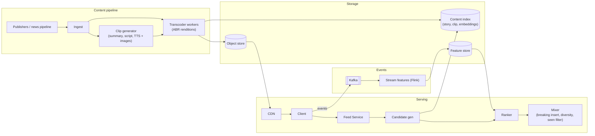
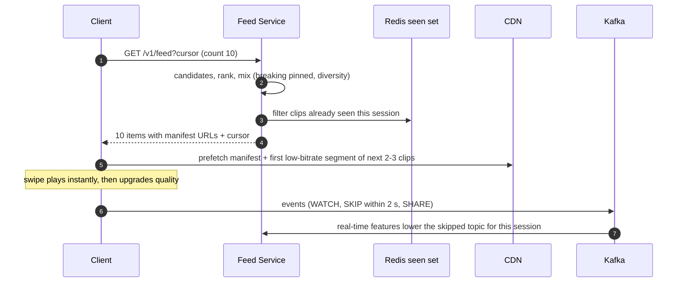

**Short answer:** Turn news stories into short vertical clips (publisher video, or auto-generated from a summary, images and voice-over), transcode them into adaptive bitrate renditions, and serve through a CDN. The feed is one item at a time, so the client prefetches the next few clips while the server returns a ranked batch from a recommender that mixes freshness, story importance and personal interest. Watch signals (completion, skip within 2 s, rewatch, share) stream back and update the ranking in near real time.

## Picture it





**How to read it:**
- Steps 1–4: the Feed Service ranks a batch of about 10 from a fresh candidate pool, mixes in breaking news and diversity, and removes clips the user already saw (the cursor carries the session).
- Step 5: the client prefetches the next 2–3 clips at low bitrate from the CDN, so a swipe starts in under 200 ms and then switches to a higher rendition.
- Steps 6–7: watch, skip and share events stream through Kafka and Flink into the feature store, so a quick skip changes the next batch within the same session.
- The top of the architecture is the content side: publisher or generated clips are transcoded into renditions, stored, and indexed for candidate generation.

## Requirements

Functional:
- Infinite vertical feed of short news clips (15–60 s); swipe for next; tap for the full article.
- Content sources: publisher videos, plus auto-generated clips for stories without video.
- Personalised by interests, language and location; breaking news is inserted for everyone.
- Like, share, "not interested", follow topic or publisher.

Non-functional:
- Next clip starts instantly (< 200 ms after swipe), so prefetch.
- Feed API p99 < 200 ms. Freshness: a breaking story appears within minutes.
- Works on slow networks (adaptive bitrate).

## Estimates

- 50M DAU × 30 clips/day = 1.5B clip views/day ≈ 17k/s; feed API called once per ~10 clips ≈ 2k QPS.
- Clip ~30 s; at an average delivered bitrate of ~1 Mbps that is ~4 MB per view → ~6 PB/day of egress. This is why the CDN dominates cost.
- New content: maybe 50k clips/day × 5 renditions × ~5 MB = ~1.25 TB/day of storage.

## API

```text
GET  /v1/feed?cursor=&count=10&lang=en   -> {items: [{clipId, storyId, manifestUrl, thumbUrl, headline, source}], cursor}
POST /v1/events   [{clipId, type: IMPRESSION|WATCH|SKIP|LIKE|SHARE|NOT_INTERESTED, watchMs}]
GET  /v1/stories/{id}                    -> full article link and related clips
```

## Data model

- `story(id, cluster_id, language, category, region, importance, published_at)`
- `clip(id, story_id, source_type PUBLISHER|GENERATED, duration_s, status, manifest_url, embedding, created_at)`
- Object store: `clips/{id}/{rendition}/segment_n.ts` plus HLS/DASH manifests.
- `user_profile` (feature store): topic weights, publishers followed, recent watched clip ids (for dedup).
- Event log in Kafka → stream processor → real-time features and training data.

## Architecture

The diagram in **Picture it** above shows the components (candidate generation draws on fresh, trending, topic and followed sources).

## Deep dives

**1. Instant playback.** Each clip has an HLS/DASH manifest with several renditions. The client keeps a buffer of the next 2–3 clips: it downloads the manifest and the first segment at a low bitrate in the background, so a swipe plays immediately and then upgrades quality. Short segments (1–2 s) help quick start. Thumbnails are shown while the first frame loads.

**2. Ranking for news, not entertainment.** Pure engagement ranking would push sensational clips. The score combines predicted watch completion, story importance (how many sources cover it, from the story clusterer), freshness decay (news ages in hours), source trust and diversity (no three clips on the same story in a row; mix topics). Breaking stories are pinned near the top for everyone in a region. Real-time feedback: a quick skip lowers that topic's weight within the session.

**3. Feed pagination without repeats.** Generate a batch of ~10 with the server remembering what was served (recently-seen set per user in Redis, a Bloom filter or a capped list). The cursor carries a session id; candidates already seen are filtered. Fresh breaking items can be injected into the next batch.

## Trade-offs

- **Precomputed vs on-request feed:** news goes stale fast, so rank on request from a precomputed candidate pool refreshed every few minutes.
- **Generated clips vs publisher-only:** generation gives coverage of every story but needs fact checks and licensing; label generated clips clearly.
- **Bitrate ladder:** more renditions mean better quality on every network but more storage and transcode cost.

## Follow-ups

- *The interviewer changes the problem (the follow-up).* Expect a pivot such as "now users upload clips", "support live video", or "make it work offline". Handle it by restating new requirements, naming which components change (upload = presigned URLs + moderation + transcoding queue; live = ingest servers + low-latency HLS; offline = prefetch on Wi-Fi) and which stay the same (CDN, ranking, events). Show the design was modular.
- *Moderation?* Automated classifiers plus human review before generated or uploaded clips enter the pool.
- *Cold start?* Use location, language and globally trending stories until a few swipes give signals.

See [F5 · Case studies: chat, news feed, collaborative editor](../academy/lessons/F5.md) and [F1 · Building blocks: load balancers, caches, queues, databases](../academy/lessons/F1.md).
