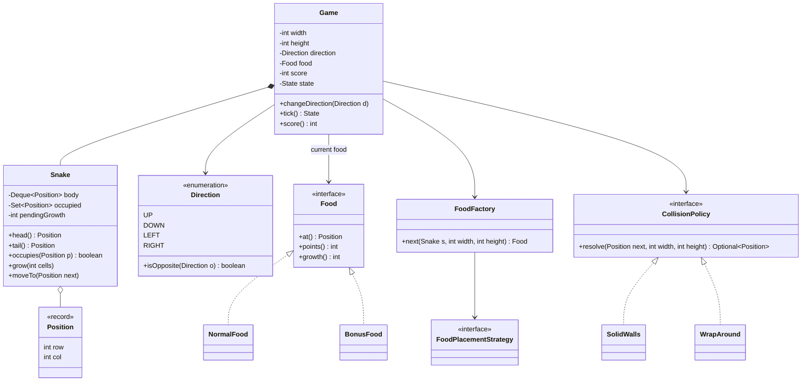
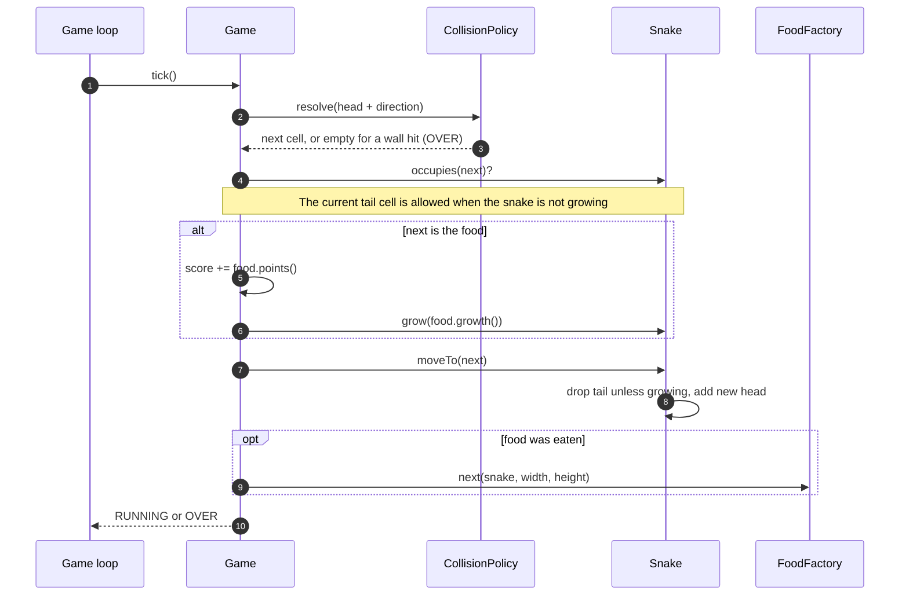

**Short answer:** Model a `Board`, a `Snake` held as a deque of cells plus a hash set of the same cells, and a `Game` that runs one `tick` per move. The deque gives O(1) move at the head and tail; the set gives O(1) self-collision checks. Food comes from a `FoodFactory`, where it spawns from a `FoodPlacementStrategy`, and what happens on a collision with a wall is a `CollisionPolicy` strategy, so new rules and food types plug in without touching `Game`.

## Picture it





**How to read it:**
- `Game` holds the rules and score; `Snake` only knows its body (a deque for order plus a set for O(1) "is this cell mine?").
- Each `tick` first asks the `CollisionPolicy` where the head lands: `SolidWalls` ends the game at the edge, `WrapAround` wraps to the other side.
- Then the self-collision check, with the one tricky case: stepping into the tail cell is fine when the tail is moving away.
- Eating food adds points and pending growth; `moveTo` then keeps the tail for as many ticks as the snake still has to grow.
- New food appears through `FoodFactory`, which asks its `FoodPlacementStrategy` for a free cell and picks the food type.

## Requirements

- Board of width x height. Snake starts at length 1 and moves one cell per tick in its current direction.
- The player can change direction, but not reverse into itself (Up to Down).
- Eating food grows the snake and adds points. Different food kinds give different points (normal, bonus).
- Game over on hitting itself, or a wall (unless the "wrap around" mode is on).
- Extensible: new food types, new board rules, new spawn rules. Rendering and input are out of scope.

## Classes

- `Position` (record `row, col`), `Direction` (enum with `dr`, `dc` and `isOpposite`).
- `Snake`: `Deque<Position> body` (head first) and `Set<Position> occupied`. Methods `head()`, `move(next, grow)`, `occupies(p)`.
- `Food` (sealed interface) with `NormalFood` and `BonusFood` records; each knows its position, points and growth.
- `FoodFactory`: creates the next food (for example a bonus food every fifth spawn).
- `FoodPlacementStrategy`: picks a free cell. `RandomPlacement` is the default.
- `CollisionPolicy` (Strategy): maps a raw next position to the final one, or reports a wall hit. `SolidWalls` and `WrapAround`.
- `Game`: owns the board size, snake, current food, score and state (`RUNNING`, `OVER`). `changeDirection` and `tick`.

## Patterns used

- **Strategy** for wall behaviour and for food placement. They are the two parts that interviewers usually ask to change.
- **Factory** for food: `Game` asks for "the next food" and does not know the concrete types.
- **Sealed interface + records** for food: the compiler knows the full set, and a `switch` over food types stays exhaustive.
- Single responsibility: `Snake` knows its body, `Game` knows rules and score, the strategies know one policy each.

## Code

```java
public record Position(int row, int col) {}

public enum Direction {
    UP(-1, 0), DOWN(1, 0), LEFT(0, -1), RIGHT(0, 1);
    final int dr, dc;
    Direction(int dr, int dc) { this.dr = dr; this.dc = dc; }
    boolean isOpposite(Direction o) { return dr + o.dr == 0 && dc + o.dc == 0; }
}

public sealed interface Food permits NormalFood, BonusFood {
    Position at(); int points(); int growth();
}
public record NormalFood(Position at) implements Food {
    public int points() { return 1; } public int growth() { return 1; }
}
public record BonusFood(Position at) implements Food {
    public int points() { return 5; } public int growth() { return 2; }
}

public interface CollisionPolicy {
    /** Returns the position to move to, or empty if this move hits a wall. */
    Optional<Position> resolve(Position next, int width, int height);
}

public final class Snake {
    private final Deque<Position> body = new ArrayDeque<>();
    private final Set<Position> occupied = new HashSet<>();
    private int pendingGrowth;

    Snake(Position start) { body.addFirst(start); occupied.add(start); }

    Position head() { return body.peekFirst(); }
    boolean occupies(Position p) { return occupied.contains(p); }
    int length() { return body.size(); }

    void grow(int cells) { pendingGrowth += cells; }

    /** Moves the head; drops the tail unless growing. Call only after collision checks. */
    void moveTo(Position next) {
        if (pendingGrowth > 0) pendingGrowth--;
        else occupied.remove(body.removeLast());   // tail first, so a head entering the old tail cell stays in the set
        body.addFirst(next);
        occupied.add(next);
    }

    Position tail() { return body.peekLast(); }
    boolean isGrowing() { return pendingGrowth > 0; }
}

public final class Game {
    public enum State { RUNNING, OVER }

    private final int width, height;
    private final Snake snake;
    private final CollisionPolicy walls;
    private final FoodFactory foods;
    private Direction direction = Direction.RIGHT;
    private Food food;
    private int score;
    private State state = State.RUNNING;

    public Game(int width, int height, CollisionPolicy walls, FoodFactory foods) {
        this.width = width; this.height = height;
        this.walls = walls; this.foods = foods;
        this.snake = new Snake(new Position(height / 2, width / 2));
        this.food = foods.next(snake, width, height);
    }

    public void changeDirection(Direction d) {
        if (snake.length() == 1 || !d.isOpposite(direction)) direction = d;
    }

    public State tick() {
        if (state == State.OVER) return state;
        Position h = snake.head();
        Optional<Position> next = walls.resolve(
            new Position(h.row() + direction.dr, h.col() + direction.dc), width, height);
        if (next.isEmpty()) return state = State.OVER;
        Position p = next.get();

        // Moving into the current tail is legal when the tail moves away this tick.
        boolean hitsSelf = snake.occupies(p) && !(p.equals(snake.tail()) && !snake.isGrowing());
        if (hitsSelf) return state = State.OVER;

        boolean eats = food != null && p.equals(food.at());
        if (eats) {
            score += food.points();
            snake.grow(food.growth());
        }
        snake.moveTo(p);
        if (eats) food = foods.next(snake, width, height);   // may be null when the board is full
        return state;
    }

    public int score() { return score; }
}
```

`FoodFactory.next` asks its `FoodPlacementStrategy` for a free cell and then decides the food type (switch on a spawn counter). `SolidWalls.resolve` returns empty when the position is outside the board; `WrapAround` returns `new Position(Math.floorMod(r, height), Math.floorMod(c, width))`.

## Extensions

- **Optimisation: self-collision.** Scanning the body is O(length) per tick. The `HashSet` makes it O(1). A `boolean[][]` grid is even cheaper for small boards.
- **Optimisation: placing food.** Random retry ("pick a cell, retry if taken") is fast while the board is sparse but degrades as the snake fills it. For a dense board keep the free cells in an array plus an index map: swap-remove makes add, remove and random pick all O(1).
- **Memory:** deque and set are O(length). The grid version is O(width x height) but fixed.
- **Tail edge case:** moving into the cell the tail is leaving is legal, which the code handles. Many first attempts get this wrong.
- **New features:** obstacles (a set checked in `tick`, or a `CollisionPolicy` decorator), poison food (a new record with negative growth), speed levels (tick interval from score), multiplayer (several snakes, check head against all occupied sets).
- **Concurrency:** input arrives on another thread. Keep `Game` single-threaded: put direction changes in a queue the game loop drains at the start of each tick, or store the latest direction in a `volatile` field.

Deeper reading: [E4 · Behavioural patterns](../academy/lessons/E4.md), [E2 · Creational patterns](../academy/lessons/E2.md), [E5 · The LLD interview method](../academy/lessons/E5.md).
