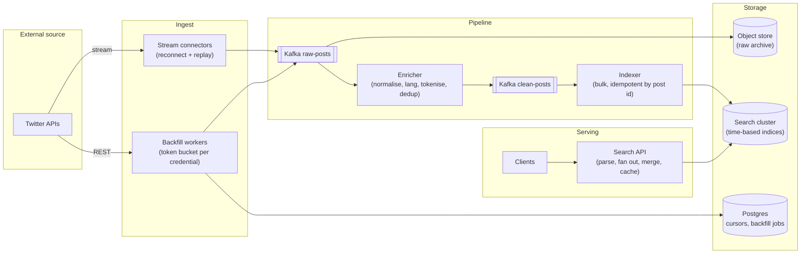
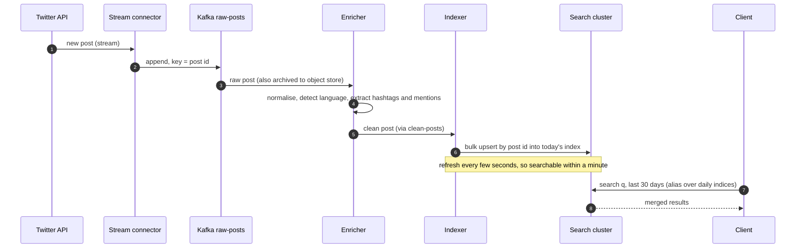
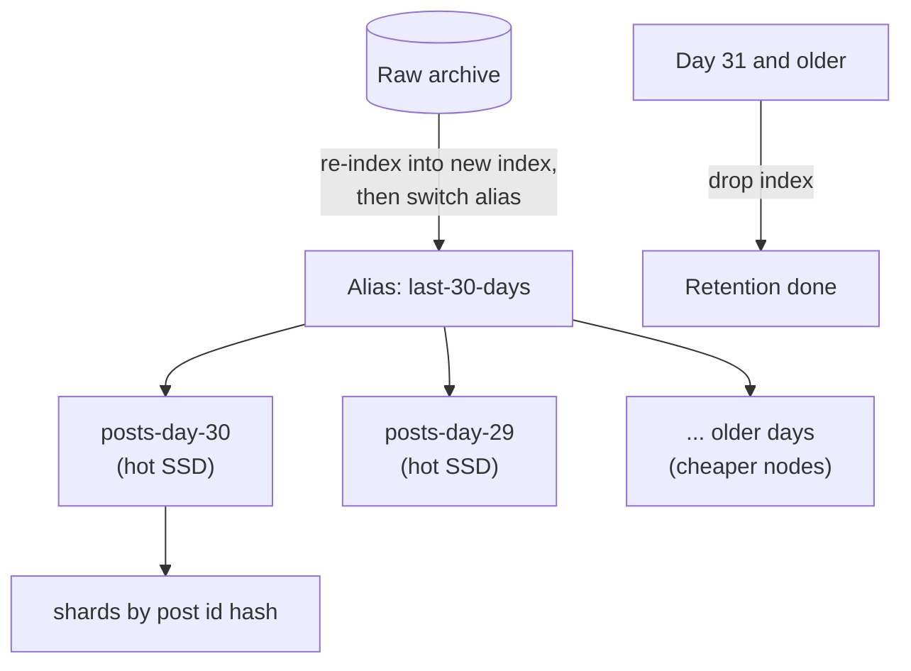

**Short answer:** Treat Twitter (X) as an external source with strict rate limits, so the design is an ingestion pipeline plus a search index. Use the platform's streaming/filtered endpoints for new posts and paced REST backfill for history, put every raw post on Kafka, normalise and enrich it, then write to a sharded inverted index (Elasticsearch/OpenSearch style) partitioned by time, with the raw JSON kept in object storage. Clarify early what "entire feed" means: the full firehose is a paid, contractual product, so scope is set by API access, not by our design.

## Picture it







**How to read it:**
- Steps 1–3: the stream connector pushes new posts to Kafka keyed by post id; backfill workers do the same for history, paced by a token bucket. The raw JSON is archived, so everything can be replayed.
- Steps 4–6: the enricher cleans and tokenises, and the indexer writes in bulk. Upsert by post id makes stream and backfill overlaps harmless.
- Steps 7–8: searches go through an alias that covers the recent daily indices.
- The last picture is the index layout: one index per day, hot recent days on SSD, retention by dropping old indices, and mapping changes done by re-indexing from the raw archive and switching the alias.

## Requirements

Functional:
- Continuously ingest posts (text, author, timestamps, hashtags, mentions, media links, engagement counts).
- Backfill history for a set of accounts or keywords.
- Search: full-text, hashtag, author, time range; sort by recency or relevance.
- Handle edits, deletions and engagement count changes.

Non-functional:
- Freshness: searchable within seconds to a minute.
- Never lose a post we received; reprocessing possible.
- Respect API rate limits and terms (including honouring deletions).

## Estimates

- Assume ~500M posts/day (an often-quoted public order of magnitude; treat as an assumption) ≈ 6k/s average, peaks 3–5× during big events.
- Post with metadata ~1 KB raw JSON (often more) → ~0.5 TB/day raw; the index with replicas is a similar or larger size.
- One year ≈ 180 TB raw, so tier storage: recent indices on SSD, older on cheaper nodes or rebuildable from object storage.
- Search load: assume 2k QPS; much lower than ingest.

## API

```text
GET /v1/search?q=election&author=&hashtag=&from=&to=&sort=recent|relevance&cursor=
GET /v1/posts/{id}
POST /v1/backfill  {accounts[]|query, from, to}  -> {jobId}
```

## Data model

- **Raw store:** object storage, `raw/yyyy/mm/dd/hh/part-*.json.gz`, the system of record for reprocessing.
- **Index document:** `{id, author_id, author_handle, text, lang, created_at, hashtags[], mentions[], urls[], reply_to, quote_of, like_count, repost_count, deleted}`.
- **Index layout:** one index per day (or per hour at very high volume), sharded by post id hash; an alias covers "last 30 days". Time-based indices make retention a cheap "drop old index" and keep recent queries on hot nodes.
- **Ingestion state (Postgres):** `source_cursor(source, partition, last_id, last_time)`, `backfill_job(id, query, range, progress, status)`, and rate-limit budgets.

## Architecture

The diagram in **Picture it** above shows the components (the REST path also carries edits and count updates).

## Deep dives

**1. Ingest within rate limits.** Streaming endpoints deliver new posts with no polling cost but can disconnect; connectors reconnect with backoff and, where the API supports it, request the missed window. Backfill runs as many small jobs, each bounded by a token bucket per credential, checkpointing a cursor so restarts resume. A central budget service hands out quota so workers do not exceed limits together. Duplicates (stream and backfill overlap) are harmless because indexing is an upsert by post id.

**2. Indexing at 6k+/s.** Use bulk indexing (batches of a few thousand), a refresh interval of a few seconds rather than per document, and enough primary shards that each daily index's shards stay a manageable size (tens of GB). Text analysis per language (tokeniser, stemmer), with hashtags and mentions as keyword fields. Kafka between enricher and indexer means a slow cluster only adds lag; the raw archive allows a full re-index when the mapping changes (write to a new index, then switch the alias).

**3. Mutable data.** Posts get deleted and engagement counts change constantly. Deletions arrive as events: mark `deleted` and remove from results, and honour the platform's compliance requirements. Counts: do not re-index the whole document on every like; update counts periodically for recent posts only, or keep counts in a separate store joined at query time for "sort by popularity".

## Trade-offs

- **Search engine vs database:** full-text relevance and faceting need an inverted index; Postgres full-text search is fine at small scale but not at hundreds of TB.
- **Time-based indices vs one big index:** fast recent queries and cheap retention, but queries over long ranges fan out to many indices.
- **Freshness vs indexing cost:** a shorter refresh interval means more small segments and merge overhead.
- **Keep raw forever:** costs storage, but makes every downstream change (new fields, new analysers) replayable.

## Follow-ups

- *Multi-tenant (many customers with different keyword rules)?* Shared ingest, per-tenant filters at query time or tenant-specific indices for large customers.
- *Trending topics?* A stream job counting hashtags in sliding windows (count-min sketch plus top-k heap).
- *Threads and conversations?* Index `reply_to` and `conversation_id`; fetch the thread by query.

See [S9 · Cloud native & event-driven systems](../academy/lessons/S9.md) and [Q8 · Scaling databases: replicas, partitioning, sharding, caching, CQRS](../academy/lessons/Q8.md).
