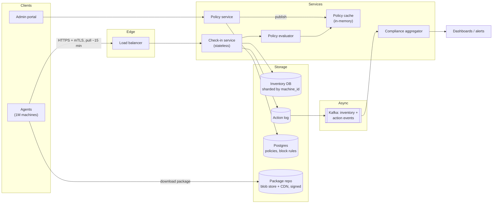
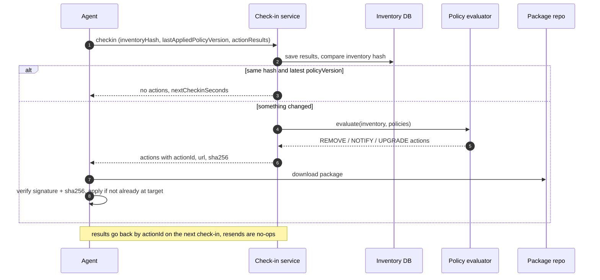
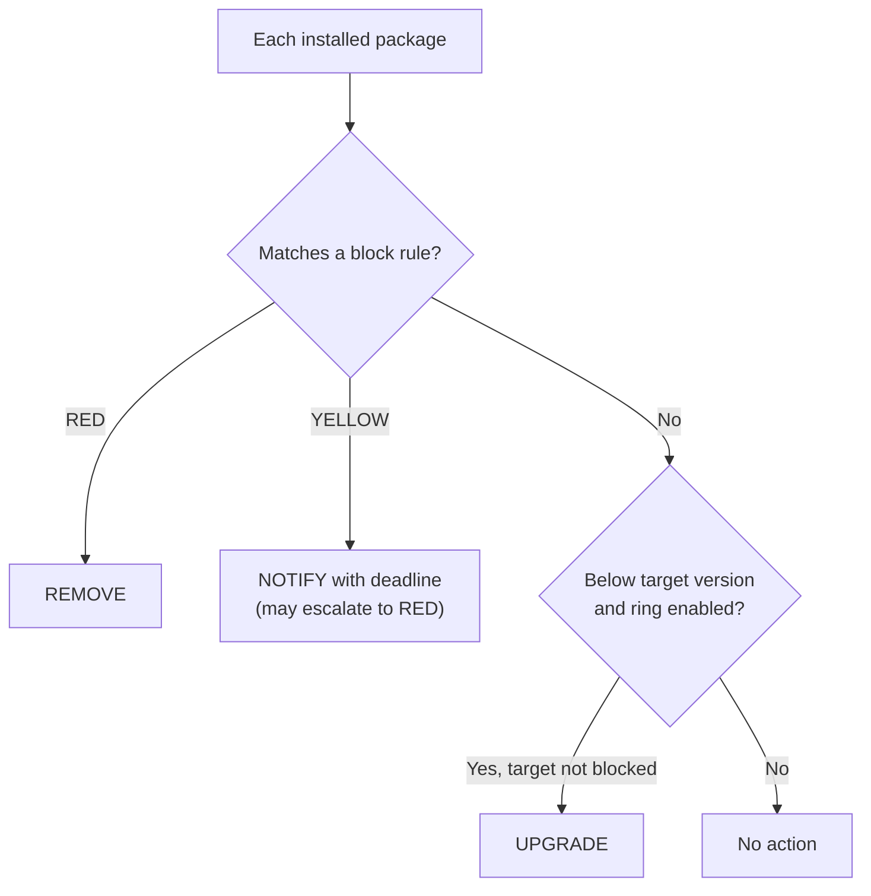

**Short answer:** Every machine runs a small agent that reports its inventory (installed software and versions) and pulls a *desired state* from a central policy service. The server evaluates policies (target versions plus a blocklist with RED/YELLOW severities) against each machine's inventory and returns actions: install, upgrade, remove, or notify. The agent pulls on a schedule with jitter, so machines that come and go simply converge the next time they check in. Rollouts are staged in rings, and every action is idempotent and audited.

## Picture it







**How to read it:**
- Step 1: every agent pulls on a jittered schedule and reports a hash of its inventory plus the results of earlier actions. New machines register this way; machines that were off just catch up.
- Steps 2–3: if the hash and policy version are unchanged, there is nothing to evaluate, which keeps 1M machines cheap.
- Steps 4–8: otherwise the evaluator (a pure function of inventory and policies) returns actions. The agent verifies the signed package and is idempotent: if it is already at the target, it reports DONE.
- The decision picture: block rules win over upgrades. RED removes, YELLOW notifies, and upgrades only reach machines whose rollout ring is enabled.

## Requirements

**Functional**
- Machines register when they appear and are marked stale when they stop checking in.
- Admins publish a new version of a package; machines in scope install it automatically.
- Admins maintain a blocklist: software name, version range, severity. RED means remove automatically. YELLOW means notify the user (and maybe the admin), with a deadline.
- Admins see compliance: how many machines are on version X, how many have blocked software.

**Non-functional**
- Scale: hundreds of thousands to a few million machines (Azure-style fleet).
- Eventually consistent: a policy change should reach most online machines within minutes, all within hours.
- Safe: a bad version must not brick the whole fleet at once. Staged rollout and fast rollback.
- Secure: only signed packages and signed policies are applied.

## Estimates

- 1M machines, check-in every 15 minutes with jitter: 1M / 900 s ≈ 1.1k requests/s average. Plan for 5–10k/s after an outage when everyone reconnects.
- Inventory: ~300 packages per machine × ~100 bytes ≈ 30 KB. Send only a delta or a hash after the first report: if the hash matches, nothing changes.
- Inventory store: 1M × 30 KB ≈ 30 GB. Fine for a sharded relational store or a document store.
- Package binaries are large but served from a CDN or blob store, not from the policy service.

## API

```text
POST /v1/machines/{id}/checkin
  body: { agentVersion, os, inventoryHash, inventoryDelta?, lastAppliedPolicyVersion, actionResults[] }
  resp: { policyVersion, actions: [ {actionId, type: INSTALL|UPGRADE|REMOVE|NOTIFY, package, version, url, sha256, deadline?} ], nextCheckinSeconds }

PUT  /v1/policies/packages/{name}      { targetVersion, rollout: {rings, percentPerStep} }
PUT  /v1/policies/blocklist/{ruleId}   { name, versionRange, severity: RED|YELLOW, message }
GET  /v1/compliance?package=&severity=
```

Long-lived push (a WebSocket or a notification channel) can be added later to say "check in now". The pull is the source of truth.

## Data model

```sql
machine(id PK, tenant_id, os, ring, last_seen_at, inventory_hash, status)       -- status: ACTIVE, STALE, RETIRED
machine_software(machine_id, name, version, PRIMARY KEY (machine_id, name))
package_policy(name PK, target_version, min_version, rollout_ring, policy_version)
block_rule(id PK, name, version_range, severity, message, created_by, policy_version)
action(id PK, machine_id, type, package, version, state, created_at, completed_at, error) -- state: PENDING, SENT, DONE, FAILED
```

`policy_version` is a global monotonic number. A machine that reports the latest version and an unchanged inventory hash needs no evaluation.

## Architecture

The diagram in **Picture it** above shows the components.

## Deep dives

**1. Pull-based desired state.** Machines come and go, so push lists are always stale. With pull, a new machine registers on its first check-in and gets the full desired state. A machine that was off for a month catches up when it returns. The server never tracks "who is online". A machine with no check-in for N days is marked STALE, later RETIRED, by a background sweep.

**2. Policy evaluation.** For each check-in: load the machine's inventory, the cached package policies, and the block rules. For each block rule that matches name and version range: RED produces a REMOVE action, YELLOW produces a NOTIFY action with a deadline (and can escalate to RED after the deadline). For each package policy where the installed version is below target *and* the machine's ring is enabled: an UPGRADE action. Block rules win over upgrades: never install a version that is on the blocklist. The evaluation is a pure function of (inventory, policies), so it is easy to test and cheap to cache by `(inventoryHash, policyVersion)`.

**3. Safe rollout.** Machines are assigned to rings (canary 1%, early 10%, broad 100%). A new version goes to ring 0 first. The aggregator watches failure rate from `actionResults`. If install failures or crash reports cross a threshold, the rollout pauses automatically. Rollback is just a new policy that sets the target back. RED removals of something critical (for example, a security tool) need a second approval.

**4. Idempotency and retries.** Every action has an `actionId`. The agent reports results by ID; resending the same result is a no-op. The agent re-checks local state before acting: if the package is already at the target version, it reports DONE without reinstalling.

## Trade-offs

- **Pull vs push:** pull is simpler and survives churn, but has latency up to the poll interval. Add a lightweight "poke" push only for urgent RED rules.
- **Server-side vs agent-side evaluation:** server-side keeps logic in one place and gives an audit trail. Agent-side evaluation (ship the policy, let the agent decide) works offline and reduces server load, but older agents may interpret rules differently. A common middle ground: server evaluates, agent enforces.
- **Full inventory vs delta:** deltas save bandwidth but can drift; send a full snapshot periodically (say daily) to repair drift.
- **Strong vs eventual consistency:** eventual is fine here. No user waits on a synchronous answer.

## Follow-ups

- *Thundering herd after an outage?* Jitter the interval, return `nextCheckinSeconds` from the server to spread load, and rate-limit at the load balancer.
- *How do you trust the package?* Packages are signed; the agent verifies the signature and `sha256` before install. Policies are signed too, and agents talk over mTLS.
- *User blocks the agent?* The machine stops checking in, turns STALE, and network access control can quarantine non-compliant machines.
- *Different policies per team?* Add scopes (tenant, group, OS) to policies; the most specific scope wins, and the blocklist always applies.

Related lessons: [F1 · Building blocks](../academy/lessons/F1.md), [F7 · DAGs: workflow orchestration and schedulers](../academy/lessons/F7.md).
