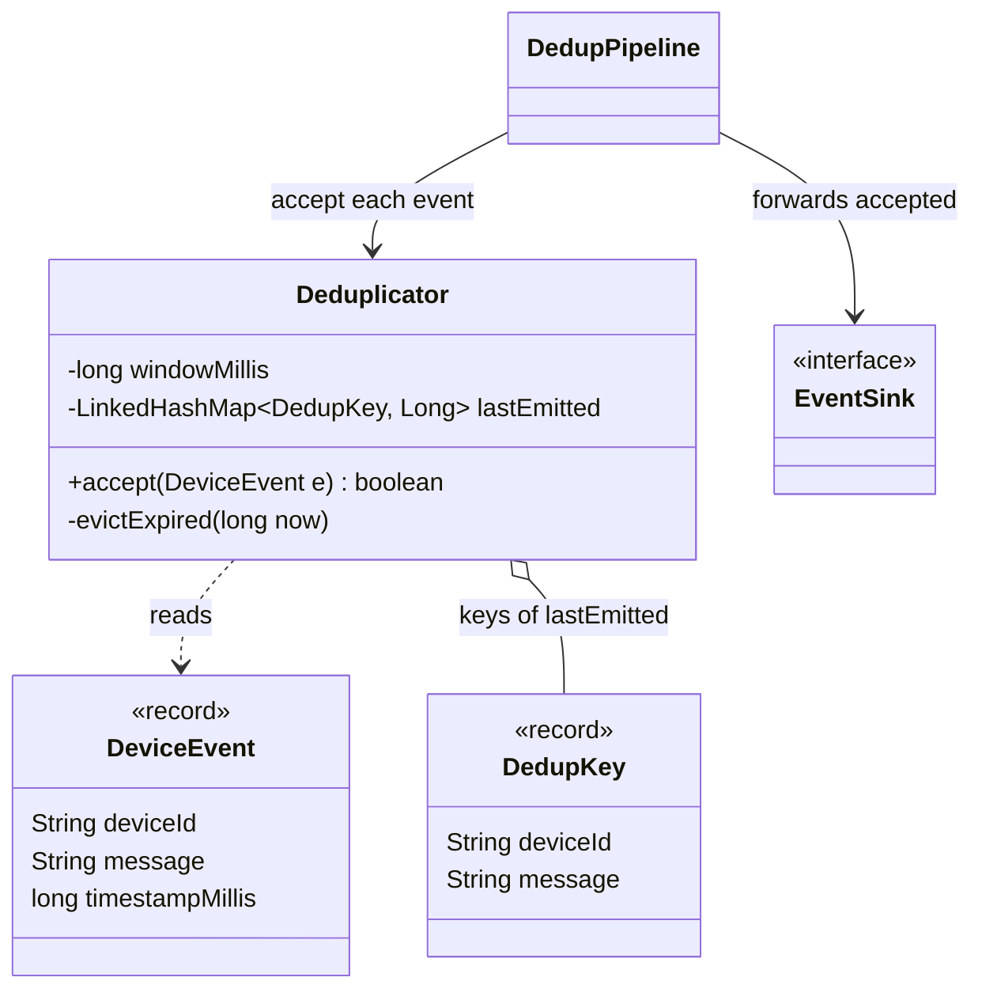
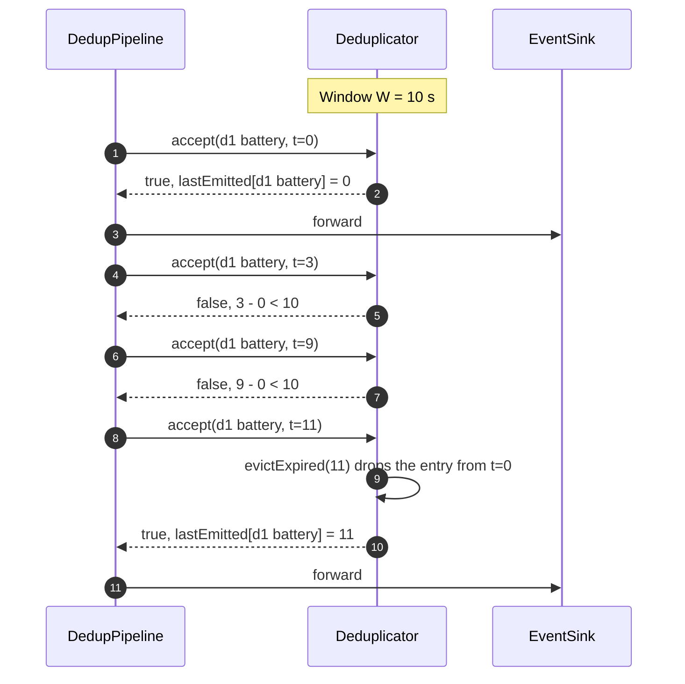

**Short answer:** Keep a map from the dedup key `(deviceId, eventType)` to the timestamp when that event was last let through. On each event: if the key was emitted less than the window ago, drop it; otherwise emit it and record the time. To stop the map growing forever, keep it in time order (a `LinkedHashMap` in insertion order) and evict expired entries from the front on every call. Each event is O(1) amortised, and memory is O(distinct keys seen in one window).

## Picture it





**How to read it:**
- The pipeline is three pieces: a source, the `Deduplicator` filter, and an `EventSink`; the filter knows neither end.
- `Deduplicator` keeps one entry per `(deviceId, message)` key: the time it last let that event through.
- An event inside the window of its key's last emission is dropped; otherwise it passes and the time is updated.
- Entries sit in the `LinkedHashMap` in emission order, so expired ones are evicted from the front and memory stays at one window's worth of keys.

## Requirements

- Input: a stream of events `(deviceId, message, timestamp)`, for example `(d1, "Battery at 10%", t)`.
- Output: the same stream with duplicates removed. A duplicate is the same device and same message within `W` (10 s or 60 s, configurable) of the last emitted copy.
- Assume timestamps arrive in non-decreasing order first; handle out-of-order later.
- Clarify one semantic choice with the interviewer: is the window measured from the last **emitted** copy (the event repeats every `W` while it keeps firing) or from the last **seen** copy (a continuous repeat is suppressed forever)? I use "last emitted", which is what alerting usually wants.

## Classes

- `DeviceEvent` (record): device id, message, timestamp in millis.
- `DedupKey` (record): device id and a normalised message. Records give correct `equals`/`hashCode` for free.
- `Deduplicator`: `boolean accept(DeviceEvent e)`. Owns the window and the time-ordered map.
- `EventSink` (interface): where accepted events go (next stage, Kafka topic, notifier). Keeps the dedup logic separate from I/O.
- `DedupPipeline`: reads from a source, calls `accept`, forwards to the sink.

## Patterns used

- **Filter / pipes-and-filters**: the deduplicator is one stage in a pipeline; it neither knows the source nor the sink.
- **Strategy** (optional): `KeyExtractor` decides what "same event" means (exact text, or "Battery at 10%" and "Battery at 9%" both map to `LOW_BATTERY`).
- Dependency inversion: the pipeline depends on `EventSink`, not on Kafka.

## Code

```java
public record DeviceEvent(String deviceId, String message, long timestampMillis) {}
public record DedupKey(String deviceId, String message) {}

/** Not thread-safe by design: run one instance per partition (see Extensions). */
public final class Deduplicator {
    private final long windowMillis;
    // Insertion order == order of last emission, because we remove and re-put on emit.
    private final LinkedHashMap<DedupKey, Long> lastEmitted = new LinkedHashMap<>();

    public Deduplicator(Duration window) {
        this.windowMillis = window.toMillis();
    }

    public boolean accept(DeviceEvent e) {
        long now = e.timestampMillis();
        evictExpired(now);

        DedupKey key = new DedupKey(e.deviceId(), e.message().strip());
        Long last = lastEmitted.get(key);
        if (last != null && now - last < windowMillis) {
            return false;                       // duplicate inside the window
        }
        lastEmitted.remove(key);                // move to the back of the order
        lastEmitted.put(key, now);
        return true;
    }

    private void evictExpired(long now) {
        Iterator<Map.Entry<DedupKey, Long>> it = lastEmitted.entrySet().iterator();
        while (it.hasNext()) {
            if (now - it.next().getValue() >= windowMillis) it.remove();
            else break;                         // the rest are newer
        }
    }

    int size() { return lastEmitted.size(); }
}
```

Example with `W = 10 s`: battery events at t = 0, 3, 9, 11 s emit at 0 and 11 only. At 11 s the entry from 0 s has expired and is evicted before the lookup.

## Extensions

**Time and space complexity (follow-up 1).** `accept` is O(1) amortised: the map lookup and update are O(1), and each entry is evicted at most once, so the eviction loop costs O(1) per event on average. Space is O(K), where K is the number of distinct keys emitted in the last `W`. A plain `HashMap` without eviction would also be O(1) per event but O(all keys ever) in memory.

**Production bottlenecks (follow-up 2):**

- **Throughput on one node.** One map behind one lock becomes the bottleneck. Partition by `deviceId` (for example the Kafka message key) so each partition has its own single-threaded `Deduplicator`. All events of a device land on the same partition, so no locks are needed and order is kept.
- **Memory.** Millions of devices times a 60 s window can be large. Bound it: normalise messages to short codes, cap entries per partition, and monitor `size()`.
- **Restarts and rebalancing.** The map is in memory, so after a restart or a partition move the first repeats slip through. If that matters, keep the state in Redis with `SET key 1 NX PX <window>` (set only if absent, with expiry), or use a stream processor with a fault-tolerant state store. It costs a network hop per event.
- **Out-of-order and late events.** Mobile devices buffer and send late. Use event time, accept lateness up to a bound, and evict by "max timestamp seen minus W minus allowed lateness". Events later than that are either dropped or passed through; pick one and say it.
- **Clock skew.** Device clocks drift. Either trust server receive time (simple, but shifts windows) or device time with a sanity bound.
- **Hot devices.** A faulty device spamming one event is cheap here (one map hit per event), but it can still flood the input. Add a per-device rate limit in front.
- **Thread-safe single-node variant.** If partitioning is not an option, use `ConcurrentHashMap.compute` for the check-and-set so it is atomic per key, and a scheduled sweep with `removeIf(v -> now - v >= W)` instead of ordered eviction.

Deeper reading: [F1 · Building blocks: load balancers, caches, queues, databases](../academy/lessons/F1.md), [B3 · Atomics, CAS and concurrent collections](../academy/lessons/B3.md).
