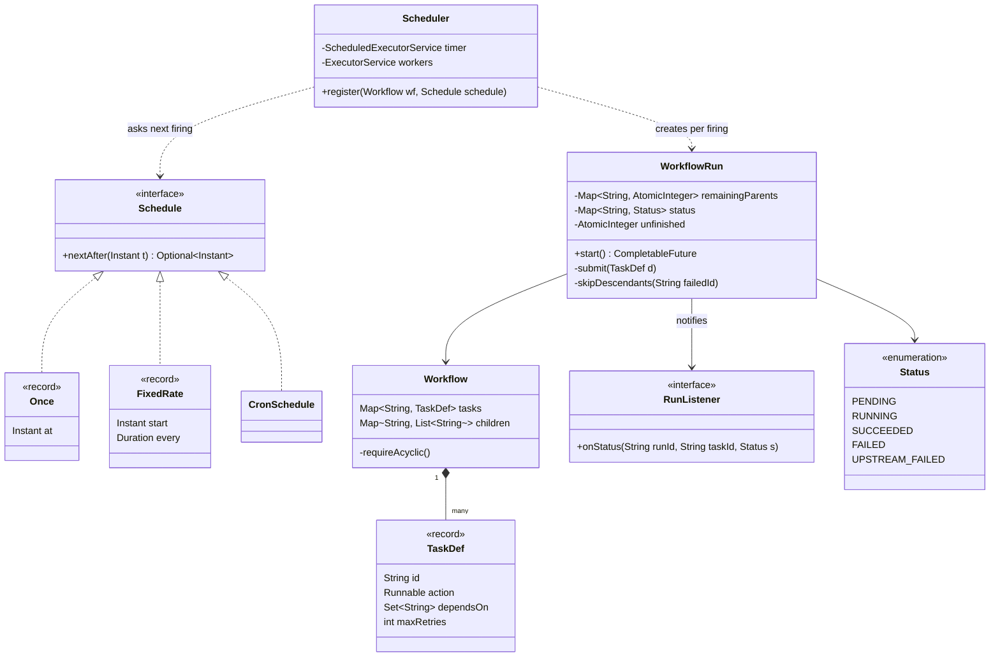
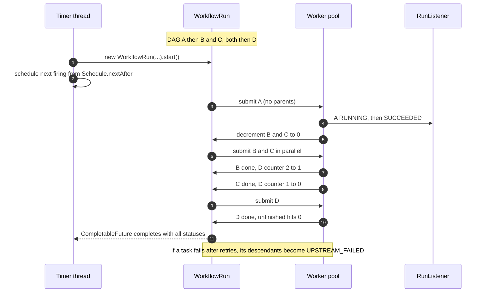

**Short answer:** Split it into three parts. A `Schedule` (one-time, fixed rate, cron) answers "when is the next run?". A `Workflow` is a DAG of `TaskDef`s, validated for cycles when it is registered. A `WorkflowRun` executes one firing: every task keeps a counter of unfinished parents, roots go to a worker pool, and when a task finishes it decrements its children and submits any that reach zero. A single timer thread fires runs and the worker pool does the work, so a slow task never delays the clock.

## Picture it





**How to read it:**
- `Schedule` answers only "when next?"; `Scheduler`'s single timer thread uses it to fire runs, then books the next firing.
- `Workflow` is the checked DAG of `TaskDef`s; each firing gets a fresh `WorkflowRun` with its own counters and statuses.
- Every task has a counter of unfinished parents; tasks with none start first on the worker pool.
- A finishing task decrements its children, and the one that hits zero submits the child, so each task runs exactly once.
- A failure marks every descendant `UPSTREAM_FAILED`; the run's future completes when the last task is terminal.

## Requirements

- Register a task or a workflow with a schedule: run once at time T, every N seconds, or on a cron expression.
- Dependencies: B runs only after A succeeds. A single task is just a one-node workflow.
- Tasks run concurrently on a bounded pool. Independent tasks run in parallel.
- Status per task per run: `PENDING`, `RUNNING`, `SUCCEEDED`, `FAILED`, `UPSTREAM_FAILED`.
- Retries with a limit. Listeners can observe status changes (logging, metrics, alerts).
- Out of scope: persistence and multiple scheduler nodes (see Extensions).

## Classes

- `Schedule` (sealed interface): `Optional<Instant> nextAfter(Instant t)`. Records `Once`, `FixedRate`, `CronSchedule`.
- `TaskDef` (record): id, the action, the ids it depends on, max retries.
- `Workflow`: the DAG. Builds the child adjacency list and rejects cycles (Kahn's algorithm).
- `WorkflowRun`: the state of one execution. Per-task remaining-parent counters, per-task status, and a `CompletableFuture` that completes when every task is terminal.
- `Scheduler`: owns a `ScheduledExecutorService` (timer) and an `ExecutorService` (workers). `register(workflow, schedule)`.
- `RunListener` (interface): `onStatus(runId, taskId, status)`.

## Patterns used

- **Strategy** via the sealed `Schedule`: adding a new schedule kind does not change the scheduler.
- **Observer**: `RunListener`s are notified of status changes, so alerting and metrics stay out of the core.
- **Command**: a `TaskDef` wraps an action that the worker pool executes without knowing what it does.
- **Topological execution** (Kahn's algorithm, done incrementally) for the DAG.

## Code

```java
public sealed interface Schedule permits Once, FixedRate, CronSchedule {
    Optional<Instant> nextAfter(Instant t);
}
public record Once(Instant at) implements Schedule {
    public Optional<Instant> nextAfter(Instant t) { return t.isBefore(at) ? Optional.of(at) : Optional.empty(); }
}
public record FixedRate(Instant start, Duration every) implements Schedule {
    public Optional<Instant> nextAfter(Instant t) {
        if (t.isBefore(start)) return Optional.of(start);
        long n = Duration.between(start, t).toMillis() / every.toMillis() + 1;
        return Optional.of(start.plus(every.multipliedBy(n)));
    }
}
// CronSchedule can delegate to Spring's org.springframework.scheduling.support.CronExpression#next.

public record TaskDef(String id, Runnable action, Set<String> dependsOn, int maxRetries) {}

public enum Status { PENDING, RUNNING, SUCCEEDED, FAILED, UPSTREAM_FAILED }

public final class Workflow {
    final Map<String, TaskDef> tasks;
    final Map<String, List<String>> children = new HashMap<>();

    public Workflow(Collection<TaskDef> defs) {
        tasks = defs.stream().collect(Collectors.toUnmodifiableMap(TaskDef::id, d -> d));
        for (TaskDef d : defs)
            for (String p : d.dependsOn()) {
                if (!tasks.containsKey(p)) throw new IllegalArgumentException("Unknown dependency " + p);
                children.computeIfAbsent(p, k -> new ArrayList<>()).add(d.id());
            }
        requireAcyclic();
    }

    private void requireAcyclic() {
        Map<String, Integer> indeg = new HashMap<>();
        tasks.values().forEach(d -> indeg.put(d.id(), d.dependsOn().size()));
        Deque<String> ready = new ArrayDeque<>();
        indeg.forEach((id, n) -> { if (n == 0) ready.add(id); });
        int seen = 0;
        while (!ready.isEmpty()) {
            String id = ready.poll(); seen++;
            for (String c : children.getOrDefault(id, List.of()))
                if (indeg.merge(c, -1, Integer::sum) == 0) ready.add(c);
        }
        if (seen != tasks.size()) throw new IllegalArgumentException("Cycle in workflow");
    }
}

public final class WorkflowRun {
    private final Workflow wf;
    private final ExecutorService workers;
    private final RunListener listener;
    private final String runId = UUID.randomUUID().toString();
    private final Map<String, AtomicInteger> remainingParents = new ConcurrentHashMap<>();
    private final Map<String, Status> status = new ConcurrentHashMap<>();
    private final AtomicInteger unfinished;
    private final CompletableFuture<Map<String, Status>> done = new CompletableFuture<>();

    WorkflowRun(Workflow wf, ExecutorService workers, RunListener listener) {
        this.wf = wf; this.workers = workers; this.listener = listener;
        this.unfinished = new AtomicInteger(wf.tasks.size());
        wf.tasks.values().forEach(d -> {
            remainingParents.put(d.id(), new AtomicInteger(d.dependsOn().size()));
            status.put(d.id(), Status.PENDING);
        });
    }

    CompletableFuture<Map<String, Status>> start() {
        wf.tasks.values().stream().filter(d -> d.dependsOn().isEmpty()).forEach(this::submit);
        return done;
    }

    private void submit(TaskDef d) {
        workers.execute(() -> {
            setStatus(d.id(), Status.RUNNING);
            for (int attempt = 0; ; attempt++) {
                try {
                    d.action().run();
                    finish(d.id(), Status.SUCCEEDED);
                    for (String c : wf.children.getOrDefault(d.id(), List.of()))
                        if (remainingParents.get(c).decrementAndGet() == 0) submit(wf.tasks.get(c));
                    return;
                } catch (RuntimeException e) {
                    if (attempt >= d.maxRetries()) { finish(d.id(), Status.FAILED); skipDescendants(d.id()); return; }
                }
            }
        });
    }

    /** A failed parent never decrements its children, so they are never submitted; mark them once. */
    private void skipDescendants(String failedId) {
        Deque<String> stack = new ArrayDeque<>(wf.children.getOrDefault(failedId, List.of()));
        while (!stack.isEmpty()) {
            String id = stack.pop();
            if (status.replace(id, Status.PENDING, Status.UPSTREAM_FAILED)) {   // atomic, wins once
                listener.onStatus(runId, id, Status.UPSTREAM_FAILED);
                completeOne();
                stack.addAll(wf.children.getOrDefault(id, List.of()));
            }
        }
    }

    private void finish(String id, Status s) { setStatus(id, s); completeOne(); }
    private void setStatus(String id, Status s) { status.put(id, s); listener.onStatus(runId, id, s); }
    private void completeOne() { if (unfinished.decrementAndGet() == 0) done.complete(Map.copyOf(status)); }
}

public final class Scheduler {
    private final ScheduledExecutorService timer = Executors.newSingleThreadScheduledExecutor();
    private final ExecutorService workers = Executors.newFixedThreadPool(8);
    private final RunListener listener;

    public Scheduler(RunListener listener) { this.listener = listener; }

    public void register(Workflow wf, Schedule schedule) { scheduleNext(wf, schedule, Instant.now()); }

    private void scheduleNext(Workflow wf, Schedule schedule, Instant after) {
        schedule.nextAfter(after).ifPresent(at -> {
            long delay = Math.max(0, Duration.between(Instant.now(), at).toMillis());
            timer.schedule(() -> {
                new WorkflowRun(wf, workers, listener).start();
                scheduleNext(wf, schedule, at);            // next firing, computed from this one
            }, delay, TimeUnit.MILLISECONDS);
        });
    }
}
```

Why it is thread-safe: each child's counter is an `AtomicInteger`, so exactly one finishing parent sees it hit zero and submits the child. A task in `UPSTREAM_FAILED` can never also run, because a failed parent never decrements it. `status.replace(id, PENDING, UPSTREAM_FAILED)` is atomic, so two failing parents mark a shared descendant once. The run's future completes exactly once, when the last terminal transition brings `unfinished` to zero.

## Extensions

- **Overlapping runs:** if a run takes longer than the interval, choose a policy: allow overlap, skip the firing if the previous run is still going (keep the last `CompletableFuture` and check `isDone()`), or queue it.
- **Retries with backoff:** instead of retrying inline (which holds a worker), reschedule the attempt on the timer with exponential delay.
- **Timeouts and cancellation:** keep the `Future` per running task and cancel it on timeout; the task code must respond to interruption.
- **Priorities:** use a `ThreadPoolExecutor` with a `PriorityBlockingQueue` (tasks must then be submitted via `execute`, not `submit`, so they stay comparable).
- **Persistence and HA:** store definitions and run state in Postgres. Multiple scheduler nodes claim due runs with `SELECT ... FOR UPDATE SKIP LOCKED`, so each firing runs once. This is how Airflow-like systems survive restarts.
- **Missed firings after downtime:** policy per schedule: run once to catch up, run all missed, or skip.

Deeper reading: [F7 · DAGs: workflow orchestration and schedulers](../academy/lessons/F7.md), [B4 · Executors and sizing thread pools](../academy/lessons/B4.md), [B5 · CompletableFuture and async composition](../academy/lessons/B5.md).
