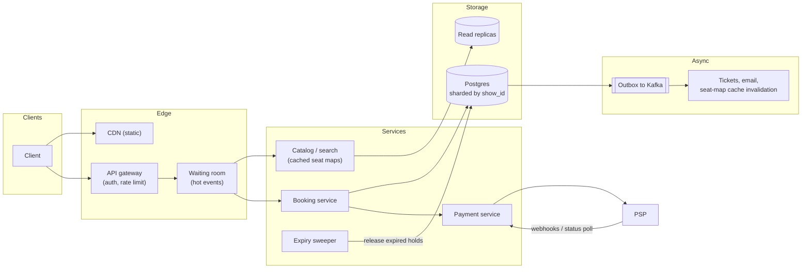
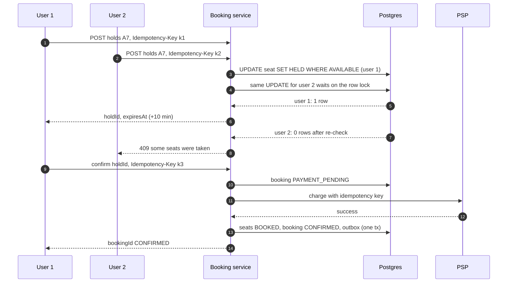
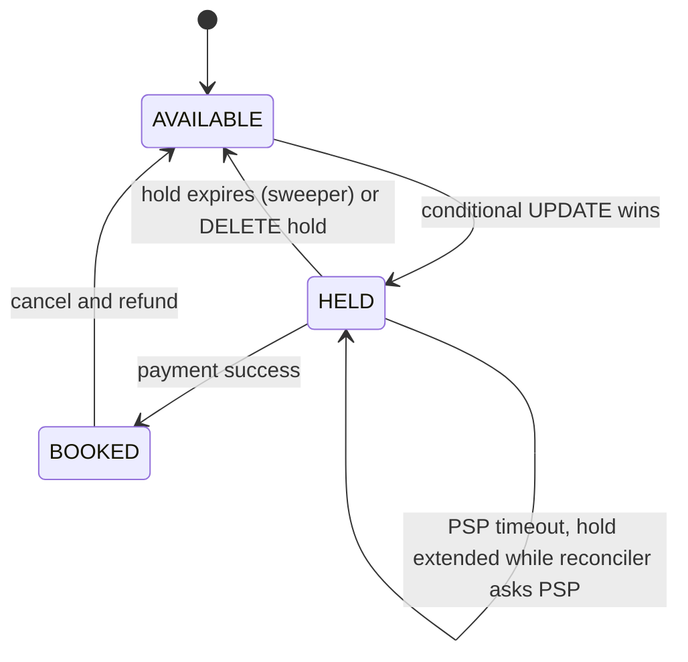

**Short answer:** Split booking into two steps: a short *hold* on specific seats, then *confirm* after payment. The hold is an atomic conditional update in the database (`UPDATE seat ... WHERE status = 'AVAILABLE'`), so two users can never hold the same seat. Holds expire after a few minutes so abandoned carts free their seats. Dropped requests are handled with idempotency keys on every write and a reconciliation job for payments whose result we never heard.

## Picture it







**How to read it:**
- Steps 1–8: both users race for seat A7. The conditional `UPDATE ... WHERE status = 'AVAILABLE'` takes a row lock, so the second update waits, re-checks the condition after the first commits, and changes 0 rows: a clean 409, never a double booking.
- Each write stores `(Idempotency-Key, response)` in the same transaction, so a retry after a dropped response gets the same hold back.
- Steps 9–14: confirm marks the booking `PAYMENT_PENDING`, charges with an idempotency key the PSP also dedupes on, then books seats and writes the outbox event in one transaction.
- The state picture: an expired hold returns the seat; a payment timeout keeps it held while the reconciler asks the PSP, then confirms or releases.

## Requirements

**Functional**
- Browse events/shows and see a seat map with live availability.
- Select seats, hold them for ~10 minutes, pay, get a confirmed ticket.
- Cancel and refund.

**Non-functional**
- No double booking, ever. This is the one strong-consistency requirement.
- Availability reads can be slightly stale (a second or two).
- Survive dropped requests and client retries without double charging or double booking.
- Spiky load: a popular concert opens and 1M users arrive in a minute.

## Estimates

- 10M bookings/day ≈ 115/s average; peak on-sale 10–50k hold attempts/s for one event.
- Reads (seat maps) are 10–100× writes.
- A seat row is ~100 bytes. A stadium of 80k seats ≈ 8 MB. Even a year of shows fits a sharded Postgres easily.

## API

```text
GET  /shows/{showId}/seats                      -> seat map (cached, 1–2 s stale)
POST /shows/{showId}/holds   Idempotency-Key: k  { seatIds[] } -> { holdId, expiresAt }
POST /holds/{holdId}/confirm Idempotency-Key: k  { paymentToken } -> { bookingId, status }
DELETE /holds/{holdId}
POST /bookings/{bookingId}/cancel
```

## Data model

```sql
show(id PK, event_id, venue_id, starts_at)
seat(show_id, seat_id, status, hold_id, held_until, booking_id, version,
     PRIMARY KEY (show_id, seat_id))        -- status: AVAILABLE, HELD, BOOKED
hold(id PK, show_id, user_id, expires_at, state)          -- ACTIVE, CONFIRMED, EXPIRED
booking(id PK, hold_id UNIQUE, user_id, show_id, amount, state, payment_id)
idempotency(key PK, user_id, request_hash, response, created_at)
```

Shard by `show_id`: every seat of one show is on one shard, so a hold is a single-shard transaction.

## Architecture

The diagram in **Picture it** above shows the components (the sweeper releases holds where `held_until < now()`).

## Deep dives

**1. The seat race.** Two users click seat A7 at the same moment. Use one atomic statement for all requested seats:

```sql
UPDATE seat
SET status = 'HELD', hold_id = :holdId, held_until = now() + interval '10 minutes'
WHERE show_id = :showId AND seat_id = ANY(:seatIds)
  AND (status = 'AVAILABLE' OR (status = 'HELD' AND held_until < now()));
```

If the updated row count is less than the number of seats asked for, roll back the transaction and return 409 "some seats were taken". The row lock taken by the UPDATE serialises the two users; the second one sees the new status after the first commits (in Read Committed, Postgres re-checks the WHERE on the updated row). Alternatives: `SELECT ... FOR UPDATE` then update (same effect, more round-trips), or optimistic locking with a `version` column (good when contention is low; for a hot on-sale, the conditional update is simpler). For general admission (no seat numbers) use a counter: `UPDATE inventory SET available = available - :n WHERE show_id = :id AND available >= :n`.

**2. Dropped requests.** The client sends a hold, the network drops the response, the client retries. Every write carries an `Idempotency-Key`. The server stores `(key, request hash, response)` in the same transaction as the hold. A retry with the same key returns the stored response instead of holding new seats. Same key with a different body is a 422. For confirm, the key is passed on to the payment provider, so the PSP also deduplicates the charge.

**3. Payment lifecycle and unknown outcomes.** Confirm flow: mark booking `PAYMENT_PENDING` → call PSP with idempotency key → on success, in one transaction set seats `BOOKED` and booking `CONFIRMED` → publish via outbox. If the PSP call times out, we do not know if money moved. Do not release the seats yet. Keep the booking `PAYMENT_PENDING`, extend the hold, and let a reconciler query the PSP by idempotency key (or wait for its webhook). If paid: confirm. If not: release. If the hold expired and the seats went to someone else while the payment later succeeded, refund automatically. That case should be rare because the hold is extended while payment is pending.

**4. Hot on-sale.** A virtual waiting room (queue with tokens) admits users at the rate the booking shard can handle. Seat maps are served from cache with short TTL; the hold itself always goes to the primary.

## Trade-offs

- **Pessimistic (row lock) vs optimistic (version):** locks are simple and correct under heavy contention; optimistic gives better throughput when collisions are rare but forces retries in a rush.
- **Holds in Redis vs Postgres:** Redis `SET seat:A7 holdId NX PX 600000` is very fast and expiry is built in, but now two stores must agree. Keeping holds in Postgres keeps one source of truth; use Redis only if the database is the measured bottleneck.
- **Stale seat map:** users may click a seat that was just taken. That is acceptable; the hold call is authoritative and returns a clear 409.

## Follow-ups

- *Hold expires during payment?* Extend the hold when payment starts; the sweeper skips holds with a pending payment.
- *Server crashes after charging but before writing BOOKED?* The reconciler finds `PAYMENT_PENDING` bookings older than N seconds and asks the PSP, then completes or refunds.
- *How do clients see seats freeing up?* Cache invalidation via outbox events, optionally pushed over SSE/WebSocket.
- *Exactly-once?* Not end to end. At-least-once delivery plus idempotent handlers gives the same visible result.

Related lessons: [Q6 · Transactions, isolation, locking and MVCC](../academy/lessons/Q6.md), [Q8 · Scaling databases](../academy/lessons/Q8.md), [F4 · Case studies: URL shortener, rate limiter, notification system](../academy/lessons/F4.md).
