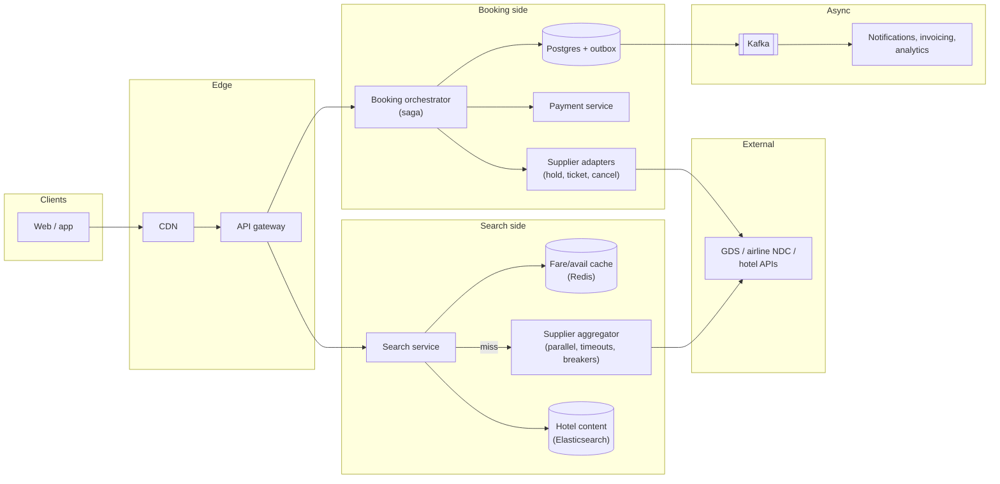
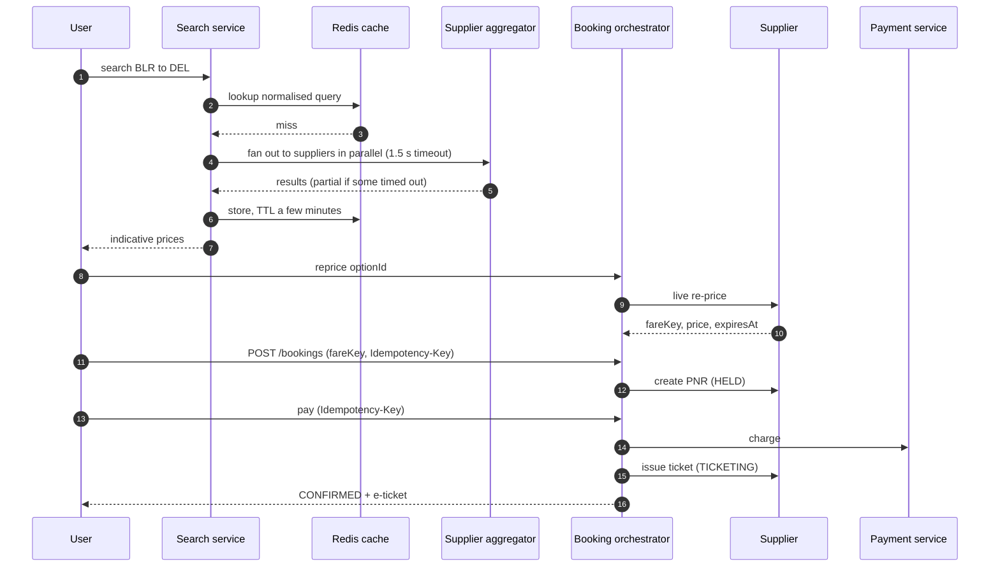
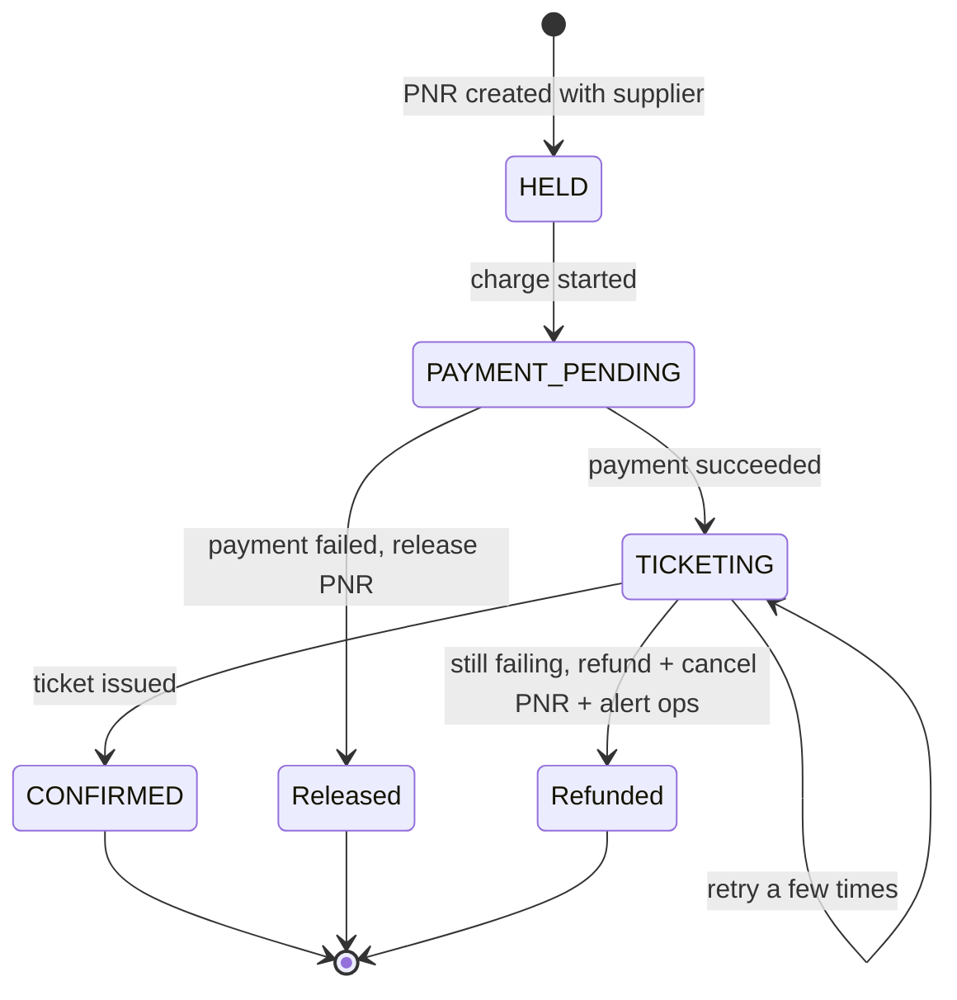

**Short answer:** A travel site is two very different systems. *Search* is read-heavy, latency-sensitive and fans out to many external suppliers (airline GDSs, hotel channel managers), so it lives on aggressive caching of fares and availability. *Booking* is low-volume but must be correct: re-price the chosen option live, hold it with the supplier, take payment, then confirm, using a saga with compensations because no single transaction spans our database, the supplier and the payment provider.

## Picture it







**How to read it:**
- Steps 1–7: search is cache-first. On a miss the aggregator fans out to suppliers in parallel with a hard timeout and returns what came back; prices shown are only indicative.
- Steps 8–10: before booking, a live re-price returns the only binding price as a short-lived `fareKey`.
- Steps 11–16: the booking is a saga. Each step's status is saved before the call, so a crashed orchestrator resumes from where it was.
- The state picture shows the compensations: payment failure releases the PNR; ticketing failure after payment ends in a refund, so nobody is charged without a ticket.

## Requirements

**Functional**
- Search flights (one-way, return, multi-city) and hotels by city, dates, guests; filter and sort.
- See a price, re-validate it, book, pay, get a PNR / confirmation and e-ticket.
- Manage bookings: view, cancel, refund.

**Non-functional**
- Search p95 under ~2 s even though suppliers are slow.
- Booking correctness: never charge without a confirmed ticket, or refund automatically.
- High availability for search; strong consistency for the booking record.
- Look-to-book ratio is very high (hundreds or thousands of searches per booking).

## Estimates

- 50M searches/day ≈ 600/s average, 3–5k/s at peak (sales, holidays).
- Look-to-book ~1000:1 ⇒ ~50k bookings/day ≈ 0.6/s. Booking load is tiny; search is the scaling problem.
- Each flight search may fan out to 5–20 suppliers. Without caching that is 10k+ supplier calls/s, which suppliers will not allow (they charge or throttle). So a cache hit rate of 80–90% is a requirement, not an optimisation.

## API

```text
GET  /flights/search?from=BLR&to=DEL&date=2026-12-20&pax=2&cabin=Y  -> { searchId, results[] (paged) }
POST /flights/reprice      { searchId, optionId }                -> { fareKey, price, expiresAt }
POST /bookings             Idempotency-Key  { fareKey, travellers[], contact } -> { bookingId, status: HELD }
POST /bookings/{id}/pay    Idempotency-Key  { paymentToken }     -> { status }
GET  /bookings/{id}
POST /bookings/{id}/cancel
```

## Data model

```sql
-- booking side: Postgres, strong consistency
booking(id PK, user_id, type, status, total_amount, currency, supplier, supplier_ref /*PNR*/, created_at)
booking_item(id PK, booking_id, segment_or_room json, fare_key, price)
traveller(id PK, booking_id, name, dob, doc_number_encrypted)
payment(id PK, booking_id, psp_ref, amount, status, idempotency_key UNIQUE)
booking_event(id PK, booking_id, from_status, to_status, at, detail)   -- audit trail

-- search side: cache / NoSQL
fare_cache key = (origin, dest, date, cabin, pax) -> [options], TTL minutes
hotel_avail key = (hotel_id, date)                -> {room_type: price, rooms_left}, TTL minutes
hotel_static (Elasticsearch): name, geo, amenities, rating  -- rarely changes
```

## Architecture

The diagram in **Picture it** above shows the components.

## Deep dives

**1. Search fan-out and caching.** The aggregator calls suppliers in parallel with a hard timeout (say 1.5 s) and returns whatever came back, marking the result as partial if some timed out. Each supplier sits behind a circuit breaker and a rate limiter, because their quotas are contractual. Results go into a cache keyed by the normalised query, with a TTL of a few minutes for popular routes. Popular routes can be pre-warmed. Cached prices are *indicative*; the only binding price is the one from re-price.

**2. Price changes between search and book.** Fares change constantly. Before booking, call the supplier's re-price for that specific option. If the price went up, show the new price and ask the user to accept. The re-price returns a `fareKey` that is valid for a few minutes, and the booking uses that.

**3. Booking saga.** No distributed transaction is possible across supplier, PSP and our DB. Steps, each recorded in `booking.status` before the call:
1. `HELD`: create the PNR with the supplier (seats held, not ticketed).
2. `PAYMENT_PENDING` → charge the card with an idempotency key.
3. `TICKETING` → ask the supplier to issue the ticket.
4. `CONFIRMED`.

Compensations: payment fails → release the PNR. Ticketing fails after payment → retry a few times, then refund and cancel the PNR, and alert operations. A crashed orchestrator resumes from the persisted status. Timeouts with unknown outcomes are resolved by querying the supplier or PSP by reference, never by blindly retrying a non-idempotent call.

**4. Inventory accuracy for hotels.** Hotels push availability updates (ARI: availability, rates, inventory) through channel managers. We store them and still confirm with the hotel at booking time. Overbooking risk is accepted and handled by the supplier contract.

## Trade-offs

- **Cache freshness vs supplier cost:** longer TTL means more "price changed" surprises at re-price; shorter TTL means more supplier cost and slower search. Tune per route popularity.
- **Partial results vs completeness:** returning in 2 s with 80% of suppliers beats waiting 8 s for all.
- **Saga vs 2PC:** suppliers do not support 2PC; a saga with an explicit state machine and compensations is the only realistic option.
- **One booking DB vs per-product services:** start with one booking service for flights and hotels; split when teams and products grow.

## Follow-ups

- *How do you rank results?* Price, duration, stops, plus business signals (margin, conversion rate). Keep the ranking service separate so it can change without touching the aggregator.
- *Double click on "Pay"?* The idempotency key on `/pay` and a unique constraint on `payment.idempotency_key` make the second call return the first result.
- *PII?* Encrypt passport numbers at rest, restrict access, and purge after the retention period.
- *Multi-region?* Search is stateless and cache-based, so run it in every region. Keep the booking DB with one primary region per user or booking, plus a replica for failover.

Related lessons: [F1 · Building blocks](../academy/lessons/F1.md), [S9 · Cloud native & event-driven systems](../academy/lessons/S9.md), [Q8 · Scaling databases](../academy/lessons/Q8.md).
