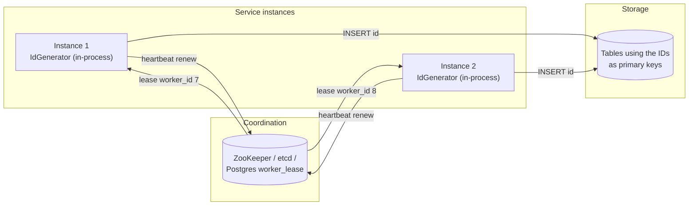
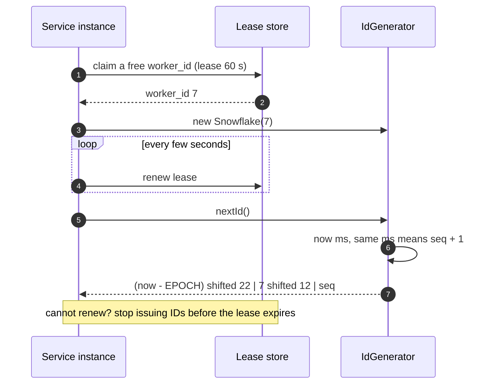
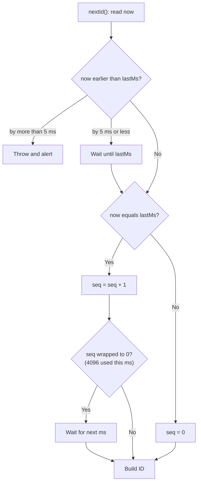

**Short answer:** Use a Snowflake-style 64-bit ID generated locally inside each service instance: 41 bits of milliseconds since a custom epoch, 10 bits of worker ID, 12 bits of per-millisecond sequence. No network call per ID, so there is no latency bottleneck and no single point of failure. IDs are roughly time-ordered (k-sorted). The hard parts are assigning unique worker IDs and handling clocks that move backwards.

## Picture it







**How to read it:**
- Steps 1–3: at startup each instance leases a unique `worker_id` (0–1023) from ZooKeeper, etcd or a Postgres row. This is the only coordination, and it happens once, not per ID.
- Steps 4–5: the instance keeps renewing the lease; if it cannot, it must stop generating, or two instances could share a worker ID and produce duplicates.
- Steps 6–8: `nextId()` is purely local: timestamp, worker ID and a per-millisecond sequence packed into one `long`, so there is no network call and no single point of failure.
- The last picture is the clock logic: small backward steps are waited out, large ones refuse to generate, and a full sequence waits for the next millisecond.

## Requirements

**Functional**
- `nextId()` returns a unique 64-bit integer.
- IDs sort roughly by creation time.

**Non-functional**
- Very high throughput (millions per second across the fleet), sub-millisecond latency.
- Highly available: generation must not depend on a central service per call.
- Fits in a `long`/`BIGINT` so it indexes well in a database.

Out of scope unless asked: strictly gap-free IDs, and strict global ordering (that would need a single sequencer).

## Estimates

- 12-bit sequence ⇒ 4,096 IDs per millisecond per worker ⇒ ~4M IDs/s per worker.
- 10-bit worker ID ⇒ 1,024 workers ⇒ ~4 billion IDs/s fleet-wide in theory.
- 41-bit timestamp in ms ⇒ 2^41 ms ≈ 69.7 years from the chosen epoch.

## API

Usually a library, not a service:

```java
public interface IdGenerator { long nextId(); }
```

If a central service is required (for example, for non-JVM clients): `GET /ids?count=100` returning a batch, so the network cost is spread over many IDs.

## Data model

```text
 1 bit  | 41 bits                      | 10 bits         | 12 bits
 sign=0 | ms since custom epoch        | worker id       | sequence within the ms
         (e.g. 2024-01-01T00:00Z)        (5 dc + 5 node)
```

Worker leases (only state that needs storing):

```sql
worker_lease(worker_id SMALLINT PK, owner TEXT, lease_until TIMESTAMPTZ)
```

## Architecture

The diagram in **Picture it** above shows the components: an in-process generator per instance, a coordination store that assigns `worker_id` on startup and is renewed by heartbeat, and IDs used directly as primary keys.

## Deep dives

**1. Generation code.**

```java
public final class Snowflake implements IdGenerator {
    private static final long EPOCH = 1_704_067_200_000L; // 2024-01-01T00:00:00Z
    private final long workerId;          // 0..1023
    private long lastMs = -1L;
    private long seq = 0L;

    public Snowflake(long workerId) {
        if (workerId < 0 || workerId > 1023) throw new IllegalArgumentException("workerId");
        this.workerId = workerId;
    }

    @Override
    public synchronized long nextId() {
        long now = System.currentTimeMillis();
        if (now < lastMs) {                       // clock moved back
            if (lastMs - now > 5) throw new IllegalStateException("clock moved back " + (lastMs - now) + " ms");
            now = waitUntil(lastMs);              // small skew: wait it out
        }
        if (now == lastMs) {
            seq = (seq + 1) & 0xFFF;
            if (seq == 0) now = waitUntil(lastMs + 1);   // 4096 used this ms
        } else {
            seq = 0;
        }
        lastMs = now;
        return ((now - EPOCH) << 22) | (workerId << 12) | seq;
    }

    private long waitUntil(long target) {
        long t = System.currentTimeMillis();
        while (t < target) { Thread.onSpinWait(); t = System.currentTimeMillis(); }
        return t;
    }
}
```

`synchronized` is fine: the critical section is a few nanoseconds. For extreme contention, use one generator per thread with distinct worker IDs, or a CAS loop on a packed `AtomicLong`.

**2. Assigning worker IDs.** Two instances with the same worker ID will produce duplicates, so this is the real correctness risk. Options: a static config per host (simple, error-prone with autoscaling); a lease from ZooKeeper/etcd (ephemeral node or lease with TTL, renewed by heartbeat); or a row lock in Postgres (`UPDATE worker_lease SET owner=?, lease_until=now()+'60s' WHERE worker_id=? AND lease_until < now()`). If an instance cannot renew its lease, it must stop issuing IDs before the lease expires. In Kubernetes, a StatefulSet ordinal is a simple source of a stable worker ID.

**3. Clock going backwards.** NTP can step the clock back. Small steps: wait. Large steps: refuse to generate and alert, because generating would risk duplicates. Persisting `lastMs` periodically protects against a restart into a past time.

## Trade-offs

| Option | Pros | Cons |
|---|---|---|
| UUIDv4 (random 128-bit) | No coordination at all | 128 bits, random order hurts B-tree index locality |
| UUIDv7 (RFC 9562) | Time-ordered, no worker IDs needed | 128 bits; ordering within a ms depends on the implementation |
| DB sequence / auto-increment | Simple, strictly increasing | Central bottleneck and SPOF; cross-shard needs offsets |
| Segment / range allocation (fetch blocks of 1,000 from a DB) | Short IDs, low DB load | IDs not time-ordered across nodes; lost ranges on crash |
| Snowflake | 64-bit, k-sorted, local, fast | Needs worker-ID management and clock discipline |

Time-ordered IDs make inserts append to the right edge of the B-tree, which keeps index pages hot and cuts page splits compared with random UUIDs.

## Follow-ups

- *Is it strictly ordered?* No. Within one worker, yes. Across workers, only to within clock skew. If strict global order is required, you need a single sequencer (or consensus), which costs throughput and availability.
- *Do IDs leak information?* Yes: creation time and rough volume. Do not expose them where that matters; map to an opaque public ID.
- *JavaScript clients?* JS numbers are exact only up to 2^53, so send 64-bit IDs as strings in JSON.
- *Need more than 4,096 per ms per node?* Borrow bits: fewer worker bits, more sequence bits, or a coarser timestamp unit.

Related lessons: [F2 · Distributed theory: CAP, consistency, consensus](../academy/lessons/F2.md), [B3 · Atomics, CAS and concurrent collections](../academy/lessons/B3.md), [Q5 · Indexes and reading EXPLAIN](../academy/lessons/Q5.md).
