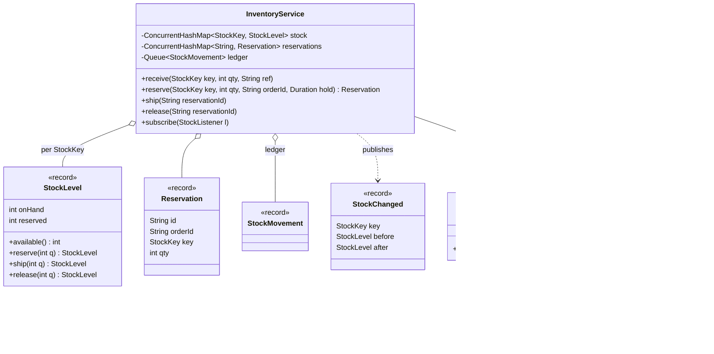
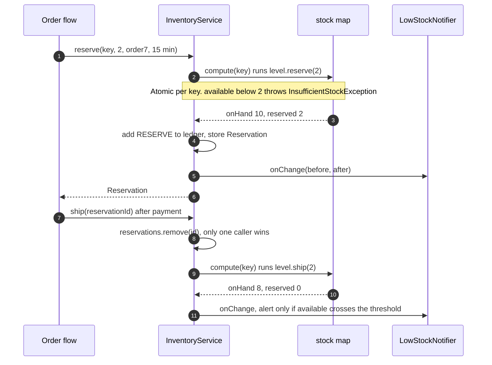

**Short answer:** Model stock per (SKU, warehouse) as two numbers, `onHand` and `reserved`, so `available = onHand - reserved`. Orders first **reserve** stock, then **ship** (commit) or **release** it, which is what stops overselling while payment is pending. Every change goes through one `InventoryService` that updates the stock record atomically (`ConcurrentHashMap.compute` in memory, a conditional `UPDATE` in a database) and writes a movement to a ledger. Low-stock alerts are observers that fire after the change commits.

## Picture it





**How to read it:**
- Stock for each (SKU, warehouse) is one immutable `StockLevel` with `onHand` and `reserved`; `available` is the difference.
- An order first reserves, which holds stock while payment runs; then it ships (stock leaves) or releases (hold dropped).
- Every change is a `compute` on that key, so two orders for the last unit run one after the other and the second one fails.
- Each change also appends a `StockMovement` to the ledger and then tells `StockListener`s; `LowStockNotifier` alerts only when the threshold is crossed.

## Requirements

- Products (SKU, name), warehouses, and stock levels per SKU per warehouse.
- Operations: `receive` (inbound shipment), `reserve` (order placed), `release` (order cancelled or reservation expired), `ship` (order fulfilled), `adjust` (cycle count found a difference), `transfer` between warehouses.
- Never let available stock go below zero, even with many concurrent orders.
- Audit trail: who changed what, when, and why.
- Notify when available stock drops below a reorder threshold.
- 30-minute scope: bins/shelves, batch/expiry tracking and pricing are extensions.

## Classes

- `Sku` and `WarehouseId` (records wrapping strings, so they cannot be mixed up).
- `StockKey` (record `sku, warehouse`).
- `StockLevel` (immutable record `onHand, reserved`) with methods that return a new level or throw `InsufficientStockException`.
- `Reservation` (record): id, order id, key, quantity, expiry.
- `StockMovement` (record): type (`RECEIVE`, `RESERVE`, `RELEASE`, `SHIP`, `ADJUST`), key, delta, reference, timestamp. Append-only ledger.
- `InventoryRepository` (interface): in-memory implementation now, Postgres later.
- `InventoryService`: the only class that changes stock. Validates, updates atomically, records the movement, publishes events.
- `StockListener` (interface) and `LowStockNotifier`: react to `StockChanged` events.

## Patterns used

- **Observer**: listeners get stock events; adding email, Slack or auto-reorder does not touch the service.
- **Repository**: storage is behind an interface, so the in-memory version and the DB version share the service.
- **Immutable value objects** (records) for stock levels: an update is "compute a new value and swap it in", which is easy to make atomic.
- **Event log / ledger**: the movements are the source of truth for audit; the stock level is a running total of them.

## Code

```java
public record Sku(String value) {}
public record WarehouseId(String value) {}
public record StockKey(Sku sku, WarehouseId warehouse) {}

public record StockLevel(int onHand, int reserved) {
    public static final StockLevel EMPTY = new StockLevel(0, 0);
    public int available() { return onHand - reserved; }

    StockLevel receive(int q) { return new StockLevel(onHand + q, reserved); }
    StockLevel reserve(int q) {
        if (available() < q) throw new InsufficientStockException(available(), q);
        return new StockLevel(onHand, reserved + q);
    }
    StockLevel release(int q) { return new StockLevel(onHand, reserved - q); }
    StockLevel ship(int q)    { return new StockLevel(onHand - q, reserved - q); }
}

public record StockChanged(StockKey key, StockLevel before, StockLevel after) {}

public interface StockListener { void onChange(StockChanged e); }

public final class InventoryService {
    private final ConcurrentHashMap<StockKey, StockLevel> stock = new ConcurrentHashMap<>();
    private final ConcurrentHashMap<String, Reservation> reservations = new ConcurrentHashMap<>();
    private final Queue<StockMovement> ledger = new ConcurrentLinkedQueue<>();
    private final List<StockListener> listeners = new CopyOnWriteArrayList<>();
    private final Clock clock;

    public InventoryService(Clock clock) { this.clock = clock; }

    public void subscribe(StockListener l) { listeners.add(l); }

    public void receive(StockKey key, int qty, String ref) {
        change(key, MovementType.RECEIVE, qty, ref, s -> s.receive(qty));
    }

    public Reservation reserve(StockKey key, int qty, String orderId, Duration hold) {
        change(key, MovementType.RESERVE, qty, orderId, s -> s.reserve(qty));   // throws if not enough
        var r = new Reservation(UUID.randomUUID().toString(), orderId, key, qty, clock.instant().plus(hold));
        reservations.put(r.id(), r);
        return r;
    }

    public void ship(String reservationId) {
        Reservation r = reservations.remove(reservationId);        // remove first: only one caller wins
        if (r == null) throw new IllegalStateException("Unknown or already settled reservation");
        change(r.key(), MovementType.SHIP, r.qty(), r.orderId(), s -> s.ship(r.qty()));
    }

    public void release(String reservationId) {
        Reservation r = reservations.remove(reservationId);
        if (r == null) return;                                    // idempotent
        change(r.key(), MovementType.RELEASE, r.qty(), r.orderId(), s -> s.release(r.qty()));
    }

    private void change(StockKey key, MovementType type, int qty, String ref,
                        UnaryOperator<StockLevel> op) {
        if (qty <= 0) throw new IllegalArgumentException("qty must be positive");
        StockLevel[] before = new StockLevel[1];
        // compute runs atomically per key; if op throws, the mapping is left unchanged.
        StockLevel after = stock.compute(key, (k, cur) -> {
            before[0] = cur == null ? StockLevel.EMPTY : cur;
            return op.apply(before[0]);
        });
        ledger.add(new StockMovement(type, key, qty, ref, clock.instant()));
        var event = new StockChanged(key, before[0], after);
        listeners.forEach(l -> l.onChange(event));                // outside compute: no slow work under the bin lock
    }
}

public final class LowStockNotifier implements StockListener {
    private final Map<Sku, Integer> reorderPoint;
    private final Notifier notifier;                              // email, Slack, ...
    public LowStockNotifier(Map<Sku, Integer> reorderPoint, Notifier notifier) {
        this.reorderPoint = Map.copyOf(reorderPoint); this.notifier = notifier;
    }
    public void onChange(StockChanged e) {
        int threshold = reorderPoint.getOrDefault(e.key().sku(), 0);
        // Fire only on the crossing, not on every change below the line.
        if (e.before().available() >= threshold && e.after().available() < threshold)
            notifier.send("Low stock: " + e.key());
    }
}
```

Why there is no oversell: two orders for the last unit both call `reserve`. `compute` runs them one after the other for that key, so the second sees `available = 0` and throws. Different SKUs never block each other.

## Extensions

- **Concurrency in a database:** the same rule as one statement: `UPDATE stock SET reserved = reserved + :q WHERE sku = :s AND warehouse = :w AND on_hand - reserved >= :q`. Zero rows updated means not enough stock. Alternatives: `SELECT ... FOR UPDATE` (pessimistic) or a `version` column (optimistic, retry on conflict). Write the ledger row in the same transaction.
- **Events after commit:** with a database, publish notifications only after the transaction commits (Spring's `@TransactionalEventListener`, or an outbox table), otherwise you can alert about a change that rolled back.
- **Reservation expiry:** a scheduled job scans reservations past `expiresAt` and calls `release`. Because `ship` and `release` both start with `reservations.remove`, a race between a late payment and the expiry job settles exactly once.
- **Transfer between warehouses:** two keys must change together. In memory, reserve at the source, then receive at the destination and ship from the source; each step is atomic and the reservation stops double use. In a database, one transaction, locking rows in a fixed order (by key) to avoid deadlock.
- **Bins and batches:** add `Location` (aisle, shelf, bin) under the warehouse and lot numbers with expiry dates; picking then becomes a strategy (FIFO, FEFO: first expiry, first out).
- **Choosing a warehouse for an order:** a `FulfilmentStrategy` (nearest with stock, fewest splits).

Deeper reading: [B3 · Atomics, CAS and concurrent collections](../academy/lessons/B3.md), [Q6 · Transactions, isolation, locking and MVCC](../academy/lessons/Q6.md), [E4 · Behavioural patterns](../academy/lessons/E4.md).
