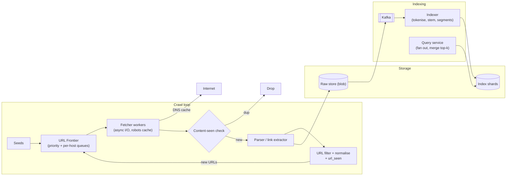
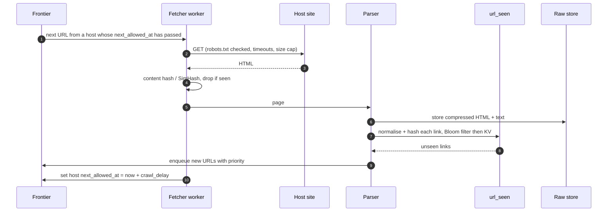
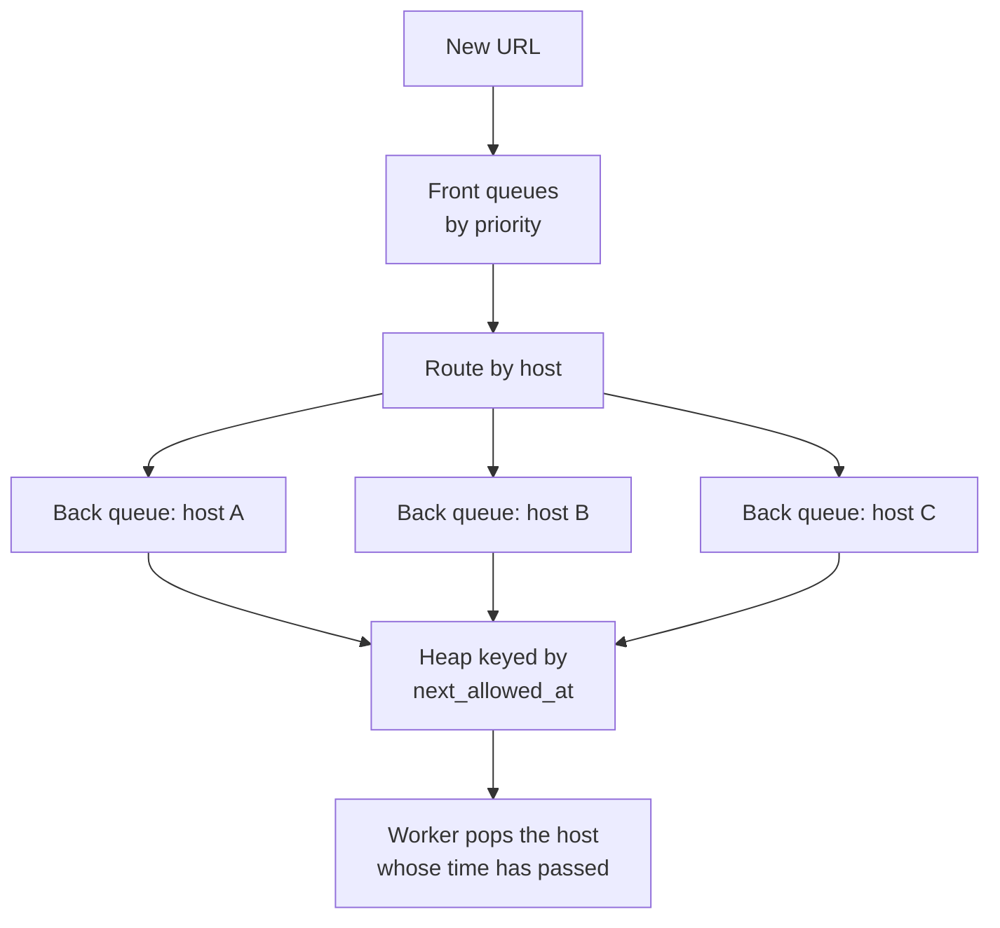

**Short answer:** A crawler is a loop: take a URL from the frontier, fetch it politely, parse it, store the content, extract links, deduplicate them, and push new ones back into the frontier. At scale the frontier is partitioned by host so one worker owns each host (which makes politeness and robots.txt easy), and URL-seen and content-seen checks keep the loop from exploding. The fetched pages then feed an indexing pipeline that tokenises them and builds an inverted index: term → sorted list of document IDs with positions, sharded by document.

## Picture it







**How to read it:**
- Steps 1–3: the frontier only hands out a URL whose host is allowed to be contacted now, and the fetcher respects robots.txt, timeouts and size caps.
- Steps 4–6: duplicate content is dropped; new pages are stored in the blob store, which feeds Kafka and the indexer.
- Steps 7–9: links are normalised and checked against `url_seen` (Bloom filter in front), and only unseen ones go back into the frontier, which keeps the loop from exploding.
- Step 10 and the last picture: per-host back queues plus a heap of `next_allowed_at` make politeness a local decision. Hosts are split across machines by `hash(host)`.

## Requirements

**Functional**
- Start from seed URLs, crawl HTML pages, follow links.
- Respect robots.txt and per-host rate limits.
- Recrawl pages based on how often they change.
- Build an inverted index for keyword search over crawled pages.

**Non-functional**
- Scale: billions of pages; throughput of thousands of pages per second.
- Polite: never overload a single site.
- Robust against spider traps, huge pages, malformed HTML, slow servers.
- Extensible: new content types or parsers can be added.

## Estimates

- Target 1B pages/month ≈ 400 pages/s average; plan for ~1,000/s.
- Average page ~100 KB HTML (compressed ~20 KB stored) ⇒ 1B × 100 KB = 100 TB raw per month; ~20 TB compressed.
- Each page has ~50 links ⇒ 50B link discoveries/month to dedupe; most are already seen. A URL-seen store of ~10B URLs × 8-byte fingerprint ≈ 80 GB, sharded.
- Inverted index is typically a fraction of the raw text size after compression; shard it across many machines.

## API

Internal interfaces rather than a public API:

```text
Frontier.enqueue(url, priority)      Frontier.next(workerId) -> url
Fetcher.fetch(url) -> {status, headers, body}
Indexer.index(docId, url, text)
Search: GET /search?q=distributed+cache&page=1  -> ranked [ {url, title, snippet} ]
```

## Data model

```text
url_seen:      fingerprint(normalised url) -> {last_crawled, next_crawl, status}   (sharded KV)
content_seen:  simhash/hash(content) -> doc_id                                     (sharded KV)
documents:     doc_id -> {url, fetched_at, compressed_html, extracted_text}       (blob store)
host_state:    host -> {robots_rules, robots_fetched_at, crawl_delay, next_allowed_at}
inverted index (per shard): term -> posting list [(doc_id, tf, positions[]), ...] sorted by doc_id
doc store for ranking: doc_id -> {url, title, pagerank, length}
```

## Architecture

The diagram in **Picture it** above shows the components.

## Deep dives

**1. The frontier and politeness.** Use the classic two-level design (as in the Mercator crawler). *Front queues* order URLs by priority (PageRank estimate, freshness need). *Back queues* are one per host; a host is mapped to exactly one back queue, and a heap tracks the earliest time each host may be contacted again. A worker pops the host whose `next_allowed_at` has passed, fetches one URL, then sets `next_allowed_at = now + crawl_delay`. Partition hosts across crawler machines by `hash(host)`, so politeness is a local decision and robots.txt is cached in one place.

**2. Deduplication.** URL-level: normalise (lowercase host, drop default port, remove fragments, sort or strip tracking params) then hash; check a sharded KV store with a Bloom filter in front to skip most lookups. Content-level: exact hash catches mirrors; SimHash (near-duplicate fingerprint, compare by Hamming distance) catches pages that differ only in ads or timestamps.

**3. Traps and robustness.** Cap URL length and path depth, cap pages per host per crawl cycle, cap download size, use timeouts on connect and read. Detect calendar-style infinite URL spaces by per-host URL pattern counts. Fetchers use non-blocking I/O (or Java 21 virtual threads) since the work is almost all waiting on the network.

**4. Inverted index.** For each document: extract text, tokenise, lowercase, optionally stem, drop very common stop words. Emit `(term, doc_id, position)` and group by term, so each term has a posting list sorted by doc_id. Sorting lets you intersect lists for AND queries with a linear merge and compress gaps between doc IDs (delta + variable-byte encoding). Build immutable *segments* in batches and merge them in the background (the Lucene model), instead of updating one giant index in place. Shard **by document**: each shard indexes a subset of docs; a query fans out to all shards, each returns its top-k by BM25 plus link signals, and the query service merges. Sharding by term makes multi-term queries cross shards and creates hot shards for common terms.

**5. Recrawl.** Track how often each page changed across visits and schedule `next_crawl` adaptively: news front pages every few minutes, static docs every few weeks. Use conditional GET (`If-Modified-Since`, `ETag`) to save bandwidth.

## Trade-offs

- **BFS vs priority crawl:** BFS is simple; priority by importance gets good pages first, which matters when you can never crawl everything.
- **Bloom filter for url_seen:** small and fast, but false positives mean a few new URLs are never crawled. Usually acceptable; back it with the exact store if not.
- **Document- vs term-partitioned index:** document partitioning gives even load and simple updates at the cost of fan-out on every query.
- **Rendering JavaScript:** headless browsers find more content but cost 10–100× more per page; use them only for sites that need it.

## Follow-ups

- *A worker dies mid-crawl?* Frontier entries are leased, not deleted; an unacked lease returns to the queue after a timeout. Fetching twice is harmless because downstream is deduplicated.
- *Freshness of the index?* Small, frequent segments for fresh content plus periodic big merges.
- *Phrase queries?* Use positions in the posting list: documents where term positions are consecutive.
- *Multi-language?* Language detection before tokenisation; per-language analysers.

Related lessons: [F1 · Building blocks](../academy/lessons/F1.md), [F3 · The system design method and estimation](../academy/lessons/F3.md), [B6 · Virtual threads and structured concurrency](../academy/lessons/B6.md).
