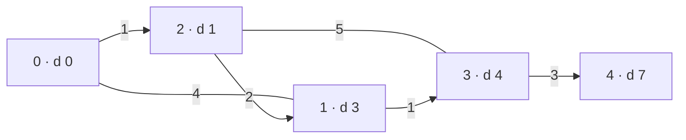

**Short answer:** With non-negative weights, use Dijkstra's algorithm. Keep the best known distance to every vertex and a min-heap of `(distance, vertex)`. Repeatedly take the closest unfinished vertex and relax its edges: if going through it gives a neighbour a shorter distance, update it and push it on the heap. When the target is popped, its distance is final. Time O((V + E) log V).

## Picture it

Example 1, `source = 0`, `target = 4`. Labels show the final distance; the shortest path is 0 → 2 → 1 → 3 → 4.



| Step | Pop (d, v) | Stale? | Improvements pushed | `dist` [0..4] after |
|---|---|---|---|---|
| 1 | (0, 0) | no | 1 → 4, 2 → 1 | [0, 4, 1, ∞, ∞] |
| 2 | (1, 2) | no | 1 → 3 (via 2), 3 → 6 | [0, 3, 1, 6, ∞] |
| 3 | (3, 1) | no | 3 → 4 (via 1) | [0, 3, 1, 4, ∞] |
| 4 | (4, 1) | yes, `dist[1] = 3` | – | unchanged |
| 5 | (4, 3) | no | 4 → 7 | [0, 3, 1, 4, 7] |
| 6 | (6, 3) | yes, `dist[3] = 4` | – | unchanged |
| 7 | (7, 4) | no, it is the target | return **7** | – |

The two entries with distance 4 may leave the heap in either order. The result is the same.

**The picture in one sentence:** always finalise the closest unfinished vertex, push a fresh heap entry on every improvement, and skip old entries when they surface.

## Approach

- **Brute force:** try every simple path with DFS and keep the cheapest. Exponential.
- **BFS?** Only correct when all edges have the same weight. Weighted edges break it.
- **Key insight (greedy):** with non-negative weights, the unvisited vertex with the smallest tentative distance cannot be improved later. Any other route to it goes through a vertex that is already at least as far. So we can finalise vertices in increasing order of distance.
- **Optimal:** Dijkstra with a binary heap. Java's `PriorityQueue` has no decrease-key, so push a new entry on every improvement and skip *stale* entries when popped (`d > dist[u]`). Stop early when the target is popped.

Build an adjacency list with each undirected edge added in both directions. Use `long` for distances because the sum can exceed `int`.

## Solution

```java
import java.util.*;

class Solution {
    public long shortestPath(int n, int[][] edges, int source, int target) {
        List<List<int[]>> adj = new ArrayList<>(n);
        for (int i = 0; i < n; i++) adj.add(new ArrayList<>());
        for (int[] e : edges) {
            adj.get(e[0]).add(new int[] {e[1], e[2]});
            adj.get(e[1]).add(new int[] {e[0], e[2]});
        }
        long[] dist = new long[n];
        Arrays.fill(dist, Long.MAX_VALUE);
        dist[source] = 0;
        PriorityQueue<long[]> pq = new PriorityQueue<>(Comparator.comparingLong(a -> a[0]));
        pq.add(new long[] {0, source});
        while (!pq.isEmpty()) {
            long[] top = pq.poll();
            long d = top[0];
            int u = (int) top[1];
            if (d > dist[u]) continue;          // stale entry
            if (u == target) return d;          // first pop of target is final
            for (int[] edge : adj.get(u)) {
                int v = edge[0];
                long nd = d + edge[1];
                if (nd < dist[v]) {
                    dist[v] = nd;
                    pq.add(new long[] {nd, v});
                }
            }
        }
        return -1;                              // target unreachable
    }
}
```

The reference solution stores the graph in flat arrays (`head`, `next`, `to`, `wt`) to avoid many small objects. Same algorithm, less memory.

## Complexity

- **Time:** O((V + E) log V). Each edge can push at most one heap entry, so the heap holds O(E) entries and each push or pop costs O(log E) = O(log V).
- **Space:** O(V + E) for the adjacency list, the distance array and the heap.

## Edge cases

- `source == target`: return 0 straight away (the first pop handles it).
- Target in another component: the heap empties, return -1.
- Parallel edges between the same pair: relaxation keeps the cheaper one automatically.
- Self-loops and zero-weight edges: harmless with non-negative weights.
- Large sums: use `long`.

## Variations

- **Return the path itself:** keep `parent[v] = u` on every successful relaxation, then walk back from the target.
- **Negative weights:** Dijkstra is wrong. Use Bellman-Ford, O(V·E), which also detects negative cycles.
- **All pairs on a small graph:** Floyd-Warshall, O(V³).
- **Weights only 0 or 1:** 0-1 BFS with a deque, O(V + E).
- **Dense graph:** the array-based O(V²) version without a heap can be faster.

Practise it in the app: Run / Submit on this page.
