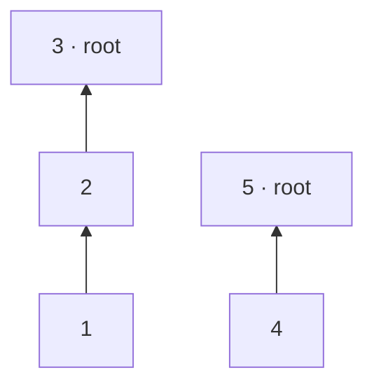

**Short answer:** Build two structures once, in the constructor. A hash set of direct pairs, stored so that order does not matter, answers `areConnected` in O(1). A union-find over the partnerships groups companies into networks. Then `areRelated(x, y)` is "same root and not a direct pair", which is near O(1) with path compression.

## Picture it

Example 1: partnerships `[[1,2],[2,3],[4,5]]`. After the constructor, `direct = {(1,2), (2,3), (4,5)}`, and the union-find forest looks like this (arrows point to the parent):



| Query | Direct-set lookup | Roots | Returns |
|---|---|---|---|
| areConnected(1, 2) | key (1,2) found | – | true |
| areRelated(1, 2) | (1,2) found, so it is direct | – | false |
| areRelated(1, 3) | key (1,3) missing | find(1) walks 1 → 2 → 3 and compresses 1 → 3; find(3) = 3 | true |
| areConnected(3, 1) | key (1,3) missing (min/max makes the order irrelevant) | – | false |
| areRelated(1, 4) | key (1,4) missing | find(1) = 3, find(4) = 5 | false |

**The picture in one sentence:** "direct" is a pair lookup in a set and "same network" is a union-find root check, so `areRelated` is "same root but not in the set".

## Approach

- **Brute force:** keep an adjacency list. `areConnected` checks the list, and `areRelated` runs a BFS/DFS from `x` looking for `y`. Each query costs O(V + E), which is too slow for 10⁴ queries on a large graph.
- **Key insight:** the two questions are different. "Direct" is just a lookup of a pair. "Same network" is connectivity, and it never changes after construction, so we can precompute it. Union-find (or a single BFS that labels components) gives every company a component.
- **Optimal:** in the constructor, add each pair to a `Set<Long>` and `union` the two ids. The key packs `{min, max}` into one `long`, so `(1,2)` and `(2,1)` match. Ids go up to 10⁹, so the parent structure is a `HashMap`, not an `int[]`. An id we have never seen is its own root.

## Solution

```java
import java.util.*;

class PartnerNetwork {
    private final Set<Long> direct = new HashSet<>();
    private final Map<Integer, Integer> parent = new HashMap<>();

    public PartnerNetwork(int[][] partnerships) {
        for (int[] p : partnerships) {
            direct.add(key(p[0], p[1]));
            union(p[0], p[1]);
        }
    }

    public boolean areConnected(int x, int y) {
        return direct.contains(key(x, y));
    }

    public boolean areRelated(int x, int y) {
        return !areConnected(x, y) && find(x) == find(y);
    }

    // Order-independent key for the pair {x, y}.
    private static long key(int x, int y) {
        int a = Math.min(x, y), b = Math.max(x, y);
        return ((long) a << 32) | (b & 0xffffffffL);
    }

    private int find(int x) {
        Integer p = parent.get(x);
        if (p == null) return x;                 // never seen: its own network
        int root = x;
        while (parent.get(root) != root) root = parent.get(root);
        while (x != root) {                      // path compression
            int nx = parent.get(x);
            parent.put(x, root);
            x = nx;
        }
        return root;
    }

    private void union(int a, int b) {
        parent.putIfAbsent(a, a);
        parent.putIfAbsent(b, b);
        int ra = find(a), rb = find(b);
        if (ra != rb) parent.put(ra, rb);
    }
}
```

`parent.get(root) != root` compares an `Integer` with an `int`. Java unboxes the `Integer`, so this compares values, not references.

## Complexity

- **Build:** O(P · α(N)) for P partnerships, which is effectively linear.
- **Query:** `areConnected` is one hash lookup, O(1) on average. `areRelated` is that lookup plus `find`, which is amortised near-O(1) because of path compression. Adding union by size/rank makes the α(N) bound strict.
- **Space:** O(P) for the pair set and the parent map.

## Edge cases

- Duplicate or reversed partnerships (`[7,8]`, `[8,7]`): the set removes the duplicate and the second union does nothing.
- An id that never appears is not in `parent`. `find` returns the id itself, so that company is related to nobody.
- A direct pair is never "related", even if the two companies are also linked through others.
- Ids go up to 10⁹, so use maps, not arrays.

## Variations

- **Partnerships added online:** union-find already handles this. Call `union` and add the pair to the set.
- **Partnerships removed:** union-find cannot split a set. You can rebuild, process the operations offline in reverse (removals become unions), or use a dynamic connectivity structure.

## Follow-ups

- **Answer both in O(1) after preprocessing:** the pair set already gives O(1) for direct links. For networks, after building, call `find` once on every id and store the result in a `HashMap<Integer, Integer> componentOf`. Then `areRelated` is the set check plus two map lookups, which is O(1) on average with no amortisation. Labelling components with BFS gives the same table.

Related: [C4 · The optimisation playbook](../academy/lessons/C4.md), [C5 · Amortised analysis](../academy/lessons/C5.md).

Practise it in the app: Run / Submit on this page.
