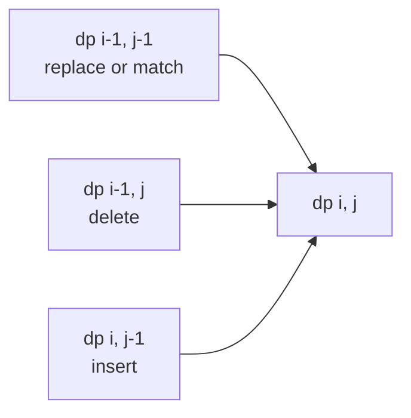

**Short answer:** This is a classic DP. `dp[i][j]` is the edit distance between the first `i` characters of `word1` and the first `j` characters of `word2`. If the last characters match, `dp[i][j] = dp[i−1][j−1]`. Otherwise it is `1 + min(replace dp[i−1][j−1], delete dp[i−1][j], insert dp[i][j−1])`. The base cases are `dp[i][0] = i` and `dp[0][j] = j`. It runs in O(m·n) time and O(n) space with two rows.

## Picture it

`word1 = "horse"` (rows), `word2 = "ros"` (columns). The filled table:

| dp | "" | r | o | s |
|---|---|---|---|---|
| "" | 0 | 1 | 2 | 3 |
| h | 1 | 1 | 2 | 3 |
| o | 2 | 2 | **1** | 2 |
| r | 3 | **2** | 2 | 2 |
| s | 4 | 3 | 3 | **2** |
| e | 5 | 4 | 4 | **3** |

Each cell depends on three neighbours: diagonal up-left (replace, or free when the letters match), up (delete) and left (insert).



A few cells worked out:
- `dp[o][o] = 1`: the letters match, so copy the diagonal `dp[h][r] = 1`.
- `dp[r][r] = 2`: match, copy the diagonal `dp[o][""] = 2`.
- `dp[s][s] = 2`: match, copy the diagonal `dp[r][o] = 2`.
- `dp[e][s] = 3`: `e ≠ s`, so 1 + min(diag 3, up 2, left 4) = 3. That is a delete of `e` after `dp[s][s]`.

**The picture in one sentence:** every cell is "free if the last letters match, otherwise one edit plus the cheapest of its three neighbours", so the bottom-right corner is the answer.

## Approach

- **Brute force:** recurse on the last characters, and try all three edits when they differ. That branches three ways at each step, roughly O(3^(m+n)).
- **Key insight:** the recursion only ever asks about a pair of prefixes `(i, j)`, and there are only (m+1)(n+1) such pairs. Memoise them or fill a table.
- **What each move means** (comparing `word1[i−1]` with `word2[j−1]`):
  - replace: make the two characters equal, then solve `(i−1, j−1)`;
  - delete from `word1`: solve `(i−1, j)`;
  - insert `word2[j−1]` into `word1`: solve `(i, j−1)`.
- **Optimal:** fill the table row by row. Row `i` needs only row `i−1` and the cell to its left, so two arrays are enough.

## Solution

```java
import java.util.*;

class Solution {
    public int minDistance(String word1, String word2) {
        int m = word1.length(), n = word2.length();
        int[] prev = new int[n + 1], cur = new int[n + 1];
        for (int j = 0; j <= n; j++) prev[j] = j;          // "" -> first j chars: j inserts
        for (int i = 1; i <= m; i++) {
            cur[0] = i;                                     // first i chars -> "": i deletes
            for (int j = 1; j <= n; j++) {
                if (word1.charAt(i - 1) == word2.charAt(j - 1)) cur[j] = prev[j - 1];
                else cur[j] = 1 + Math.min(prev[j - 1], Math.min(prev[j], cur[j - 1]));
            }
            int[] t = prev; prev = cur; cur = t;            // swap rows
        }
        return prev[n];
    }
}
```

## Complexity

- **Time:** O(m·n), with constant work per cell. That is about 250,000 cells at the limits.
- **Space:** O(n) for two rows. If you use the shorter string for the columns, it becomes O(min(m, n)).

## Edge cases

- One or both strings empty: the answer is the length of the other string (the base row and column).
- Identical strings: 0.
- Two strings of the same length with no matching positions: the answer is the length (all replaces).
- After the last swap, the answer is in `prev`, not `cur`. Returning `cur[n]` is a common bug.

## Variations

- **Only insert and delete allowed:** the answer is `m + n − 2·LCS`.
- **Different cost per operation:** put the costs into the recurrence.
- **Reconstruct the edits:** keep the full table and walk back from `(m, n)`.
- **One Edit Distance (is the distance exactly 1?):** a linear two-pointer check, no DP needed.
- **Damerau–Levenshtein:** adds swapping two adjacent characters as a fourth move.

Related: [C2 · Where memory goes in Java solutions](../academy/lessons/C2.md), [C4 · The optimisation playbook](../academy/lessons/C4.md).

Practise it in the app: Run / Submit on this page.
