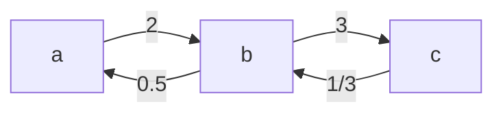

**Short answer:** Model the facts as a weighted graph. `A / B = k` becomes an edge `A → B` with weight `k` and an edge `B → A` with weight `1/k`. To answer `C / D`, search from `C` to `D` and multiply the weights along the path. If either name is unknown, or there is no path, return `-1.0`. The facts are consistent, so every path gives the same product.

## Picture it

Example 1: `a / b = 2`, `b / c = 3`. Each fact gives a forward edge and a reverse edge:



The search for `a / c`:

| Step | Pop (node, product) | Is it `c`? | Pushed (neighbour, product × weight) |
|---|---|---|---|
| 1 | (a, 1) | no | (b, 1 × 2 = 2) |
| 2 | (b, 2) | no | (c, 2 × 3 = 6); a is already seen |
| 3 | (c, 6) | yes | return **6** |

The other queries: `b / a` follows the reverse edge, 1 × 0.5 = 0.5. `a / e` and `x / x` are `-1.0` because `e` and `x` are not nodes. `a / a` pops `a` at once and returns 1.0.

**The picture in one sentence:** each fact is a two-way weighted edge, and a query is the product of the weights along any path between the two names.

## Approach

- **Why a graph:** `a/c = (a/b) · (b/c)`. A chain of facts is a path, and the answer is the product of the edge weights along it. The reverse fact `b/a = 1/(a/b)` is the reverse edge.
- **Per-query search:** DFS or BFS from `C`, carrying the running product. Stop when you reach `D`. With at most 20 equations, this is plenty.
- **Unknown names:** if `C` or `D` is not a node, the answer is `-1.0`, even for `x / x`. If both are known and `C == D`, the search returns 1.0 at once.
- **For many queries:** use weighted union-find. Each node stores its ratio to its root (`node / root`). Then `C / D = ratio(C) / ratio(D)` when both have the same root, and `-1` otherwise. Each query is then almost O(1).

## Solution

```java
import java.util.*;

class Solution {
    // Graph: edge A -> B with weight k and B -> A with weight 1/k. A query is the product of the
    // weights along any path from C to D (consistency makes every path give the same answer).
    public double[] calcEquation(List<List<String>> equations, double[] values, List<List<String>> queries) {
        Map<String, Map<String, Double>> g = new HashMap<>();
        for (int i = 0; i < equations.size(); i++) {
            String a = equations.get(i).get(0), b = equations.get(i).get(1);
            g.computeIfAbsent(a, k -> new HashMap<>()).put(b, values[i]);
            g.computeIfAbsent(b, k -> new HashMap<>()).put(a, 1.0 / values[i]);
        }
        double[] out = new double[queries.size()];
        for (int q = 0; q < queries.size(); q++) {
            String c = queries.get(q).get(0), d = queries.get(q).get(1);
            out[q] = (g.containsKey(c) && g.containsKey(d)) ? search(g, c, d) : -1.0;
        }
        return out;
    }

    // Iterative DFS carrying the product of weights from the start.
    private static double search(Map<String, Map<String, Double>> g, String from, String to) {
        Deque<Object[]> stack = new ArrayDeque<>();
        Set<String> seen = new HashSet<>();
        stack.push(new Object[] {from, 1.0});
        seen.add(from);
        while (!stack.isEmpty()) {
            Object[] top = stack.pop();
            String u = (String) top[0];
            double acc = (Double) top[1];
            if (u.equals(to)) return acc;
            for (Map.Entry<String, Double> e : g.get(u).entrySet()) {
                if (seen.add(e.getKey())) stack.push(new Object[] {e.getKey(), acc * e.getValue()});
            }
        }
        return -1.0;
    }
}
```

`seen.add(...)` returns `false` if the node is already in the set. It marks and checks in one call, and it is what stops the search going round the `A → B → A` loops created by the reverse edges. In Java 21 you could replace `Object[]` with a small `record Step(String node, double acc)` for type safety.

## Complexity

- **Build:** O(E) for E equations.
- **Each query:** O(V + E) for the DFS, so O(Q · (V + E)) in total, which is tiny for 20 equations and 20 queries.
- **Weighted union-find:** O((E + Q) · α(V)).
- **Space:** O(V + E).

## Edge cases

- `x / x` where `x` never appears: `-1.0`, not `1.0`.
- `a / a` where `a` is known: `1.0`.
- Two names that are both known but in different components: `-1.0`.
- Floating point: the products are approximate, and the output is printed to 5 decimal places, so that is fine.

## Variations

- **Contradictory facts:** check them with weighted union-find. When a new fact joins two nodes that already share a root, compare the implied ratio with the given one, within an epsilon.
- **Many queries over fixed facts:** union-find, or precompute each component's ratios to one root with a single BFS.
- Currency conversion is the same problem in a different setting.

Related: [C4 · The optimisation playbook](../academy/lessons/C4.md), [H1 · Java idioms for coding interviews](../academy/lessons/H1.md).

Practise it in the app: Run / Submit on this page.
