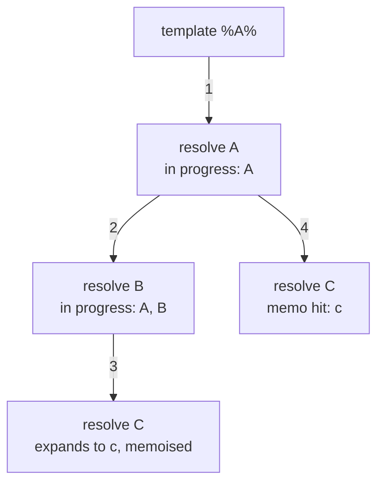

**Short answer:** Scan the text left to right. `%%` becomes a literal `%`. `%NAME%` is replaced by the fully expanded value of `NAME`, which we get by recursively expanding that variable's own value. Fail if a name is missing or a `%` is never closed. Detect cycles with an "in progress" set, the grey nodes of a DFS: meeting a name that is already in progress means there is a cycle. Memoise each finished expansion, so shared references are expanded only once.

## Picture it

`vars = {A: "%B%-%C%", B: "%C%!", C: "c"}`, `template = "%A%"`. The DFS of `resolve` calls, numbered in call order:



| Call | Name | `inProgress` on entry | Result | `done` after |
|---|---|---|---|---|
| 1 | A | {} | waits for B and C | – |
| 2 | B | {A} | waits for C | – |
| 3 | C | {A, B} | `"c"` | {C} |
| 2 returns | B | – | `"c!"` | {C, B} |
| 4 | C | {A} | memo `"c"`, no recursion | unchanged |
| 1 returns | A | – | `"c!-c"` | {C, B, A} |

Result `"c!-c"`. With the cycle of Example 2 (`A = "x%B%"`, `B = "y%A%"`), the path is resolve A (in progress {A}) → resolve B ({A, B}) → resolve A again. `inProgress.add("A")` returns false, which is the back edge, and `null` flows up to the caller.

**The picture in one sentence:** expansion is a DFS over the variable dependency graph, where "in progress" catches cycles and "done" makes shared references free.

## Approach

- **Naive:** keep running "find a `%KEY%` and replace it" over the whole string until nothing changes. This is wrong: replaced text gets scanned again, a literal `%` inside a value gets misread, and a cycle loops forever. It is also slow.
- **Key insight:** the variables form a dependency graph, where `A` depends on every name its value references. Expanding a variable is a DFS on that graph:
  - **in progress** (on the current recursion path): seeing it again is a back edge, which means a cycle;
  - **done** (memoised): reuse the result. Without this, a chain like `A = %B%%B%`, `B = %C%%C%`, … doubles at each level and takes exponential time.
- **Scanner rules:** at a `%`, if the next character is also `%`, emit one `%`. Otherwise find the next `%`. If there is none, the reference is unclosed. If there is, the text between the two is the name. The expanded text is appended as-is and never rescanned.
- Only variables that are actually reached are expanded, so an unused broken variable never causes a failure.

## Solution

```java
import java.util.*;

class Solution {
    private Map<String, String> vars;
    private final Map<String, String> done = new HashMap<>();   // name -> expanded value
    private final Set<String> inProgress = new HashSet<>();     // names on the current path

    public String expand(Map<String, String> vars, String template) {
        this.vars = vars;
        return expandText(template);
    }

    // Expands one piece of text; null means failure.
    private String expandText(String s) {
        StringBuilder sb = new StringBuilder();
        int i = 0, n = s.length();
        while (i < n) {
            char c = s.charAt(i);
            if (c != '%') {
                sb.append(c);
                i++;
            } else if (i + 1 < n && s.charAt(i + 1) == '%') {
                sb.append('%');                       // escaped percent
                i += 2;
            } else {
                int close = s.indexOf('%', i + 1);
                if (close < 0) return null;           // unclosed reference
                String value = resolve(s.substring(i + 1, close));
                if (value == null) return null;
                sb.append(value);
                i = close + 1;
            }
        }
        return sb.toString();
    }

    private String resolve(String name) {
        String memo = done.get(name);
        if (memo != null) return memo;
        if (!vars.containsKey(name)) return null;    // missing variable
        if (!inProgress.add(name)) return null;      // already on the path: cycle
        String value = expandText(vars.get(name));
        inProgress.remove(name);
        if (value != null) done.put(name, value);
        return value;
    }
}
```

The `%%` check comes first, so `%%` can never be read as an empty reference. A name must be non-empty, and that rule is what guarantees this.

## Complexity

- **Time:** each variable's value is scanned at most once, thanks to the memo. Each output character is copied once per level where it is appended, so the total is O(input sizes + total size of the expanded strings). The problem caps the expanded strings at 10⁵ characters each.
- **Space:** O(V) for the memo entries plus their expanded strings, and O(depth) for the recursion stack.

## Edge cases

- `100%%` gives `100%`. A value containing `%%` also becomes `%`, but only after its own expansion. The inserted text is not rescanned.
- `A = %A%`: a self-cycle, so the expansion fails.
- A trailing lone `%` (`"50%"`): unclosed, so the expansion fails.
- A very deep chain of references (thousands of levels) can overflow the Java stack. You can make it iterative with an explicit stack, or run it on a thread with a larger stack.

## Follow-ups

- **Missing keys: return an error.** `resolve` returns `null` when `vars` has no such key. In a real library, throw something like `MissingVariableException(name)` instead, so the caller knows which key is missing.
- **Detect cycles (A → %B%, B → %A%) and fail cleanly.** This is the `inProgress` set: three-colour DFS, where meeting a grey node means a back edge. Clean up the set as the recursion returns.
- **Handle literal % characters.** Use an escape: here `%%` becomes `%`. Check for it before you parse a reference. Do not rescan inserted values, or a literal `%` in a value would turn into a reference.
- **Detect cycles and throw an error.** Throw `new IllegalStateException("Cycle: " + path)`. Keep the path as an ordered `LinkedHashSet` or a stack instead of a plain set, so the message can show `A -> B -> A`. Throwing also unwinds all the recursion at once.

Related: [C4 · The optimisation playbook](../academy/lessons/C4.md), [H1 · Java idioms for coding interviews](../academy/lessons/H1.md).

Practise it in the app: Run / Submit on this page.
