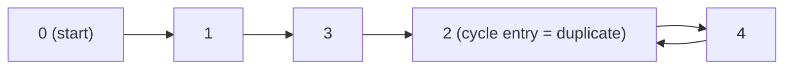

**Short answer:** Treat the array as a function `i -> nums[i]`. Because there are `n + 1` slots but only values `1..n`, following `0 -> nums[0] -> nums[nums[0]] -> ...` must eventually loop, and the value where the loop starts is the duplicate (two indices point to it). Floyd's tortoise-and-hare finds that entry point in O(n) time and O(1) space without touching the array.

## Picture it

`nums = [1, 3, 4, 2, 2]`. Draw an edge `i -> nums[i]` for every index:



Indices 3 and 4 both point to 2, so 2 has two incoming edges: that is the duplicate.

| Phase | Step | slow | fast | Note |
|---|---|---|---|---|
| 1 | start | 1 | 1 | both at `nums[0]` |
| 1 | 1 | nums[1] = 3 | nums[nums[1]] = nums[3] = 2 | |
| 1 | 2 | nums[3] = 2 | nums[nums[2]] = nums[4] = 2 | meet inside the cycle |
| 2 | reset | 1 | 2 | slow back to `nums[0]` |
| 2 | 1 | 3 | nums[2] = 4 | both move one step |
| 2 | 2 | 2 | nums[4] = 2 | meet at the entry: return 2 |

**The picture in one sentence:** the array is a linked list in disguise, and the duplicate is the node where the cycle begins, which Floyd finds in O(1) space.

## Approach

- **Brute force:** compare every pair, O(n²). A `HashSet` gives O(n) time but O(n) space. Sorting is O(n log n) but modifies the array. All break a rule.
- **Binary search on the value range (O(n log n), O(1)):** for a guess `mid`, count how many elements are `<= mid`. If the count is greater than `mid`, the duplicate is in `[1, mid]` (pigeonhole), otherwise in `[mid + 1, n]`.
- **Key insight (O(n)):** view each index as a node with an edge to `nums[i]`. Index `0` is never a target (values start at 1), so it is the start of a path. Every node has exactly one outgoing edge, so the path ends in a cycle. The cycle's entry node has two incoming edges: one from the path and one from inside the cycle. Two incoming edges means two indices hold the same value, so the entry is the duplicate.
- **Floyd:** move `slow` one step and `fast` two steps until they meet inside the cycle. Then reset `slow` to the start and move both one step at a time; they meet at the cycle entry. This works because the distance from the start to the entry equals the distance from the meeting point to the entry, modulo the cycle length.

## Solution

```java
class Solution {
    public int findDuplicate(int[] nums) {
        // Treat i -> nums[i] as a linked list; the duplicate is where the cycle begins.
        int slow = nums[0], fast = nums[0];
        do {
            slow = nums[slow];
            fast = nums[nums[fast]];
        } while (slow != fast);

        slow = nums[0];
        while (slow != fast) {
            slow = nums[slow];
            fast = nums[fast];
        }
        return slow;
    }
}
```

Both pointers start at `nums[0]` (one step from index 0), which is the same as starting both at `0`; phase two resets `slow` to that same starting point, so the distances still line up.

## Complexity

- **Time O(n):** phase one finishes within a bounded number of laps of the cycle; phase two walks at most the tail length.
- **Space O(1):** two integers. The array is only read.

## Edge cases

- The duplicate appears many times (`[3,3,3,3,3]`): several indices point to 3, the entry is still 3.
- Smallest input `n = 1`, `[1,1]`: `0 -> 1 -> 1`, the self-loop at 1 is found at once.
- The duplicate is `n` or `1`: nothing special, the graph argument holds.

## Variations

- Linked List Cycle II (LeetCode 142) is the same algorithm on real nodes.
- If you may modify the array, cyclic sort or sign-marking also give O(n) / O(1).
- See [C4 · The optimisation playbook](../academy/lessons/C4.md) for walking from the HashSet answer to the O(1)-space one out loud.

Practise it in the app: Run / Submit on this page.
