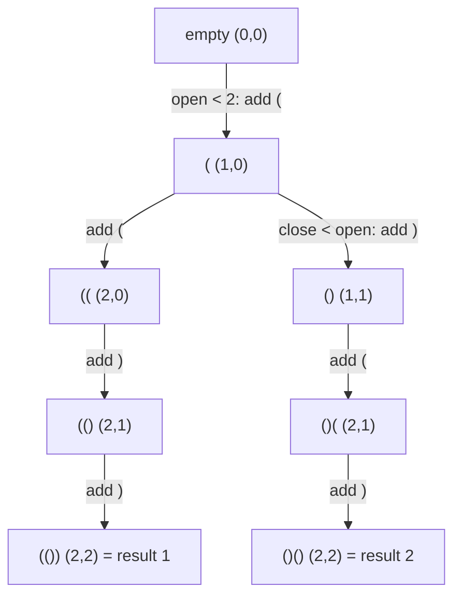

**Short answer:** Backtrack one character at a time while tracking how many `(` and `)` are already placed. You may add `(` while `open < n`, and `)` only while `close < open`. Those two rules keep every prefix valid, so every complete string is balanced and no work is wasted on dead branches. The number of results is the n-th Catalan number.

## Picture it

The recursion tree for `n = 2`. Each node is the prefix built so far with `(open, close)`; only branches allowed by the two guards are drawn.



Pruned without ever being built: `)` at the root (close would exceed open), `(((` (open would exceed n) and `())` (close would exceed open). Every leaf is a valid answer, in the order `(())`, `()()`.

**The picture in one sentence:** the two guards (`open < n`, `close < open`) keep every prefix valid, so the recursion tree only grows branches that end in an answer.

## Approach

- **Brute force:** generate all `2^(2n)` strings of `(` and `)` and keep the balanced ones. For `n = 8` that is 65,536 strings, each checked in O(n). It works but does needless work.
- **Key insight:** a string is balanced iff no prefix has more `)` than `(` and the totals are equal. So prune while building: never place a `)` that would make the prefix invalid, and never place more than `n` opens.
- **Optimal:** backtracking with those two guards. Every leaf reached is a valid answer, and each answer is reached exactly once because the choices at each position are distinct characters.

## Solution

```java
import java.util.*;

class Solution {
    public List<String> generateParenthesis(int n) {
        List<String> out = new ArrayList<>();
        build(new char[2 * n], 0, 0, 0, n, out);
        return out;
    }

    private void build(char[] buf, int pos, int open, int close, int n, List<String> out) {
        if (pos == buf.length) {
            out.add(new String(buf));
            return;
        }
        if (open < n) {
            buf[pos] = '(';
            build(buf, pos + 1, open + 1, close, n, out);
        }
        if (close < open) {
            buf[pos] = ')';
            build(buf, pos + 1, open, close + 1, n, out);
        }
    }
}
```

A reused `char[]` avoids creating a new string at every step; the slot is simply overwritten on the next branch, so no explicit "undo" is needed.

## Complexity

- **Time O(Cₙ · n)** where `Cₙ = (2n)! / ((n+1)! n!)` is the Catalan number (1430 for `n = 8`). Each result costs O(n) to copy into a `String`; pruning means internal nodes are bounded by a small multiple of the leaves times `n`. Commonly quoted as O(4ⁿ / √n).
- **Space O(n)** for the recursion and buffer, plus the output.

## Edge cases

- `n = 1`: `["()"]`.
- No duplicates can occur, so no `Set` is needed.

## Variations

- Count only (no strings): the Catalan number, via DP `C(i+1) = Σ C(j)·C(i−j)`.
- Valid Parentheses / Remove Invalid Parentheses use the same prefix-balance rule.
- Iterative build: every valid string is `"(" + A + ")" + B` where `A` and `B` are valid with `i` and `n−1−i` pairs.

Practise it in the app: Run / Submit on this page.
