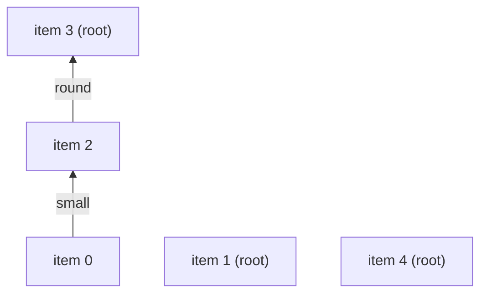

**Short answer:** This is connected components on a graph where items are nodes and a shared tag is an edge. Do not compare item pairs. Instead keep a map from each tag to the first item that had it; when a later item has the same tag, union the two items in a union-find. At the end, group items by their root. That is near-linear in the total number of tags.

## Picture it

Example 1: `[["red","small"],["blue"],["small","round"],["round"],["green"]]`.

| Item | Tag | owner before | Action | parent after |
|---|---|---|---|---|
| 0 | red | — | owner[red] = 0 | [0,1,2,3,4] |
| 0 | small | — | owner[small] = 0 | [0,1,2,3,4] |
| 1 | blue | — | owner[blue] = 1 | [0,1,2,3,4] |
| 2 | small | 0 | union(0, 2): parent[0] = 2 | [2,1,2,3,4] |
| 2 | round | — | owner[round] = 2 | [2,1,2,3,4] |
| 3 | round | 2 | union(2, 3): parent[2] = 3 | [2,1,3,3,4] |
| 4 | green | — | owner[green] = 4 | [2,1,3,3,4] |

The union-find forest at the end (arrows point to the parent):



Grouping by `find(i)` gives root 3 → [0, 2, 3], root 1 → [1], root 4 → [4].

**The picture in one sentence:** each tag links every item that carries it to the tag's first owner, so the groups fall out as union-find components without comparing pairs.

## Approach

- **Brute force:** for every pair of items, check whether their tag sets intersect, add an edge, then run DFS. O(n² · t). Too slow for 10⁴ items.
- **Key insight:** you only need each tag to connect all items that carry it, and a chain (or star) is enough for connectivity. Linking every item to the *first* owner of the tag gives exactly that with one union per tag occurrence.
- **Optimal:** union-find with path compression. Alternative: build a bipartite item–tag adjacency and BFS/DFS it; same complexity, more memory.

## Solution

```java
import java.util.*;

class Solution {
    private int[] parent;

    public List<List<Integer>> groupItems(List<List<String>> itemTags) {
        int n = itemTags.size();
        parent = new int[n];
        for (int i = 0; i < n; i++) parent[i] = i;

        Map<String, Integer> owner = new HashMap<>(); // tag -> first item seen with it
        for (int i = 0; i < n; i++) {
            for (String tag : itemTags.get(i)) {
                Integer o = owner.putIfAbsent(tag, i);
                if (o != null) union(o, i);
            }
        }

        Map<Integer, List<Integer>> groups = new LinkedHashMap<>();
        for (int i = 0; i < n; i++) groups.computeIfAbsent(find(i), k -> new ArrayList<>()).add(i);
        return new ArrayList<>(groups.values());
    }

    private int find(int x) {
        while (parent[x] != x) {
            parent[x] = parent[parent[x]];   // path halving
            x = parent[x];
        }
        return x;
    }

    private void union(int a, int b) {
        parent[find(a)] = find(b);
    }
}
```

`putIfAbsent` returns the previous owner, or `null` if this item is the first, so one map call does both the lookup and the insert.

## Complexity

- **Time O(T · α(n))** roughly, where `T` is the total number of tags across items (at most 10⁵ here), plus hashing each tag string. With path halving alone (no union by rank) the bound is O(log n) amortised per operation, which is still fast; add union by size for the inverse-Ackermann bound.
- **Space O(n + distinct tags).**

## Edge cases

- Item with no tags: its own group.
- Same tag twice in one item: `owner` already maps to this item, so it unions with itself, a no-op.
- All items share one tag: one group.

## Variations

- Accounts Merge (LeetCode 721): the same with emails as tags, returning merged email lists.
- Online version (items arrive over time, queries "are A and B grouped?"): union-find handles incremental adds naturally; deletions need a different structure.

Practise it in the app: Run / Submit on this page.
