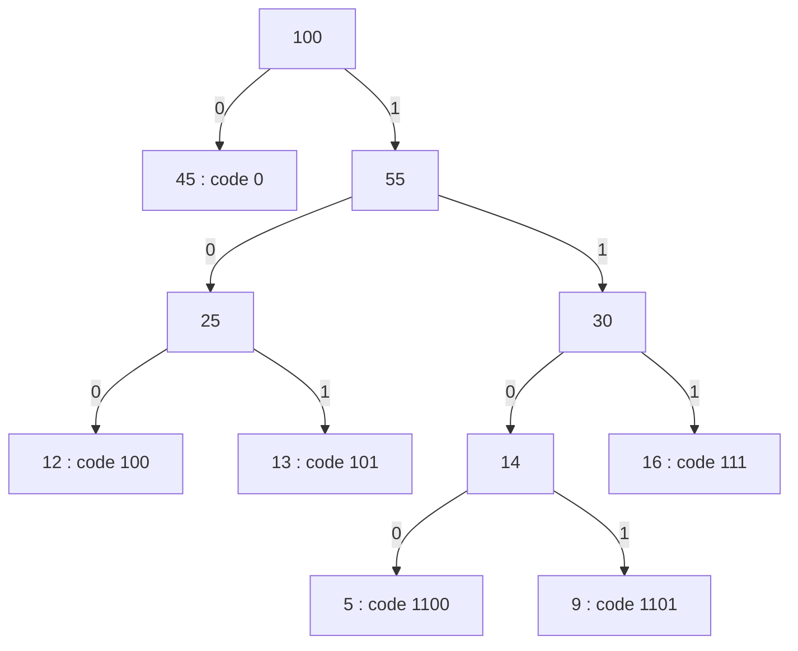

**Short answer:** Put every symbol in a min-heap by frequency. Repeatedly pop the two lightest nodes, join them under a new parent whose weight is their sum, and push the parent back. When one node remains it is the root of the Huffman tree; a symbol's codeword is the path to its leaf, `0` for left and `1` for right. Leaves give a prefix-free code, and the greedy merge is provably optimal. O(n log n).

## Picture it

Example 1: `freq = [5, 9, 12, 13, 16, 45]` (symbol ids 0 to 5). Each merge pops the two lightest; the first popped goes left.

| Merge | Heap before (weights) | Pop a, b | New node (id = weight) |
|---|---|---|---|
| 1 | 5, 9, 12, 13, 16, 45 | 5, 9 | id 6 = 14 |
| 2 | 12, 13, 14, 16, 45 | 12, 13 | id 7 = 25 |
| 3 | 14, 16, 25, 45 | 14, 16 | id 8 = 30 |
| 4 | 25, 30, 45 | 25, 30 | id 9 = 55 |
| 5 | 45, 55 | 45, 55 | id 10 = 100 (root) |

The resulting tree, with `0` on left edges and `1` on right edges:



Cost: 45·1 + (12 + 13 + 16)·3 + (5 + 9)·4 = 45 + 123 + 56 = 224.

**The picture in one sentence:** keep merging the two lightest nodes, so the rarest symbols sink deepest and get the longest codes.

## Approach

- **Why a tree:** a prefix-free code is exactly a binary tree where symbols sit on leaves. Total cost is `Σ freq · depth`.
- **Brute force:** try tree shapes. Exponential. Scanning for the two smallest weights each round without a heap is O(n²).
- **Key insight (greedy):** in some optimal tree the two least frequent symbols are siblings at the deepest level (swapping a deeper leaf with a lighter one never increases cost). Merging them into one symbol of combined weight leaves a smaller problem of the same form, and the cost differs by exactly their sum. Induction gives optimality.
- **Optimal:** a priority queue of node ids keyed by weight, `n − 1` merges.

## Solution

```java
import java.util.*;

class Solution {
    public String[] huffmanCodes(int[] freq) {
        int n = freq.length;
        String[] codes = new String[n];
        if (n == 1) {                 // a single symbol still needs one bit
            codes[0] = "0";
            return codes;
        }
        // Nodes 0..n-1 are leaves; internal nodes are appended as they are created.
        int[] left = new int[2 * n], right = new int[2 * n];
        long[] weight = new long[2 * n];
        PriorityQueue<Integer> pq = new PriorityQueue<>((a, b) -> Long.compare(weight[a], weight[b]));
        for (int i = 0; i < n; i++) {
            weight[i] = freq[i];
            pq.add(i);
        }
        int next = n;
        while (pq.size() > 1) {
            int a = pq.poll(), b = pq.poll();
            weight[next] = weight[a] + weight[b];
            left[next] = a;
            right[next] = b;
            pq.add(next++);
        }
        // Assign codes top-down. A parent is always created after its children,
        // so walking ids from the root downwards visits parents before children.
        String[] path = new String[2 * n];
        int root = next - 1;
        path[root] = "";
        for (int v = root; v >= n; v--) {
            path[left[v]] = path[v] + "0";
            path[right[v]] = path[v] + "1";
        }
        System.arraycopy(path, 0, codes, 0, n);
        return codes;
    }
}
```

Weights are `long` because merged sums of up to 10⁴ values of 10⁹ overflow `int`. Using arrays instead of node objects keeps it compact and avoids recursion, so a deep (skewed) tree cannot overflow the stack.

## Complexity

- **Time O(n log n)** for the heap work, plus the total length of the codewords for building strings (O(n²) in the worst skewed case, e.g. Fibonacci-like frequencies, but that is the output size).
- **Space O(n)** for the tree arrays, plus the codewords.

## Edge cases

- One symbol: codeword `"0"`, cost `freq[0]` (Example 3).
- All equal frequencies with `n` a power of two: a balanced tree, every code length `log₂ n` (Example 2).
- Ties: any tie-break gives an optimal total, though code lengths may differ.

## Variations

- If the input is already sorted, two queues (leaves and merged nodes, both stay sorted) give O(n) construction.
- Decoding: walk the tree bit by bit, emit a symbol at each leaf, restart at the root.
- Canonical Huffman codes store only the code lengths, so the decoder can rebuild the codes; this is what DEFLATE uses.
- Optimal Merge Pattern / Minimum Cost to Connect Sticks (LeetCode 1167) is the same greedy, returning only the total cost.

Practise it in the app: Run / Submit on this page.
