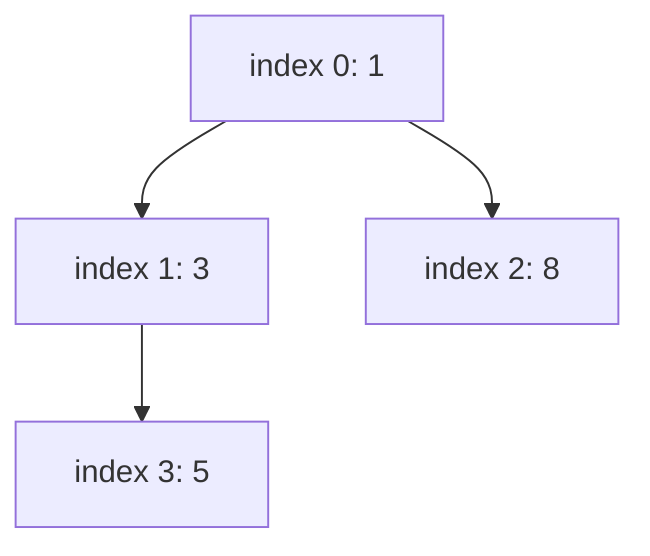

**Short answer:** Store a complete binary tree in an array: the children of index `i` are `2i+1` and `2i+2`, the parent is `(i-1)/2`. `offer` appends at the end and sifts the value up while it is smaller than its parent. `poll` takes the root, moves the last element to the root and sifts it down, swapping with the smaller child. Both are O(log n); `peek` and `size` are O(1).

## Picture it

`offer(5)`, `offer(3)`, `offer(8)`, `offer(1)`, then `poll()` twice.

| Operation | Array before | What moves | Array after | Returns |
|---|---|---|---|---|
| offer 5 | [] | placed at 0 | [5] | — |
| offer 3 | [5] | at 1; parent 0 holds 5 > 3: swap | [3, 5] | — |
| offer 8 | [3, 5] | at 2; parent 0 holds 3 ≤ 8: stop | [3, 5, 8] | — |
| offer 1 | [3, 5, 8] | at 3; parent 1 (5) > 1: swap; parent 0 (3) > 1: swap | [1, 3, 8, 5] | — |
| poll | [1, 3, 8, 5] | take 1; last (5) to root; smaller child 3 < 5: swap | [3, 5, 8] | 1 |
| poll | [3, 5, 8] | take 3; last (8) to root; child 5 < 8: swap | [5, 8] | 3 |

The array `[1, 3, 8, 5]` as a tree (children of `i` are `2i+1` and `2i+2`):



**The picture in one sentence:** the array is a complete tree, and each operation repairs the heap order along one root-to-leaf path, so it costs O(log n).

## Approach

- **Brute force:** keep a sorted list. `peek` and `poll` are cheap, but each `offer` costs O(n) to shift elements. Or keep an unsorted list and scan for the minimum on every `poll`, which is O(n) per poll.
- **Key insight:** you never need full order, only the minimum. The heap property (every parent ≤ its children) is enough, and it can be restored along a single root-to-leaf path, which has length log n.
- **Optimal:** an array-backed binary heap. The tree is always complete, so there are no gaps in the array and no pointers. Grow the array by doubling when it is full (amortised O(1) per insert, like `ArrayList`).

## Solution

```java
import java.util.Arrays;

class MinHeap {
    private int[] a = new int[16];
    private int n;

    public void offer(int x) {
        if (n == a.length) a = Arrays.copyOf(a, n * 2);
        a[n] = x;
        siftUp(n++);
    }

    public Integer poll() {
        if (n == 0) return null;
        int min = a[0];
        a[0] = a[--n];          // move the last leaf to the root
        siftDown(0);
        return min;
    }

    public Integer peek() { return n == 0 ? null : a[0]; }

    public int size() { return n; }

    private void siftUp(int i) {
        while (i > 0) {
            int parent = (i - 1) / 2;
            if (a[parent] <= a[i]) break;
            swap(i, parent);
            i = parent;
        }
    }

    private void siftDown(int i) {
        while (true) {
            int l = 2 * i + 1, r = l + 1, smallest = i;
            if (l < n && a[l] < a[smallest]) smallest = l;
            if (r < n && a[r] < a[smallest]) smallest = r;
            if (smallest == i) return;
            swap(i, smallest);
            i = smallest;
        }
    }

    private void swap(int i, int j) { int t = a[i]; a[i] = a[j]; a[j] = t; }
}
```

## Complexity

- **Time:** `offer` and `poll` are O(log n), because a sift walks at most the height of a complete tree. Array doubling adds amortised O(1) to `offer`. `peek` and `size` are O(1).
- **Space:** O(n) for the array.

## Edge cases

- `poll` / `peek` on an empty heap return `null`.
- Duplicates: use `<=` in sift-up and strict `<` in sift-down so equal values stop the sift (fewer swaps, still correct).
- Polling the last element: `a[0] = a[--n]` writes over itself, then sift-down finds no children. Fine.
- Negative values and the full `int` range: compare values directly, never with `a - b`, which can overflow.

## Variations

- **Generic heap with a `Comparator<T>`:** same code over `Object[]`; this is what `java.util.PriorityQueue` does.
- **Build a heap from an array in O(n):** call `siftDown` on indexes `n/2 - 1` down to 0 (heapify).
- **Max-heap:** flip the comparisons.
- **Decrease-key** (Dijkstra): also keep a map from value to index, and update it on every swap.
- **Thread safety:** `PriorityBlockingQueue` wraps a heap with one lock.

See [C5 · Amortised analysis](../academy/lessons/C5.md) for why doubling the array is O(1) per insert.

Practise it in the app: Run / Submit on this page.
