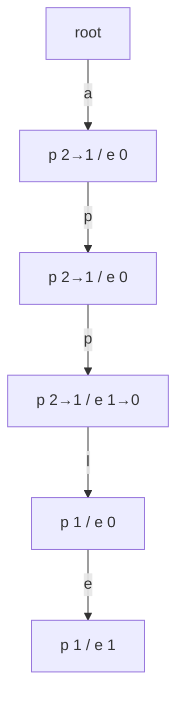

**Short answer:** A trie where every node keeps two counters: `passing` (how many stored words go through or end at this node) and `ending` (how many end exactly here). Insert walks the word and increments `passing` on each node, then `ending` at the last one. Count-equal reads `ending`, count-prefix reads `passing`. Erase walks the path decrementing `passing`, and prunes a branch as soon as its count hits zero. For a multilingual dictionary, children are a `Map<Character, Node>` instead of a 26-slot array.

## Picture it

Example 2: insert "app" and "apple", then erase "app". Each node shows `passing / ending`, before → after the erase.



| Call | Walk | Reads or changes | Result |
|---|---|---|---|
| countWordsStartingWith("app") | a → p → p | read passing at the third node | 2 |
| erase("app") | a → p → p | passing 2→1 on each node (none hits 0, no prune); ending 1→0 at the end | — |
| countWordsEqualTo("app") | a → p → p | read ending | 0 |
| countWordsStartingWith("app") | a → p → p | read passing | 1 |
| countWordsEqualTo("apple") | a → p → p → l → e | read ending | 1 |

In Example 1, erasing the second "apple" drops `passing` on the "a" node from 1 to 0, so the whole branch is cut off at the root in one step.

**The picture in one sentence:** every node remembers how many words pass through it and end at it, so prefix counts are a walk plus one read, and erase is the same walk with decrements.

## Approach

- **Brute force:** a `HashMap<String, Integer>` of word counts. Exact counts are O(L), but a prefix count means scanning every stored word.
- **Key insight:** words sharing a prefix share a path. If each node stores how many words pass through it, a prefix query is just "walk to the node, read one number". No subtree traversal.
- **Erase correctly:** decrement `passing` along the whole path, then `ending` at the end. If a node's `passing` drops to 0, nothing else uses that branch, so remove it from its parent and stop.
- **Any alphabet:** a `HashMap` per node handles Unicode, at the cost of more memory per node than an array.

## Solution

```java
import java.util.HashMap;
import java.util.Map;

class Trie {
    private static final class Node {
        final Map<Character, Node> children = new HashMap<>(); // any alphabet
        int passing; // words that go through or end at this node
        int ending;  // words that end exactly here
    }

    private final Node root = new Node();

    public void insert(String word) {
        Node n = root;
        for (char c : word.toCharArray()) {
            n = n.children.computeIfAbsent(c, k -> new Node());
            n.passing++;
        }
        n.ending++;
    }

    public int countWordsEqualTo(String word) {
        Node n = find(word);
        return n == null ? 0 : n.ending;
    }

    public int countWordsStartingWith(String prefix) {
        Node n = find(prefix);
        return n == null ? 0 : n.passing;
    }

    public void erase(String word) {
        if (countWordsEqualTo(word) == 0) return;
        Node n = root;
        for (char c : word.toCharArray()) {
            Node next = n.children.get(c);
            if (--next.passing == 0) {
                n.children.remove(c); // prune the now-unused branch
                return;
            }
            n = next;
        }
        n.ending--;
    }

    private Node find(String s) {
        Node n = root;
        for (char c : s.toCharArray()) {
            n = n.children.get(c);
            if (n == null) return null;
        }
        return n;
    }
}
```

## Complexity

- **Time:** O(L) per operation, where L is the length of the word or prefix.
- **Space:** O(total characters inserted) nodes in the worst case (no shared prefixes). A `HashMap` per node is heavy; an array of 26 is faster for plain lowercase.

## Edge cases

- A word that is also a prefix of another (`"app"` and `"apple"`): erasing `"app"` must leave `"apple"` counted. The two counters make this work.
- Duplicate inserts: counts go above 1; erase removes one occurrence.
- Erase of a missing word: guarded by the first check.
- Prefix longer than any stored word: `find` returns `null`, count 0.

## Follow-up: what test cases would you write?

- Empty dictionary: both counts return 0.
- Insert once, count equal and prefix; insert again, both counts become 2.
- Word that is a prefix of another, then erase the shorter one (Example 2).
- Erase until zero, then confirm the branch is gone and counts are 0, and re-insert works.
- Prefix equal to the whole word, and a prefix not present at all.
- Non-ASCII words (accents, CJK) to prove the map-based children work.
- Large load: 3·10⁴ operations on 2000-character words, to check time and memory.

## Variations

- Autocomplete: walk to the prefix node, then DFS for the top k words (often with a cached top-k per node).
- Update a word = erase old + insert new.
- Unicode beyond the BMP: iterate code points (`word.codePoints()`) instead of `char`s.

Practise it in the app: Run / Submit on this page.
