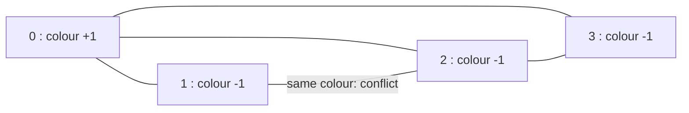

**Short answer:** Try to 2-colour the graph. BFS from every uncoloured node, give it colour 1, and give each neighbour the opposite colour. If you ever find an edge whose two ends already have the same colour, the graph has an odd cycle and is not bipartite. Restart from each uncoloured node so disconnected components are all checked. O(n + e).

## Picture it

Example 1: `graph = [[1,2,3],[0,2],[0,1,3],[0,2]]`. Colours as BFS assigns them from node 0:



| Step | Pop u (colour) | Neighbour v | colour[v] before | Action |
|---|---|---|---|---|
| 1 | 0 (+1) | 1 | 0 | colour −1, enqueue |
| 2 | 0 (+1) | 2 | 0 | colour −1, enqueue |
| 3 | 0 (+1) | 3 | 0 | colour −1, enqueue |
| 4 | 1 (−1) | 0 | +1 | different, fine |
| 5 | 1 (−1) | 2 | −1 | same as u: return false |

The triangle 0-1-2 is an odd cycle. In Example 2 (a square 0-1-2-3) the same BFS gives 0 = +1, 1 and 3 = −1, 2 = +1 and no edge ever joins equal colours, so it returns true.

**The picture in one sentence:** colouring one node forces every node it reaches, so one BFS per component either 2-colours it or runs into an edge whose ends already share a colour.

## Approach

- **Brute force:** try all 2ⁿ ways to split the nodes and check every edge. Hopeless beyond tiny n.
- **Key insight:** once you place one node in a group, every neighbour is forced into the other group, and so on outward. There is no choice to make inside a component, so a single traversal either succeeds or finds a contradiction. A contradiction means an odd cycle.
- **Optimal:** BFS (or DFS) colouring per component. Union-find also works: for each node u, union all its neighbours together, and fail if u ends up in the same set as a neighbour.

## Solution

```java
class Solution {
    public boolean isBipartite(int[][] graph) {
        int n = graph.length;
        int[] color = new int[n]; // 0 = unseen, 1 / -1 = the two groups
        int[] queue = new int[n];
        for (int start = 0; start < n; start++) {
            if (color[start] != 0) continue;     // already done with this component
            color[start] = 1;
            int head = 0, tail = 0;
            queue[tail++] = start;
            while (head < tail) {
                int u = queue[head++];
                for (int v : graph[u]) {
                    if (color[v] == 0) {
                        color[v] = -color[u];
                        queue[tail++] = v;
                    } else if (color[v] == color[u]) {
                        return false;            // odd cycle
                    }
                }
            }
        }
        return true;
    }
}
```

Each node enters the queue exactly once (when it gets its colour), so an `int[]` of size n is a safe queue.

## Complexity

- **Time:** O(n + e). Each node is coloured once; each edge is looked at twice (once from each end).
- **Space:** O(n) for colours and the queue.

## Edge cases

- Disconnected graph: the outer loop starts a new BFS in every component.
- Isolated nodes (`[]`): trivially fine.
- Single node, or no edges at all: `true`.
- Even cycle (square): `true`. Odd cycle (triangle): `false`.
- Recursive DFS on a long path of 10⁴ nodes can get deep; BFS avoids that.

## Variations

- **Possible Bipartition (LeetCode 886):** same, but you build the adjacency list from a "dislikes" edge list first.
- **Return the two groups:** collect nodes by colour.
- **Find the odd cycle:** keep BFS parents and walk back from both ends of the conflicting edge.
- **Union-find version** is handy when edges arrive as a stream and you must answer after each one.

Practise it in the app: Run / Submit on this page.
