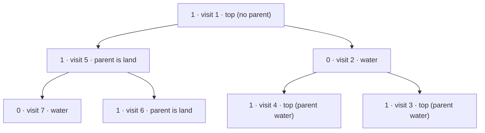

**Short answer:** Every island has exactly one topmost node: a land node whose parent is missing or is water. So you do not need flood fill at all. Traverse the tree once, passing each node's parent along, and count land nodes whose parent is null or 0. Use an explicit stack because the tree can be a 10⁵-deep chain.

## Picture it

Example 1: `root = [1,1,0,0,1,1,1]`. Each label shows the value, the stack visit order and whether the node is the top of an island (land with a null or water parent).



| Visit | Node | Parent value | Counted? | islands |
|---|---|---|---|---|
| 1 | root (1) | none | yes | 1 |
| 2 | right (0) | 1 | water | 1 |
| 3 | right.right (1) | 0 | yes | 2 |
| 4 | right.left (1) | 0 | yes | 3 |
| 5 | left (1) | 1 | no, same island as root | 3 |
| 6 | left.right (1) | 1 | no, same island as root | 3 |
| 7 | left.left (0) | 1 | water | 3 |

The right child is pushed last, so it is popped first; the order does not change the count.

**The picture in one sentence:** every island has exactly one highest node, so count land nodes whose parent is missing or water and skip flood fill entirely.

## Approach

- **Brute force:** treat the tree as a graph, keep a visited set, and flood-fill from each unvisited land node (going to children and to the parent). Works, but needs parent pointers or a map, and extra memory.
- **Key insight:** in a tree, a connected group of land nodes is itself a subtree-shaped piece with a single highest node. That highest node is the only one whose parent is not land in the same island. Counting islands = counting such "tops".
- **Optimal:** one traversal, counting `node.val == 1 && (parent == null || parent.val == 0)`.

## Solution

`TreeNode` is the usual LeetCode class (`int val; TreeNode left, right;`).

```java
import java.util.ArrayDeque;
import java.util.Deque;

class Solution {
    public int countIslands(TreeNode root) {
        if (root == null) return 0;
        int islands = 0;
        Deque<TreeNode[]> stack = new ArrayDeque<>(); // {node, parent}
        stack.push(new TreeNode[] {root, null});
        while (!stack.isEmpty()) {
            TreeNode[] top = stack.pop();
            TreeNode node = top[0], parent = top[1];
            if (node.val == 1 && (parent == null || parent.val == 0)) islands++;
            if (node.left != null) stack.push(new TreeNode[] {node.left, node});
            if (node.right != null) stack.push(new TreeNode[] {node.right, node});
        }
        return islands;
    }
}
```

## Complexity

- **Time:** O(n): every node is visited once.
- **Space:** O(h) for the stack in a DFS order, O(n) in the worst case. No recursion, so no `StackOverflowError` on a long chain.

## Edge cases

- Empty tree: 0.
- All water: 0. All land: 1.
- Root is water and both children are land: two separate islands (they connect only through the parent).
- Alternating land/water down a chain: each land node is its own island.
- Deep chain of 10⁵ nodes: recursion would overflow the default thread stack; the explicit stack does not.

## Follow-up: return the sizes of unique islands

- **Sizes:** when you find a top, run a small DFS from it over land children only and count nodes. Each land node is visited by exactly one such DFS, so total time stays O(n). Return the list of sizes.
- **Unique islands** (distinct shapes): serialise each island's shape during that DFS, for example as a pre-order string like `"(L(R))"` where `L` / `R` mark which child was taken and `)` marks returning. Add each string to a `HashSet<String>`. The set's size is the number of distinct shapes, and you can map shape → size if you need "sizes of unique islands".
- If "unique" means unique sizes, a `TreeSet<Integer>` of the sizes is enough. Ask which one the interviewer means.

Practise it in the app: Run / Submit on this page.
