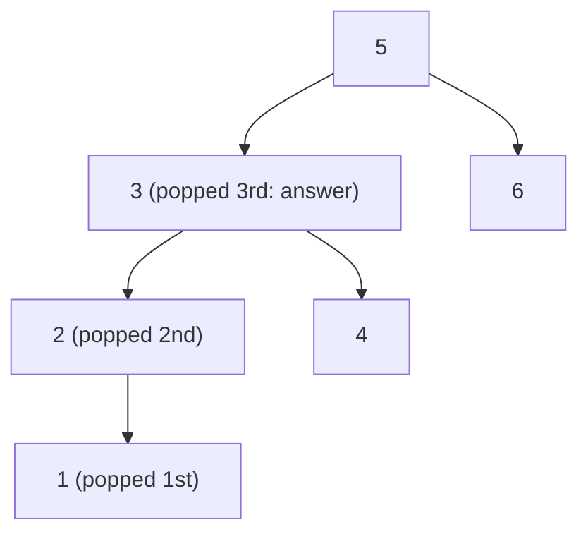

**Short answer:** An inorder walk (left, node, right) visits a BST's values in increasing order. Walk it iteratively with a stack, count nodes as you pop them, and return the k-th one. You stop early, so the cost is O(h + k), not O(n).

## Picture it

Example 2: `root = [5,3,6,2,4,null,null,1]`, `k = 3`.



| Step | Action | Stack (top on the right) | k after | cur after |
|---|---|---|---|---|
| 1 | push the left spine 5, 3, 2, 1 | [5, 3, 2, 1] | 3 | null |
| 2 | pop 1 | [5, 3, 2] | 2 | 1.right = null |
| 3 | pop 2 | [5, 3] | 1 | 2.right = null |
| 4 | pop 3 | [5] | 0 | return 3 |

Nodes 4, 5 and 6 are never popped: the walk stops as soon as k reaches 0.

**The picture in one sentence:** inorder on a BST pops values in sorted order, so the k-th pop is the answer and you can stop there.

## Approach

- **Brute force:** collect all values (any traversal), sort them, take index k−1. O(n log n) time and O(n) space, and it ignores the BST property.
- **Better:** a full recursive inorder into a list, then take index k−1. O(n), no sort.
- **Key insight:** you do not need the whole list. Inorder produces the values already sorted, so the k-th node popped is the answer. Stop there.
- **Iterative, not recursive:** the tree may be very unbalanced (a 10⁴-deep chain), so an explicit stack is the safe choice.

## Solution

`TreeNode` is the usual LeetCode class.

```java
import java.util.ArrayDeque;
import java.util.Deque;

class Solution {
    public int kthSmallest(TreeNode root, int k) {
        Deque<TreeNode> stack = new ArrayDeque<>();
        TreeNode cur = root;
        while (cur != null || !stack.isEmpty()) {
            while (cur != null) {          // go as far left as possible
                stack.push(cur);
                cur = cur.left;
            }
            cur = stack.pop();             // next smallest value
            if (--k == 0) return cur.val;
            cur = cur.right;
        }
        throw new IllegalArgumentException("k is larger than the tree");
    }
}
```

## Complexity

- **Time:** O(h + k). You descend the left spine once (h) and then pop k nodes, each with a little extra pushing that is paid for by the nodes popped.
- **Space:** O(h) for the stack; O(n) in the worst case of a chain, O(log n) when balanced.

## Edge cases

- k = 1: the leftmost node.
- k = n: the largest value, the walk visits everything.
- Single node tree.
- Skewed tree (all left or all right children): recursion could be deep; the explicit stack is fine.

## Variations

- **Frequent queries with inserts and deletes (the classic follow-up):** store the size of each node's subtree. Then at each node compare k with `size(left) + 1` and go left or right, O(h) per query. Keep sizes up to date on insert and delete. With a balanced tree (red-black, AVL) this is O(log n). This is an "order statistic tree".
- **Morris traversal:** O(1) extra space by temporarily threading right pointers back to the inorder successor; mention it, but it modifies the tree while it runs.
- **k-th largest:** reverse inorder (right, node, left).
- **Kth smallest in a sorted matrix** or across two sorted arrays: different structure, same "stop at the k-th" idea, often with a heap or binary search.

Practise it in the app: Run / Submit on this page.
