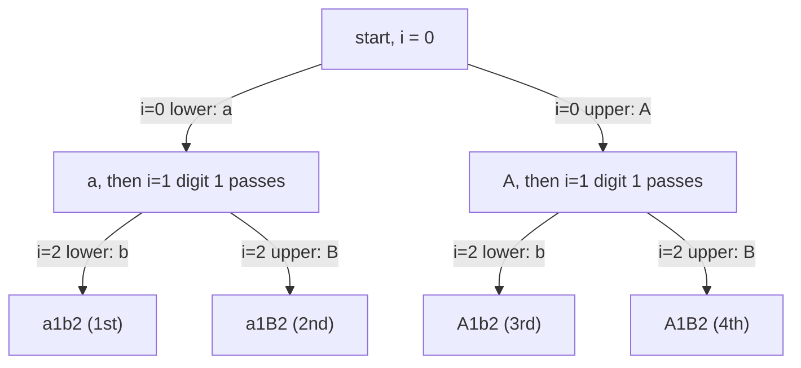

**Short answer:** Backtracking over positions. At a digit there is one choice, so move on. At a letter there are two: lowercase and uppercase. Recurse on both, writing into one shared `char[]`, and add a copy to the result at the end. With L letters there are 2^L strings.

## Picture it

The decision tree for `s = "a1b2"`. Letters branch into lower and upper case; digits pass straight through, so they add no branches.



Two letters give 2² = 4 leaves. The same `char[]` is reused: going from leaf 2 back to the `A` branch simply overwrites `cs[0]` with `A`, and `cs[2]` is rewritten on the way down.

**The picture in one sentence:** each letter doubles the tree and each digit is a straight line, so the leaves are exactly the 2^L case choices.

## Approach

- **Brute force idea:** there is nothing smarter than generating them, since the output itself has 2^L strings. The question is how to generate cleanly.
- **Backtracking:** a decision tree with depth n; letters branch into two, digits pass straight through. Mutate a `char[]` in place, so there is no string building per step.
- **Iterative alternative:** start with `[s]`; for each letter position, double the list by adding a copy of every string with that position's case flipped.
- **Bitmask alternative:** for each mask from 0 to 2^L − 1, bit j decides the case of the j-th letter.

## Solution

```java
import java.util.ArrayList;
import java.util.List;

class Solution {
    public List<String> letterCasePermutation(String s) {
        List<String> out = new ArrayList<>();
        build(s.toCharArray(), 0, out);
        return out;
    }

    private void build(char[] cs, int i, List<String> out) {
        if (i == cs.length) {
            out.add(new String(cs));
            return;
        }
        if (Character.isLetter(cs[i])) {
            cs[i] = Character.toLowerCase(cs[i]);
            build(cs, i + 1, out);
            cs[i] = Character.toUpperCase(cs[i]);
            build(cs, i + 1, out);
        } else {
            build(cs, i + 1, out);
        }
    }
}
```

Note there is no explicit "undo" step: the next call at position i overwrites `cs[i]` anyway, and positions after i are rewritten on the way down.

## Complexity

- **Time:** O(2^L · n). There are 2^L results and each copy costs O(n).
- **Space:** O(n) recursion depth plus the output, O(2^L · n).

## Edge cases

- No letters (`"123"`): exactly one string, the input.
- All letters: 2^n strings, at most 4096 for n = 12.
- Mixed input case (`"aB"`): set the case explicitly with `toLowerCase` / `toUpperCase` rather than "flip", so both branches are right whatever the original case was.
- Duplicates cannot occur, because each letter position has two different characters.

## Variations

- **Subsets** and **Letter Combinations of a Phone Number**: same backtracking shape, different branching.
- **Generalized Abbreviation:** at each position choose "keep the letter" or "count it".
- Count only, no strings: the answer is `1 << letters`.

Practise it in the app: Run / Submit on this page.
