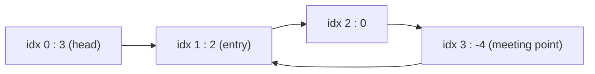

**Short answer:** Floyd's tortoise and hare. Move `slow` one step and `fast` two steps; if they meet, there is a cycle. Then start one pointer at the head and keep the other at the meeting point, and move both one step at a time. They meet exactly at the node where the cycle begins. O(n) time, O(1) space, and the list is not modified.

## Picture it

Example 1: `head = [3,2,0,-4]`, the tail links back to index 1.



| Phase | Step | slow | fast (or a) | Note |
|---|---|---|---|---|
| 1 | start | idx 0 | idx 0 | both at head |
| 1 | 1 | idx 1 | idx 2 | |
| 1 | 2 | idx 2 | idx 1 (2 → 3 → 1) | fast has lapped into the cycle |
| 1 | 3 | idx 3 | idx 3 (1 → 2 → 3) | meet |
| 2 | start | idx 3 | a = idx 0 | a restarts at head |
| 2 | 1 | idx 1 | a = idx 1 | meet: return idx 1 |

Head to entry is 1 step, and meeting point to entry (3 → 1) is also 1 step: that equality is why phase 2 works.

**The picture in one sentence:** the fast pointer catches the slow one inside the loop, and then a pointer from the head and one from the meeting point reach the entry at the same moment.

## Approach

- **Brute force:** walk the list and put every node in a `HashSet<ListNode>` (identity, not value). The first node already in the set is the entry. O(n) time, O(n) space.
- **Key insight:** two pointers at different speeds must meet inside a cycle. And the distance from the head to the entry equals the distance from the meeting point forward to the entry (modulo the cycle length). So a second pass with two one-step pointers lands both on the entry.

## Solution

`ListNode` is the usual LeetCode class (`int val; ListNode next;`).

```java
class Solution {
    public ListNode detectCycle(ListNode head) {
        ListNode slow = head, fast = head;
        while (fast != null && fast.next != null) {
            slow = slow.next;
            fast = fast.next.next;
            if (slow == fast) {                 // inside the cycle
                ListNode a = head;
                while (a != slow) {             // both move one step
                    a = a.next;
                    slow = slow.next;
                }
                return a;                       // the cycle entry
            }
        }
        return null;                            // fast fell off the end
    }
}
```

## Complexity

- **Time:** O(n). Before meeting, slow takes at most `a + c` steps (tail plus one lap). The second phase takes `a` steps.
- **Space:** O(1).

## Edge cases

- Empty list or one node without a cycle: the loop never runs or exits at once, returns `null`.
- One node pointing to itself: slow and fast meet at it on the first step, and it is the entry.
- Cycle that starts at the head (`pos = 0`): the second phase returns at once with `a == slow`.
- Repeated values: compare references (`==`), never `val`.

## Follow-up: prove why the meeting-point trick works

Let `a` = steps from the head to the entry, `c` = cycle length, and suppose they meet `b` steps past the entry.

- Slow has walked `a + b`. Fast has walked twice that, `2(a + b)`.
- Fast is on the same node, so it walked the same path plus some whole laps: `2(a + b) = a + b + k·c` for some k ≥ 1.
- So `a + b = k·c`, which gives `a = k·c − b = (k − 1)·c + (c − b)`.
- `c − b` is the distance from the meeting point forward to the entry. So walking `a` steps from the meeting point means going `c − b` steps to the entry and then `k − 1` full laps, ending at the entry.
- Meanwhile a pointer from the head reaches the entry after exactly `a` steps. Both arrive at the entry at the same time, and it is the first node where they coincide (before that, one is on the tail and the other in the cycle).

Why they must meet at all: once both are in the cycle, fast gains one step on slow per move, so the gap shrinks by 1 each time and hits 0 within `c` moves. Fast cannot "jump over" slow.

## Variations

- **Linked List Cycle I:** just return whether they meet.
- **Cycle length:** after meeting, keep one pointer still and count steps until the other returns.
- **Find the Duplicate Number (LeetCode 287):** treat `i → nums[i]` as a linked list; the duplicate is the cycle entry.
- **Intersection of two lists:** link one list's tail to its head and find the cycle entry from the other head (but that modifies the list; the two-pointer swap trick avoids it).

Practise it in the app: Run / Submit on this page.
