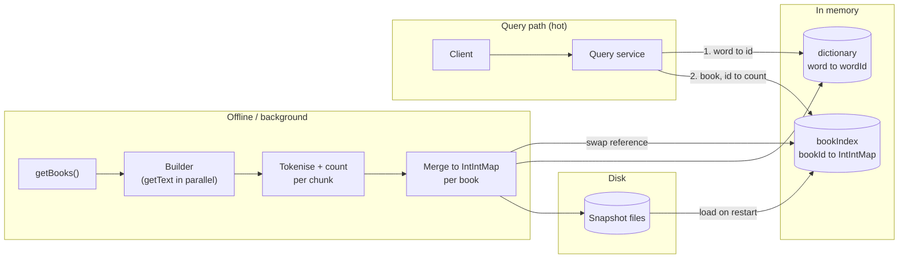
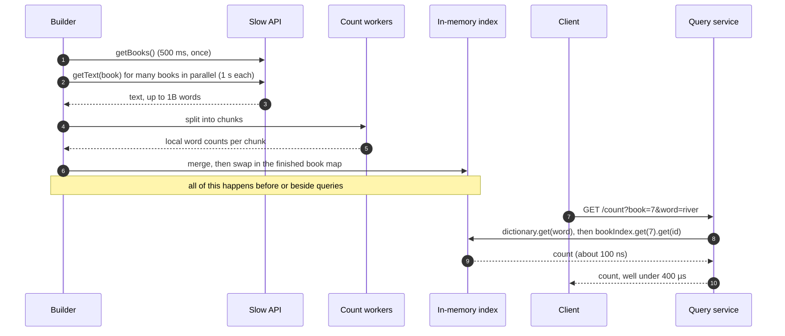

**Short answer:** You cannot touch the slow API on the query path: one `getText` call alone is 1,000 ms, 2,500× over budget. So move all the work offline. Fetch every book once (in parallel), count words, and keep an in-memory index `book -> (word -> count)`. A query is then two hash lookups, well under a microsecond, which leaves the 400 µs budget for the network hop. The real design questions are memory size, how long the warm-up takes, and how the index stays fresh.

## Picture it





**How to read it:**
- Steps 1–3: the slow API is called only by the background builder, many books at a time, never on the query path.
- Steps 4–6: each book's text is counted in parallel chunks with local maps, merged, and published by swapping a reference, so readers never see a half-built map.
- Steps 7–10: a query is two hash lookups in memory; almost all of the 400 µs budget is left for parsing and the network.
- Snapshots on disk mean a restart loads the index in seconds instead of re-fetching every book.

## Requirements

**Functional**
- `count(bookId, word)` returns how many times `word` appears in that book.
- Source: `getBooks()` (500 ms, ~1,000 books) and `getText(book)` (up to 1B words, 1,000 ms).

**Non-functional**
- p99 query latency 400 µs (so: no I/O to the slow API, no disk seek on the hot path).
- Assume books change rarely; define what "fresh enough" means with the interviewer.
- Clarify word rules: case-insensitive? punctuation stripped? These decide the tokeniser.

## Estimates

- Warm-up fetch: 1,000 books × 1 s = ~17 minutes sequential; with 50 concurrent calls (if the API allows) ≈ 20 s plus counting time.
- Counting 1B words of one book: a tight single-threaded tokeniser handles very roughly 100M+ words/s, so seconds per large book. Split the text into chunks and count in parallel, then merge.
- Memory is the deciding number. Total distinct (book, word) pairs, call it P:
  - Naive `HashMap<String, HashMap<String,Integer>>`: ~80–120 bytes per entry. P = 100M ⇒ ~10 GB. Too fat.
  - Global dictionary `word -> int id`, plus per book a primitive open-addressing map `int -> int` (8 bytes per entry, ~12 with load factor). P = 100M ⇒ ~1.2 GB. Comfortable.
  - Natural-language books reuse a small vocabulary (tens to hundreds of thousands of distinct words), so P is usually far below the worst case.

## API

```text
GET /count?book={bookId}&word={word}  -> { count }      (in-process call if co-located)
POST /admin/refresh?book={bookId}                       (rebuild one book's counts)
```

## Data model

```text
dictionary:   String word -> int wordId          (one global map, words normalised)
bookIndex:    int bookId  -> IntIntMap(wordId -> count)
snapshot:     on-disk file per book: sorted (wordId, count) pairs  -> fast restart
meta:         bookId -> { version/etag, lastBuiltAt }
```

## Architecture

The diagram in **Picture it** above shows the components: an offline builder and a hot query path that only reads the immutable in-memory index.

## Deep dives

**1. Build once, read forever.** The builder calls `getBooks()`, then `getText` for each book on a bounded pool (virtual threads suit this, since the work is waiting on I/O). Each book's text is split into chunks; worker threads count words in each chunk into local maps and merge at the end, so there is no shared mutable map and no lock contention. The finished per-book map is published by swapping a reference in a `ConcurrentHashMap<Integer, IntIntMap>` (or a volatile map), so readers never see a half-built index.

```java
public long count(int bookId, String word) {
    Integer id = dictionary.get(normalise(word));
    if (id == null) return 0;
    IntIntMap counts = bookIndex.get(bookId);
    if (counts == null) throw new BookNotIndexedYet(bookId);   // or a fallback policy
    return counts.getOrDefault(id, 0);
}
```

Two hash lookups on in-memory structures take on the order of 100 ns. Everything else in the 400 µs goes to request parsing and the network.

**2. Keeping memory small.** Strings and boxed `Integer`s dominate a naive map. Replace them with an interned word ID and a primitive map (a library such as fastutil or Eclipse Collections, or a hand-written open-addressing array). An even tighter layout per book: two parallel sorted `int[]` arrays (word IDs and counts) with binary search, ~8 bytes per entry and still a few hundred ns per lookup. If it still does not fit one machine, shard by `bookId` across nodes; the router knows which node owns a book.

**3. Freshness and restart.** A full rebuild takes minutes, so do not repeat it on restart: persist each book's map as a snapshot file and load it at boot (or memory-map it). For updates, ask whether the API exposes a version or last-modified time; if yes, rebuild only books that changed, in the background, and swap in. If no change signal exists, rebuild on a schedule and state the staleness window.

**4. Cold book.** A query for a book not yet indexed cannot be answered in 400 µs. Options: reject with "not ready", or serve from an approximate structure. State this clearly rather than pretending.

## Trade-offs

- **Exact map vs Count-Min Sketch:** CMS uses fixed small memory but only gives an upper-bound estimate (it overcounts with collisions). Use it only if approximate answers are acceptable.
- **Per-book maps vs per-word map (`word -> int[1000]` counts):** per-word is compact when the vocabulary is shared and lets you answer "which books contain W" quickly; per-book is simpler to rebuild one book at a time.
- **Lazy vs eager build:** lazy (build on first query) spreads the load but the first query per book is slow; eager meets the SLA from the start.
- **Precompute only frequent words:** saves memory, but misses for rare words would hit the slow path. Not acceptable with a hard 400 µs bound.

## Follow-ups

- *Why not a cache in front of `getText`?* A cache of raw text still requires scanning up to 1B words per query: seconds, not microseconds. Cache the *answer structure*, not the input.
- *GC pauses?* A multi-GB heap of primitive arrays has few objects to trace; a low-pause collector (ZGC in Java 21) keeps p99 stable. Or hold data off-heap.
- *Phrase counts?* Needs positions or n-gram counts, which multiplies memory; scope it explicitly.
- *Concurrency?* The index is immutable after build; readers need no locks.

Related lessons: [F6 · Case studies: distributed cache, metrics & monitoring](../academy/lessons/F6.md), [B3 · Atomics, CAS and concurrent collections](../academy/lessons/B3.md), [B6 · Virtual threads and structured concurrency](../academy/lessons/B6.md).
