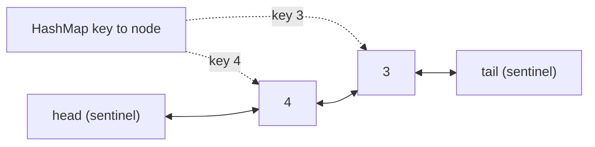

**Short answer:** Combine a `HashMap` from key to node with a doubly linked list ordered by recency. The map finds a node in O(1). The list moves a node to the front, or removes the tail, in O(1) because each node knows its neighbours. `get` moves the node to the front. `put` updates or inserts at the front, and evicts the tail when over capacity. Sentinel head and tail nodes remove the null checks.

## Picture it

Example 1, `capacity = 2`. The list is drawn from most recent (next to `head`) to least recent (next to `tail`).

| Call | List after (head → tail) | Evicted | Returns |
|---|---|---|---|
| put(1,1) | head ⇄ 1 ⇄ tail | — | — |
| put(2,2) | head ⇄ 2 ⇄ 1 ⇄ tail | — | — |
| get(1) | head ⇄ 1 ⇄ 2 ⇄ tail | — | 1 |
| put(3,3) | head ⇄ 3 ⇄ 1 ⇄ tail | 2 (tail.prev) | — |
| get(2) | unchanged | — | -1 |
| put(4,4) | head ⇄ 4 ⇄ 3 ⇄ tail | 1 (tail.prev) | — |
| get(1) | unchanged | — | -1 |
| get(3) | head ⇄ 3 ⇄ 4 ⇄ tail | — | 3 |
| get(4) | head ⇄ 4 ⇄ 3 ⇄ tail | — | 4 |



The map jumps straight to a node; the node's `prev` and `next` let it be unlinked and moved to the front in O(1).

**The picture in one sentence:** the hash map finds the node and the doubly linked list keeps recency order, so both lookup and "move to front or evict the tail" are O(1).

## Approach

- **Brute force:** a list of entries with a timestamp. `get` is O(n), eviction scans for the oldest, O(n).
- **Key insight:** we need two things in O(1): lookup by key (hash map) and "move to most recent / remove least recent" (doubly linked list). Neither works alone, so store list nodes as map values.
- **Shortcut:** `LinkedHashMap` with `accessOrder = true` and an overridden `removeEldestEntry` is exactly this structure. Mention it, but expect to be asked to build it by hand.

## Solution

```java
import java.util.*;

class LRUCache {
    private static final class Node {
        int key, val;
        Node prev, next;
        Node(int k, int v) { key = k; val = v; }
    }

    private final int capacity;
    private final Map<Integer, Node> map = new HashMap<>();
    private final Node head = new Node(0, 0), tail = new Node(0, 0); // head.next = most recent

    public LRUCache(int capacity) {
        this.capacity = capacity;
        head.next = tail;
        tail.prev = head;
    }

    public int get(int key) {
        Node n = map.get(key);
        if (n == null) return -1;
        unlink(n);
        addFront(n);
        return n.val;
    }

    public void put(int key, int value) {
        Node n = map.get(key);
        if (n != null) {                     // update counts as a use
            n.val = value;
            unlink(n);
            addFront(n);
            return;
        }
        if (map.size() == capacity) {        // evict least recently used
            Node lru = tail.prev;
            unlink(lru);
            map.remove(lru.key);             // why the node stores its key
        }
        n = new Node(key, value);
        map.put(key, n);
        addFront(n);
    }

    private void unlink(Node n) { n.prev.next = n.next; n.next.prev = n.prev; }

    private void addFront(Node n) {
        n.next = head.next; n.prev = head;
        head.next.prev = n; head.next = n;
    }
}
```

## Complexity

- **Time:** O(1) average for `get` and `put`. A hash lookup plus a constant number of pointer changes.
- **Space:** O(capacity) for the map and the nodes.

## Edge cases

- Capacity 1: every new key evicts the old one.
- `put` on an existing key: update in place, never evict.
- `get` on a missing key returns -1 and does not change the order.

## Variations

- **Thread-safe:** the simplest correct version wraps `get` and `put` in one `ReentrantLock` (or `synchronized`). A read-write lock does *not* help, because `get` also changes the list. For high concurrency, shard: N independent LRU segments chosen by `hash(key) % N`, each with its own lock. That gives approximate global LRU and much less contention. In production use Caffeine, which uses a concurrent map plus buffered recency updates.
- **Singleton?** Only if the whole application should share one cache, for example one process-wide cache of reference data. In Spring, make it a singleton-scoped bean rather than a static `getInstance()`, so it can still be injected and replaced in tests. A hand-written singleton hides the dependency and makes tests share state.
- **Inheritance vs composition:** `extends LinkedHashMap` is short but exposes every `Map` method, so callers can bypass the policy. Composition (a private map inside `LRUCache`) exposes only `get` and `put`. Prefer composition.
- **Misses exceed hits: size or policy?** Measure the working set: the number of distinct keys in a time window. If it is larger than the capacity, the cache is too small (hit rate rises as you grow it). If the pattern is a large one-time scan pushing out hot keys, LRU is the wrong policy; LFU or a scan-resistant policy (like Caffeine's W-TinyLFU) fits better. Replay a sample of real traffic against different sizes and policies to decide.
- **Priority-based cache:** evict the lowest priority first, then LRU within a priority. Keep a `TreeMap<Integer, LinkedList-of-nodes>` (or one doubly linked list per priority level) and evict from the lowest non-empty level. O(log P) per operation.
- **LFU:** LeetCode 460, a frequency map of lists plus a `minFreq` pointer, also O(1).

Further reading: [B7 · Classic problems: concurrent LRU](../academy/lessons/B7.md), [E6 · LLD case studies](../academy/lessons/E6.md).

Practise it in the app: Run / Submit on this page.
