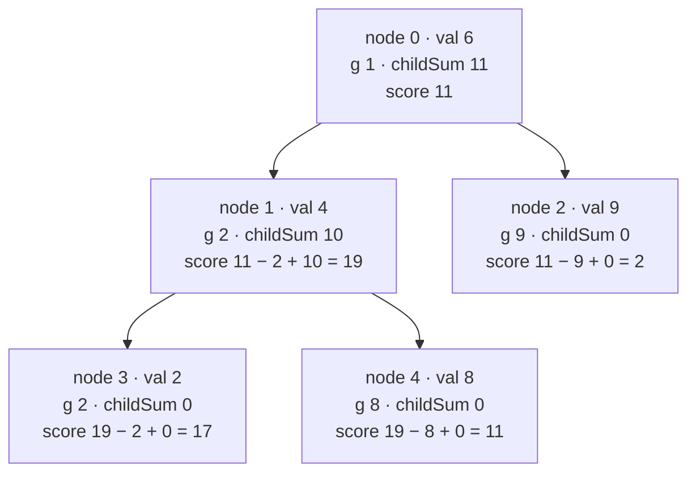

**Short answer:** Compute `g[u]`, the GCD of u's whole subtree, bottom-up. When you delete the path root → v, the components are exactly the subtrees of the path nodes' children that are *not* on the path. So score(v) = sum over path nodes u of (sum of g over u's children) minus the sum of g over the path nodes below the root (those children were deleted, not left as components). That is a prefix sum along the path, so one top-down pass gives every score in O(n log V).

## Picture it

Example 1: `parent = [-1,0,0,1,1]`, `values = [6,4,9,2,8]`. Each node shows its value, its subtree GCD `g`, `childGcdSum` and `score`:



| Pass | Order | What it fills |
|---|---|---|
| Bottom-up (reverse BFS) | 4, 3, 2, 1, 0 | g4 = 8, g3 = 2, g2 = 9, g1 = gcd(4,2,8) = 2, g0 = gcd(6,2,9) = 1; childSum1 = 2 + 8 = 10, childSum0 = 2 + 9 = 11 |
| Top-down (BFS) | 0, 1, 2, 3, 4 | score0 = 11, score1 = 19, score2 = 2, score3 = 17, score4 = 11 → best 19 |

Choosing v = 1 (score 19) deletes 0 and 1 and leaves {2}, {3}, {4}: 9 + 2 + 8.

**The picture in one sentence:** stepping the cut one node deeper swaps that child's subtree GCD for the sum of its own children's GCDs, so `score(v) = score(parent) − g[v] + childGcdSum[v]`.

## Approach

- **Brute force:** for each v, delete the path, find the components, and compute each GCD. O(n) per v, O(n²) overall: 4·10¹⁰ at n = 2·10⁵.
- **Key insight 1:** each remaining component is a complete subtree hanging off the path, so its GCD is a precomputed subtree GCD. No component ever needs recomputing.
- **Key insight 2:** let `childGcdSum[u] = Σ g[c]` over children c of u. If the path is `root = u0, u1, …, ut = v`, then each u_i contributes all its children's subtrees except the one that continues the path, u_{i+1}. So `score(v) = Σ childGcdSum[u_i] − Σ_{i≥1} g[u_i]`. Going one level down adds `childGcdSum[v] − g[v]`, so `score(v) = score(parent(v)) − g[v] + childGcdSum[v]`, with `score(root) = childGcdSum[root]`.
- **Iterative traversal:** a chain of 2·10⁴ (or 2·10⁵) nodes would overflow recursion. Build a BFS order: parents come before children, so a reverse BFS order computes `g` bottom-up and a forward BFS order computes `score` top-down.

## Solution

```java
import java.util.Arrays;

class Solution {
    public long maxGcdSum(int[] parent, int[] values) {
        int n = parent.length;
        // children lists in CSR form: children of u are children[start[u] .. start[u+1])
        int[] start = new int[n + 1];
        for (int i = 1; i < n; i++) start[parent[i] + 1]++;
        for (int i = 0; i < n; i++) start[i + 1] += start[i];
        int[] children = new int[Math.max(0, n - 1)];
        int[] fill = Arrays.copyOf(start, n + 1);
        for (int i = 0; i < n; i++) if (parent[i] >= 0) children[fill[parent[i]]++] = i;

        // BFS order: parents before children
        int[] order = new int[n];
        int head = 0, tail = 0;
        order[tail++] = 0;
        while (head < tail) {
            int u = order[head++];
            for (int e = start[u]; e < start[u + 1]; e++) order[tail++] = children[e];
        }

        long[] g = new long[n];            // GCD of u's subtree
        long[] childGcdSum = new long[n];  // sum of g over u's children
        for (int i = n - 1; i >= 0; i--) {
            int u = order[i];
            long x = values[u];
            for (int e = start[u]; e < start[u + 1]; e++) {
                int c = children[e];
                x = gcd(x, g[c]);
                childGcdSum[u] += g[c];
            }
            g[u] = x;
        }

        long[] score = new long[n];
        long best = 0;
        for (int i = 0; i < n; i++) {
            int u = order[i];
            score[u] = (u == 0 ? 0 : score[parent[u]] - g[u]) + childGcdSum[u];
            best = Math.max(best, score[u]);
        }
        return best;
    }

    private static long gcd(long a, long b) {
        while (b != 0) { long t = a % b; a = b; b = t; }
        return a;
    }
}
```

## Complexity

- **Time:** O(n log V): each edge does one GCD, and Euclid's algorithm is O(log V) for V up to 10⁹.
- **Space:** O(n) for the arrays.

## Edge cases

- Single node: deleting the root leaves nothing, score 0.
- Chain: deleting down to v leaves only the subtree below v, so the best v is usually near the bottom (Example 3).
- Leaf v: `childGcdSum[v] = 0`, so its score is its parent's score minus `g[v]`.
- Parent numbers larger than child numbers: never assume `parent[i] < i`; the BFS order handles any numbering.
- Overflow: the sum can reach 2·10⁵ · 10⁹ = 2·10¹⁴, so use `long`.
- Modulo: the original report asks for the answer mod 10⁹ + 7. Taking the modulo *before* comparing would break the maximum. Compute exactly in `long` (it fits), take the max, and apply `% 1_000_000_007` only at the very end if required.

## Variations

- **Delete a single node instead of a path:** its children's subtrees plus "the rest of the tree" are the components; the GCD of "everything except subtree v" needs a rerooting pass (prefix/suffix GCDs over siblings).
- **Sum instead of GCD:** same structure with subtree sums.

Practise it in the app: Run / Submit on this page.
