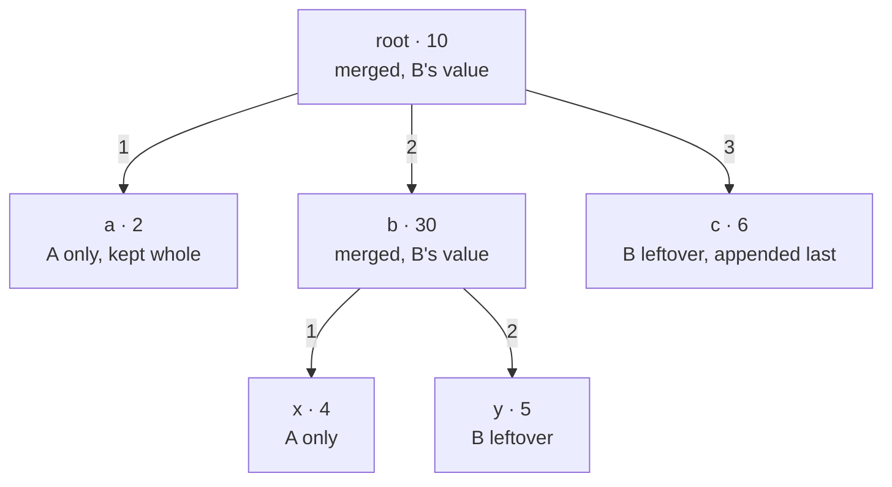

**Short answer:** Recursive merge. For two nodes with the same key, the result takes B's value. Build a map from key to child for B's children. Walk A's children in order: if B has a child with the same key, merge the pair recursively, otherwise keep A's child as is. Then append B's children whose keys were not matched, in B's order. With the map, each node is touched once: O(|A| + |B|).

## Picture it

Example 1. A = root(1) → [a(2), b(3) → [x(4)]]; B = root(10) → [b(30) → [y(5)], c(6)]. The merged tree, with where each node came from:



| Call | bByKey (B's children) | Walk A's children | B leftovers appended |
|---|---|---|---|
| merge(root, root) | {b, c} | a: no match → keep; b: match → recurse | c |
| merge(b, b) | {y} | x: no match → keep | y |

Edge labels give the child order: A's order first, then B's unmatched children in B's order.

**The picture in one sentence:** a map of B's children by key turns matching into O(1), and walking A's list then B's leftovers gives the required order.

## Approach

- **Brute force:** for each child of A, scan B's children for the same key. Correct, but O(c²) at a node with c children, which hurts on wide trees.
- **Key insight:** keys are unique among siblings, so a `HashMap<String, Node>` of B's children gives O(1) matching, and a set of matched keys tells you which of B's children are left over.
- **Ordering rule:** the output keeps A's order first and then B's leftovers. Iterating A's list, then B's list, gives exactly that.
- **Unmatched subtrees** are reused whole; there is nothing to merge inside them.

## Solution

`Node` is provided: `String key; int value; List<Node> children`.

```java
import java.util.*;

class Solution {
    public Node merge(Node a, Node b) {
        if (a == null) return b;
        if (b == null) return a;
        Node out = new Node(a.key, b.value);               // B's value wins
        Map<String, Node> bByKey = new HashMap<>();
        for (Node c : b.children) bByKey.put(c.key, c);
        Set<String> usedFromB = new HashSet<>();
        for (Node c : a.children) {                        // A's order first
            Node match = bByKey.get(c.key);
            if (match != null) {
                usedFromB.add(c.key);
                out.children.add(merge(c, match));
            } else {
                out.children.add(c);
            }
        }
        for (Node c : b.children) {                        // then B's leftovers
            if (!usedFromB.contains(c.key)) out.children.add(c);
        }
        return out;
    }
}
```

## Complexity

- **Time:** O(|A| + |B|) on average, counting each key hash as O(key length). Every node is visited at most once (matched nodes once each, unmatched subtrees not at all).
- **Space:** O(depth) for recursion plus O(c) for the per-node map and set. Depth ≤ 500 here, so recursion is safe. For unbounded depth, convert to an explicit stack of (a, b, outParent) frames.

## Edge cases

- One tree null: return the other. Both null: `null`.
- Leaf merged with a non-leaf: the loops handle empty child lists.
- Same key in both but different values: B wins at every level.
- Output shares unmatched subtrees with the inputs. If callers may later modify A or B, deep-copy those subtrees instead (ask what is expected).
- Roots with different keys: the spec guarantees they match; defensively, you could throw `IllegalArgumentException`.

## Variations

- **Value merge function:** pass a `BinaryOperator<Integer>` (sum, max, prefer A) instead of hard-coding "B wins".
- **Merge k trees:** fold pairwise, or merge level by level with a map from key to list of nodes.
- **Sorted output:** sort children by key at each node instead of keeping A-then-B order.
- **Real-world shape:** this is how configuration overlays work (a base config merged with an environment override, where the override wins), for example how Spring merges property sources by key.

Practise it in the app: Run / Submit on this page.
