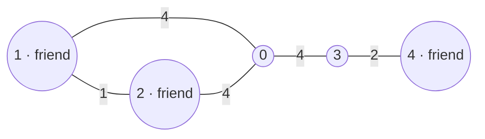

**Short answer:** Run Dijkstra once from each person's start. For every node x, the meeting cost is the sum of the distances to x from all starts; take the smallest sum among nodes every person can reach. With k people that is O(k · (n + m) log n). For exactly two people, the answer is simply their shortest distance to each other, because any node on that shortest path costs exactly that much.

## Picture it

Example 2: friends start at places 1, 2 and 4.



One Dijkstra per friend, then add the columns place by place:

| Place x | from 1 | from 2 | from 4 | total |
|---|---|---|---|---|
| 0 | 4 | 4 | 6 | 14 |
| 1 | 0 | 1 | 10 | **11** |
| 2 | 1 | 0 | 10 | **11** |
| 3 | 8 | 8 | 2 | 18 |
| 4 | 10 | 10 | 0 | 20 |

Answer 11 (meet at place 1; place 2 ties).

**The picture in one sentence:** roads are two-way, so one Dijkstra from each of the k friends gives every place's distance to everyone, and the best meeting point is the smallest row sum.

## Approach

- **Brute force:** for every candidate node x, run Dijkstra from x and add up the distances to all people. n runs: O(n · m log n), about 10⁴ × 3·10⁴ × 14. Too slow.
- **Key insight:** the graph is undirected, so `dist(friend, x) = dist(x, friend)`. Instead of one search per candidate, run one search per *person* (k ≤ 10), and every candidate's total is just an addition per node.
- **Two people:** for any x, `dist(A, x) + dist(x, B) ≥ dist(A, B)` (triangle inequality), with equality on a shortest path. So the minimum is `dist(A, B)`: one Dijkstra suffices.
- **Directed roads:** if roads were one-way, run Dijkstra on the *reversed* graph from x, or simply from each friend on the forward graph, since each friend travels *to* x.

## Solution

```java
import java.util.*;

class Solution {
    public long minTotalCost(int n, int[][] edges, int[] friends) {
        List<List<int[]>> adj = new ArrayList<>();
        for (int i = 0; i < n; i++) adj.add(new ArrayList<>());
        for (int[] e : edges) {
            adj.get(e[0]).add(new int[] {e[1], e[2]});
            adj.get(e[1]).add(new int[] {e[0], e[2]});
        }
        long[] total = new long[n];
        boolean[] reachable = new boolean[n];
        Arrays.fill(reachable, true);
        for (int f : friends) {
            long[] d = dijkstra(adj, n, f);
            for (int x = 0; x < n; x++) {
                if (d[x] == Long.MAX_VALUE) reachable[x] = false;
                else total[x] += d[x];
            }
        }
        long best = Long.MAX_VALUE;
        for (int x = 0; x < n; x++) if (reachable[x]) best = Math.min(best, total[x]);
        return best == Long.MAX_VALUE ? -1 : best;
    }

    private static long[] dijkstra(List<List<int[]>> adj, int n, int src) {
        long[] dist = new long[n];
        Arrays.fill(dist, Long.MAX_VALUE);
        dist[src] = 0;
        PriorityQueue<long[]> pq = new PriorityQueue<>((a, b) -> Long.compare(a[0], b[0]));
        pq.add(new long[] {0, src});
        while (!pq.isEmpty()) {
            long[] top = pq.poll();
            int u = (int) top[1];
            if (top[0] > dist[u]) continue;          // stale entry
            for (int[] e : adj.get(u)) {
                long nd = top[0] + e[1];
                if (nd < dist[e[0]]) {
                    dist[e[0]] = nd;
                    pq.add(new long[] {nd, e[0]});
                }
            }
        }
        return dist;
    }
}
```

## Complexity

- **Time:** O(k · (n + m) log n): k Dijkstra runs, plus O(k · n) to sum.
- **Space:** O(n + m) for the graph, O(n) per distance array.

## Edge cases

- Disconnected graph: a node counts only if every friend reaches it; if none does, return −1.
- Friends at the same start: fine, they each add their distance.
- One friend: the answer is 0 (meet where they stand).
- Parallel roads and self-loops: Dijkstra just relaxes the cheaper one; loops never improve anything.
- Overflow: a path can cost up to about 10⁴ × 10⁶ = 10¹⁰ per person, so use `long`.

## Follow-ups: k friends, and the node minimising the total for all

That is exactly the solution above: one Dijkstra per friend, then the node with the smallest total. Points to add:

- If k is large (say k close to n), k Dijkstra runs become expensive; on unit-weight graphs, use BFS (O(k · (n + m))). For all pairs on small graphs, Floyd–Warshall is O(n³).
- **Minimise the maximum** travel instead of the sum ("nobody travels too far"): same distance arrays, take `max` instead of `sum` per node.
- **Return the node,** not just the cost: keep the argmin, and break ties by the lowest id.
- On a tree or a line with unit weights, the optimal sum-meeting point is a median of the friends' positions, which can be found without Dijkstra.

Practise it in the app: Run / Submit on this page.
