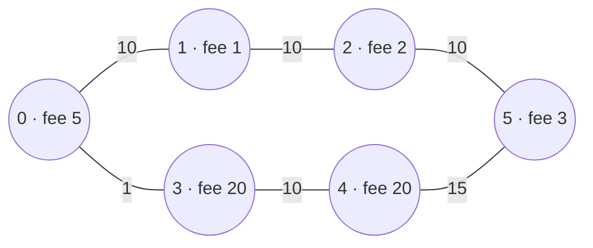

**Short answer:** Make time part of the state. Let `best[t][v]` be the cheapest fees to stand in city v at exactly minute t. Every road moves you from (t, x) to (t + time, y) and adds y's fee. Because every road takes at least one minute, process t from 0 up to `maxTime` and relax all edges: that is a DP over a DAG of (time, city) states. The answer is the minimum of `best[t][n−1]` over all t. O(maxTime · E).

## Picture it

Example 1 roads (edge label = minutes) and tolls:



Some of the filled cells `best[t][v]` (cheapest fees to stand in city v at exactly minute t). Each cell is filled from `best[t − time][u] + fee[v]` for a road u–v:

| Minute t | City v | best[t][v] | Filled from |
|---|---|---|---|
| 0 | 0 | 5 | start (its toll is paid) |
| 1 | 3 | 25 | best[0][0] + 20 |
| 10 | 1 | 6 | best[0][0] + 1 |
| 11 | 4 | 45 | best[1][3] + 20 |
| 20 | 2 | 8 | best[10][1] + 2 |
| 26 | 5 | 48 | best[11][4] + 3 |
| 30 | 5 | 11 | best[20][2] + 3 |

Other cells (for example bouncing 0 → 3 → 0) are filled too but cost more. The answer is the minimum of column `n − 1` over `t ≤ maxTime`: maxTime 30 → min(48, 11) = 11; maxTime 29 → 48; maxTime 25 → no cell, −1.

**The picture in one sentence:** time is small and every road takes at least a minute, so (minute, city) states form a DAG and a DP over minutes tracks the cheapest fees for each exact arrival time.

## Approach

- **Why one Dijkstra is not enough:** Dijkstra on fees finds the cheapest route, which may be too slow. Dijkstra on time finds the fastest route, which may be too expensive. You have two quantities and a constraint on one of them.
- **Key insight:** time is small (≤ 1000) and every edge takes ≥ 1 minute, so (minute, city) states form a DAG ordered by minute. A DP over that DAG handles both quantities exactly. Revisiting a city is allowed and is naturally modelled, since it is just a later state.
- **Alternative (Dijkstra with pruning):** Dijkstra keyed on fees over states (city, time); keep `minTime[city]` and skip a state if you have already reached that city with lower fees *and* less time (a state that is both more expensive and slower is dominated). This is often faster in practice.

## Solution

```java
import java.util.Arrays;

class Solution {
    public int minCost(int maxTime, int[][] edges, int[] passingFees) {
        int n = passingFees.length;
        final int INF = Integer.MAX_VALUE / 2;
        // best[t][v] = cheapest fees to stand in city v at exactly minute t
        int[][] best = new int[maxTime + 1][n];
        for (int[] row : best) Arrays.fill(row, INF);
        best[0][0] = passingFees[0];                       // the start city is paid too
        for (int t = 0; t <= maxTime; t++) {
            for (int[] e : edges) {
                int x = e[0], y = e[1], nt = t + e[2];
                if (nt > maxTime) continue;
                if (best[t][x] < INF && best[t][x] + passingFees[y] < best[nt][y]) {
                    best[nt][y] = best[t][x] + passingFees[y];
                }
                if (best[t][y] < INF && best[t][y] + passingFees[x] < best[nt][x]) {
                    best[nt][x] = best[t][y] + passingFees[x];
                }
            }
        }
        int ans = INF;
        for (int t = 0; t <= maxTime; t++) ans = Math.min(ans, best[t][n - 1]);
        return ans >= INF ? -1 : ans;
    }
}
```

## Complexity

- **Time:** O(maxTime · E) = 10⁶ edge relaxations.
- **Space:** O(maxTime · n) = 10⁶ ints (about 4 MB). Since edges only go forward in time, you cannot shrink it to one row, but you could keep `best[v][t]` in a `HashMap` if most states are unreachable.

## Edge cases

- Start and end fees are both paid: initialise with `passingFees[0]` and add the destination's fee when you arrive.
- Arriving exactly at `maxTime` is allowed (`nt > maxTime` is the cut-off).
- Parallel roads between the same cities: each is relaxed separately.
- Unreachable in time: return −1.
- `INF = MAX_VALUE / 2` so that `INF + fee` cannot overflow.

## Variations

- **Cheapest Flights Within K Stops:** the budget is the number of edges instead of minutes; the same "budget as part of the state" idea (Bellman–Ford for K rounds).
- **Constrained shortest path with large budgets:** the DP table becomes too big; use the dominance-pruned Dijkstra or a Pareto front per node (pairs of (time, cost) where neither is worse in both).
- **Also return the route:** store the predecessor (time, city) for each improved state and walk back.

Practise it in the app: Run / Submit on this page.
