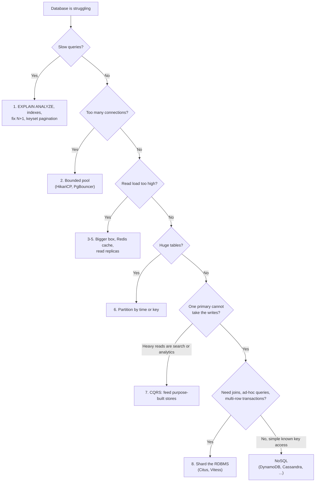
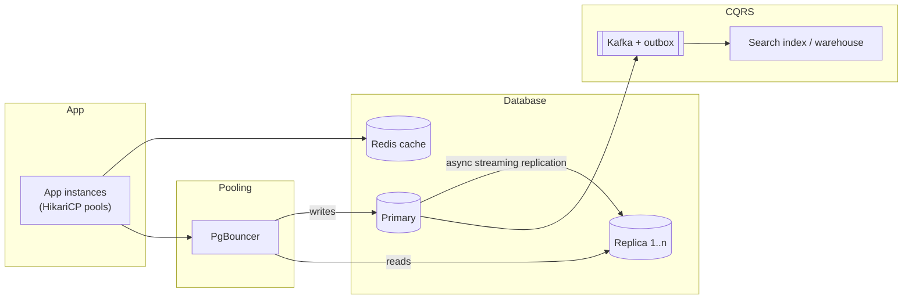
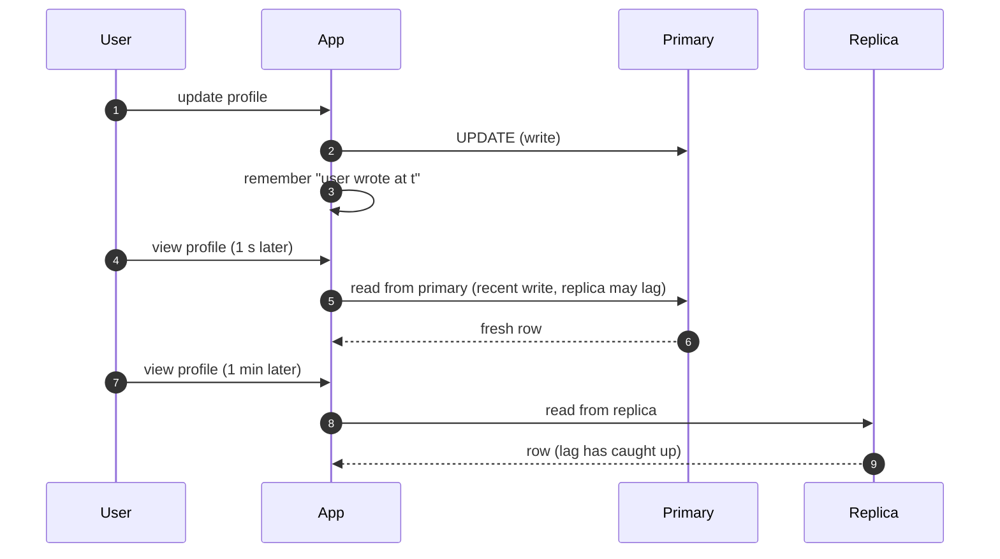

**Short answer:** An RDBMS usually hits limits in a fixed order: slow queries, then too many connections, then read load, then write throughput and data size on one primary. Fix them in that order: indexes and query tuning, connection pooling, caching and read replicas, partitioning, and only then sharding. Choose NoSQL when the access pattern is simple and known (mostly key lookups), the scale needs horizontal writes, and you can live without joins and multi-row transactions. If you need joins, ad-hoc queries and strong transactions, stay relational and scale it.

## Picture it







**How to read it:**
- The first picture is the ladder: fix problems in the order they usually appear, and reach for sharding or NoSQL only after the cheaper steps are used up.
- The fork at the bottom is the real NoSQL decision: if access is simple key lookups at huge write scale, NoSQL fits; if you need joins and multi-row transactions, shard the RDBMS instead.
- The architecture shows the scaled RDBMS: pooled connections, writes to the primary, reads to replicas, Redis for hot reads, and an outbox feeding search and analytics.
- Steps 1–8 show the catch with replicas, replication lag, and its fix: read-your-writes routing sends a user's reads to the primary for a short time after they write.

## Requirements

Frame the discussion as a system that has outgrown one database:

**Functional**
- OLTP workload: users, orders, payments; reads and writes through a Spring Boot service.

**Non-functional**
- p99 read under ~50 ms, writes durable, growth of 10× in data and traffic.
- Some data needs strong consistency (money), some can be eventual (feeds, counters, logs).

## Estimates

Rough single-node numbers, enough to reason with (they vary a lot with hardware and query shape):

- A well-indexed point read on Postgres: well under 1 ms of server time; a few thousand to tens of thousands of simple queries/s per node.
- Writes: thousands of small transactions/s per primary before WAL I/O and lock contention dominate.
- Connections: each Postgres connection is a separate backend process, so hundreds are fine and thousands are not. Use a pool (HikariCP in the app, PgBouncer in front if many app instances).
- Data size: single-node Postgres handles multiple TB, but vacuum, index rebuilds, backups and restores get slow. That operational pain usually arrives before raw query limits.

## API

Not about endpoints here; the "API" is the data access pattern, which drives the choice:

```text
Key lookup:        get(orderId)                         -> any store
Range by key:      orders of user U, newest first       -> RDBMS index, or wide-column with clustering key
Ad-hoc / joins:    revenue by region by product by week -> RDBMS / warehouse
Multi-row atomic:  debit A, credit B                    -> RDBMS transaction
```

## Data model

Relational stays normalised with foreign keys. For NoSQL you model *per query*: denormalise, duplicate data into one item or partition per access pattern, and choose the partition key so load spreads evenly.

```sql
-- Postgres declarative partitioning by time
CREATE TABLE orders (
  id BIGINT, user_id BIGINT, created_at TIMESTAMPTZ NOT NULL, total NUMERIC(12,2),
  PRIMARY KEY (id, created_at)
) PARTITION BY RANGE (created_at);
CREATE TABLE orders_2026_10 PARTITION OF orders
  FOR VALUES FROM ('2026-10-01') TO ('2026-11-01');
```

On a partitioned table, the primary key must include the partition key column, which is why `created_at` is part of it.

## Architecture

The diagram in **Picture it** above shows the components. Later, shard by `tenant_id` / `user_id` across several primaries, with the router in the app or a proxy.

## Deep dives

**1. The ladder of scaling an RDBMS.**
1. *Query and index work:* read `EXPLAIN ANALYZE`, add the right composite or partial indexes, remove N+1 queries, use keyset pagination instead of large `OFFSET`.
2. *Connections:* a bounded pool; many idle connections waste memory and context switches.
3. *Vertical scaling:* more RAM so the working set fits in memory. Cheap and quick; it has a ceiling.
4. *Caching:* cache-aside in Redis for hot, read-mostly data, with TTL and invalidation on write.
5. *Read replicas:* route reads to replicas. The catch is replication lag: a user may not see their own write. Fix with read-your-writes routing (read from primary for a short time after a write).
6. *Partitioning:* split big tables by time or key inside one database. Old partitions are detached or dropped instantly instead of slow `DELETE`s; queries that filter on the partition key touch fewer partitions.
7. *CQRS:* move heavy reads (search, analytics) to purpose-built stores fed by events.
8. *Sharding:* split data across several primaries by a shard key. Now cross-shard joins, cross-shard transactions, global unique constraints and resharding become your problem. Citus (for Postgres) or Vitess (for MySQL) handle some of this.

**2. When NoSQL fits.**
- *Key-value / wide-column (DynamoDB, Cassandra):* huge write rates, predictable key-based access, multi-region writes, tunable consistency. Poor at ad-hoc queries.
- *Document (MongoDB):* nested aggregates read and written as one unit, schema that varies per record.
- *Time-series stores:* metrics with high ingest and time-window queries.
- *Graph databases:* many-hop relationship queries.
- *Search engines (Elasticsearch/OpenSearch):* full-text and faceted search, usually as a secondary index, not the source of truth.

**3. When it does not.** Money movement, inventory, anything that needs multi-entity invariants. Several NoSQL stores now offer transactions, but with limits on scope and cost; check them before relying on them.

## Trade-offs

| Dimension | RDBMS | Typical NoSQL |
|---|---|---|
| Schema | Enforced, migrations | Flexible, enforced in code |
| Queries | Ad-hoc, joins | Designed per access pattern |
| Transactions | Full ACID, multi-row | Often single-item or limited |
| Scale-out writes | Hard (sharding) | Built in (partitioning) |
| Consistency | Strong on primary | Often eventual or tunable |

A common answer: **polyglot persistence.** Postgres as the system of record, Redis for cache, a search engine for search, a columnar store for analytics, connected by change events.

## Follow-ups

- *Choosing a shard key?* High cardinality, even distribution, and present in most queries (for example `tenant_id`). Avoid monotonically increasing keys with range sharding, since all new writes land on one shard.
- *Resharding without downtime?* Use many logical shards mapped to fewer physical nodes, then move logical shards; or consistent hashing. Dual-write or replicate, backfill, verify, then switch reads.
- *Replica lag hurting users?* Read-your-writes routing, or synchronous replication for critical data at a latency cost.
- *Is "NoSQL scales, SQL doesn't" true?* No. Relational databases scale far with the ladder above; NoSQL trades query flexibility and transactions for easier horizontal scale.

Related lessons: [Q8 · Scaling databases: replicas, partitioning, sharding, caching, CQRS](../academy/lessons/Q8.md), [Q5 · Indexes and reading EXPLAIN](../academy/lessons/Q5.md), [Q7 · Query performance in practice](../academy/lessons/Q7.md), [F2 · Distributed theory: CAP, consistency, consensus](../academy/lessons/F2.md). Postgres partitioning reference: [postgresql.org/docs/current/ddl-partitioning.html](https://www.postgresql.org/docs/current/ddl-partitioning.html).
