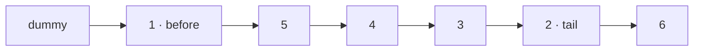

**Short answer:** Use a dummy head, walk to the node just before position `left` (call it `before`), then repeatedly take the node after the current block tail and move it to the front of the block, right after `before`. After `right - left` moves the block is reversed. One pass, O(n) time, O(1) space.

## Picture it

`head = [1,2,3,4,5,6]`, `left = 2`, `right = 5`. `before` = node 1, `tail` = node 2 (it stays the last node of the block).

| Step (i) | moved = tail.next | List after moving it to just after `before` |
|---|---|---|
| start | — | 1 → 2 → 3 → 4 → 5 → 6 |
| 2 | 3 | 1 → 3 → 2 → 4 → 5 → 6 |
| 3 | 4 | 1 → 4 → 3 → 2 → 5 → 6 |
| 4 | 5 | 1 → 5 → 4 → 3 → 2 → 6 |

The final links:



**The picture in one sentence:** keep `tail` fixed and keep pulling the node after it to the front of the block, so the block reverses in place and the list never needs reconnecting.

## Approach

- **Brute force.** Copy values into an array, reverse the slice, write values back. Two passes and O(n) space, and it rewrites values instead of relinking nodes, which interviewers usually disallow.
- **Three-phase relink.** Find the node before `left`, reverse `right - left + 1` nodes with the classic `prev/cur` loop, then reconnect both ends. Works, but the reconnection is where bugs live.
- **Key insight (front insertion).** Keep `before` fixed and `tail` = the original node at `left`. `tail` stays the last node of the reversed block the whole time. Each step, unlink `tail.next` and insert it directly after `before`. The block grows from the front, already reversed, and the list stays connected after every step, so there is nothing to reconnect at the end.
- **Dummy head** removes the special case `left == 1`, where the real head changes.

Trace for `[1,2,3,4,5]`, left 2, right 4: `before = 1`, `tail = 2`. Move 3 → `1,3,2,4,5`. Move 4 → `1,4,3,2,5`. Done.

## Solution

```java
class Solution {
    public ListNode reverseBetween(ListNode head, int left, int right) {
        ListNode dummy = new ListNode(0, head);
        ListNode before = dummy;
        for (int i = 1; i < left; i++) before = before.next;
        ListNode tail = before.next; // ends up as the last node of the reversed block
        for (int i = left; i < right; i++) {
            ListNode moved = tail.next;
            tail.next = moved.next;    // unlink moved
            moved.next = before.next;  // put it at the front of the block
            before.next = moved;
        }
        return dummy.next;
    }
}
```

## Complexity

- **Time:** O(right), a single pass up to position `right`.
- **Space:** O(1), a few pointers.

## Edge cases

- `left == right`: the loop runs zero times, list unchanged.
- `left == 1`: the head changes; the dummy handles it.
- `right` equal to the list length: `tail.next` becomes null at the end, which is correct.
- Single-node list.

## Variations

- **Reverse the whole list:** `left = 1`, `right = n`, or the plain `prev/cur/next` loop.
- **Reverse Nodes in k-Group:** apply the same block reversal to every full block of k.
- **Recursive version:** elegant but uses O(n) stack, which can overflow for 10⁵ nodes in Java.

Practise it in the app: Run / Submit on this page.
