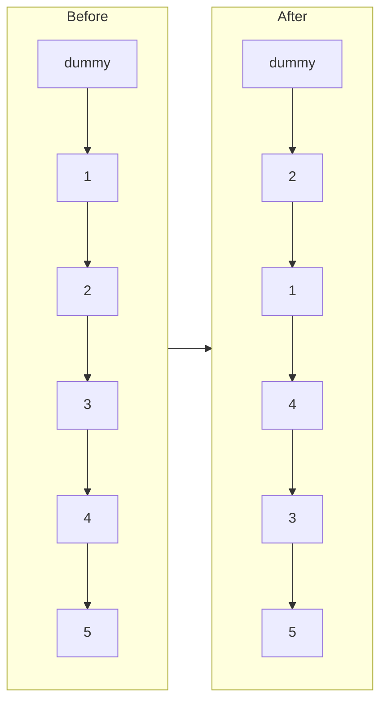

**Short answer:** Walk the list block by block. For each block, first check that k nodes exist; if not, stop and leave the tail as it is. Otherwise reverse the k nodes in place, pointing the first node of the block at the node after the block, and hook the previous block's tail to the new block head. Iterative, O(n) time and O(1) extra space.

## Picture it

`1 → 2 → 3 → 4 → 5`, `k = 2`. Each pass finds `kth`, reverses the block with `prev` starting at `groupNext`, then links `groupPrev` to `kth`.



| Pass | groupPrev | kth | groupNext | Reversal relinks | List after the pass | New groupPrev |
|---|---|---|---|---|---|---|
| 1 | dummy | 2 | 3 | `1.next = 3`, `2.next = 1` | dummy → 2 → 1 → 3 → 4 → 5 | 1 |
| 2 | 1 | 4 | 5 | `3.next = 5`, `4.next = 3` | dummy → 2 → 1 → 4 → 3 → 5 | 3 |
| 3 | 3 | null (only 5 left) | – | none, break | dummy → 2 → 1 → 4 → 3 → 5 | – |

**The picture in one sentence:** start each block's reversal with `prev = groupNext` so the old first node already points past the block, then hook `groupPrev` to the old k-th node.

## Approach

- **Brute force.** Push k nodes onto a stack and pop them to relink, or copy values into an array. That costs O(k) extra space, and rewriting values is not allowed.
- **Recursive.** Reverse the first k nodes and recurse on the rest. Clean, but O(n/k) stack depth.
- **Key insight.** Each block is an ordinary list reversal with two fixed ends: `groupPrev` (the node before the block) and `groupNext` (the node after it). Start the reversal with `prev = groupNext`, so the block's first node, which becomes its last, already points to the rest of the list. Then set `groupPrev.next = kth` (the new block head), and the old first node becomes `groupPrev` for the next block.
- **Look ahead first.** Find the k-th node before touching anything; if the list runs out, the remaining nodes stay in order.

## Solution

```java
class Solution {
    public ListNode reverseKGroup(ListNode head, int k) {
        ListNode dummy = new ListNode(0, head);
        ListNode groupPrev = dummy;
        while (true) {
            // find the k-th node of this block
            ListNode kth = groupPrev;
            for (int i = 0; i < k && kth != null; i++) kth = kth.next;
            if (kth == null) break;                 // fewer than k nodes left
            ListNode groupNext = kth.next;
            // reverse groupPrev.next .. kth
            ListNode prev = groupNext, cur = groupPrev.next;
            while (cur != groupNext) {
                ListNode nx = cur.next;
                cur.next = prev;
                prev = cur;
                cur = nx;
            }
            ListNode first = groupPrev.next;        // old first node is now the block tail
            groupPrev.next = kth;
            groupPrev = first;
        }
        return dummy.next;
    }
}
```

## Complexity

- **Time:** O(n). Each node is visited twice: once by the look-ahead, once by the reversal.
- **Space:** O(1), no stack and no recursion.

## Edge cases

- `k == 1`: every block is a single node, list unchanged.
- `k == n`: the whole list is reversed.
- `n` not divisible by k: the last `n mod k` nodes keep their order.
- Two-node list with `k = 2`: the head changes, the dummy handles it.

## Variations

- **Reverse the leftover tail too:** drop the `kth == null` break and reverse whatever remains.
- **Reverse alternate blocks:** reverse a block, then skip k nodes without reversing.
- **Swap Nodes in Pairs (LC 24):** this problem with k = 2.
- **Reverse Linked List II:** reverse a single block between two positions.

Practise it in the app: Run / Submit on this page.
