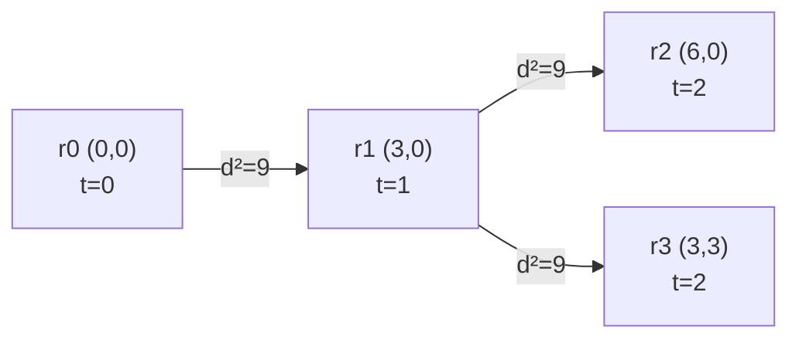

**Short answer:** Model the routers as a graph where two routers are connected if their distance is at most R. Switching on spreads one hop per second, so the answer is the BFS depth of the farthest router from the source, or -1 if BFS does not reach everyone. With n up to 2000, an O(n²) BFS that checks every pair on the fly is enough.

## Picture it

Example 1: `routers = [[0,0],[3,0],[6,0],[3,3]]`, `radius = 3` (so `r2 = 9`), `source = 0`. An edge means squared distance ≤ 9; labels show the second each router turns on.



r0–r2 (d² = 36), r0–r3 (d² = 18) and r2–r3 (d² = 18) are too far, so they have no edge.

| Pop | dist of popped (`last`) | Scan of routers still off | Queue after |
|---|---|---|---|
| r0 | 0 | r1: 9 ≤ 9 → dist 1 · r2: 36 no · r3: 18 no | [r1] |
| r1 | 1 | r2: 9 → dist 2 · r3: 9 → dist 2 | [r2, r3] |
| r2 | 2 | r3 already on → skip | [r3] |
| r3 | 2 | nothing left | [] |

`tail = 4 = n`, so every router was reached and the answer is `last = 2`.

**The picture in one sentence:** the second a router turns on is its BFS hop distance from the source, so the answer is the depth of the last router popped.

## Approach

- **Brute force:** simulate second by second, and each second test every on router against every off router. That is O(n²) per second and up to n seconds, so O(n³).
- **Key insight:** "every on router pings its neighbours each second" is exactly breadth-first search. The time a router turns on is its shortest hop distance from the source. The answer is the largest such distance.
- **Optimal:** BFS from the source. Do not build the adjacency list up front (that is O(n²) memory). Instead, when you pop a router, scan all routers that are still off and enqueue the ones within range. Each router is popped once, so the total work is O(n²).
- Compare **squared** distances as `long`. This avoids `sqrt` and `int` overflow (coordinates up to 10⁶, so dx² can reach 4·10¹²).

## Solution

```java
import java.util.*;

class Solution {
    public int minTimeToTurnOn(int[][] routers, int radius, int source) {
        int n = routers.length;
        long r2 = (long) radius * radius;
        int[] dist = new int[n];
        Arrays.fill(dist, -1);
        dist[source] = 0;
        int[] queue = new int[n];
        int head = 0, tail = 0, last = 0;
        queue[tail++] = source;
        while (head < tail) {
            int u = queue[head++];
            last = dist[u];                       // BFS pops in non-decreasing distance
            for (int v = 0; v < n; v++) {
                if (dist[v] != -1) continue;
                long dx = routers[u][0] - routers[v][0], dy = routers[u][1] - routers[v][1];
                if (dx * dx + dy * dy <= r2) {
                    dist[v] = dist[u] + 1;
                    queue[tail++] = v;
                }
            }
        }
        return tail == n ? last : -1;             // someone was never enqueued
    }
}
```

## Complexity

- **Time:** O(n²). Each router is dequeued once and scans all n routers.
- **Space:** O(n) for the distance array and queue. No adjacency list is stored.

## Edge cases

- One router: answer 0.
- Distance exactly R counts (`<=`).
- Several routers on the same point (distance 0), and `radius = 0`.
- An unreachable router: return -1.
- Overflow: `dx` is stored as `long` before it is squared.

## Follow-ups

- **Each router has its own radius:** reachability becomes directed (u reaches v if the distance is at most R_u, not R_v). The same BFS works; use `R[u]²` when scanning from u. The answer is still the BFS depth, or -1 if some router is unreachable from the source.
- **Much larger n:** bucket routers into a grid with cell size R, so each pop only checks the 3×3 neighbouring cells. That is near-linear for spread-out points.

See [C1 · From constraints to the expected complexity](../academy/lessons/C1.md) for why n = 2000 allows O(n²).

Practise it in the app: Run / Submit on this page.
