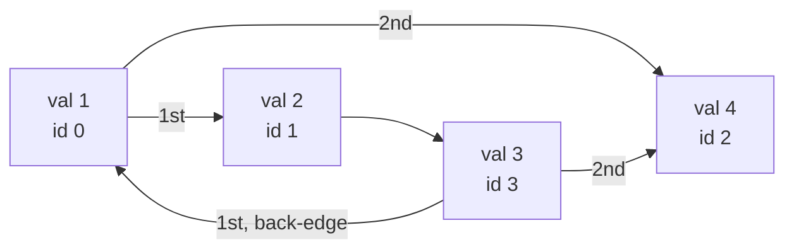

**Short answer:** Give every reachable node a number in BFS order, using an `IdentityHashMap` so nodes with equal values stay distinct. Write the node count, then each node's value, then each node's neighbour numbers in order. To rebuild, create all n nodes first and then wire the edges by number, which handles cycles and self-loops with no special case.

## Picture it

Example 1: `values = [1,2,3,4]`, `adjacency = [[1,3],[2],[0,3],[]]`. Labels show each node's value and the BFS id it gets during `serialize`.



| BFS step (k) | Node popped | Neighbours in order | New ids given | `order` after |
|---|---|---|---|---|
| start | – | – | val 1 → 0 | [1] |
| 0 | val 1 | val 2, val 4 | val 2 → 1, val 4 → 2 | [1, 2, 4] |
| 1 | val 2 | val 3 | val 3 → 3 | [1, 2, 4, 3] |
| 2 | val 4 | none | – | same |
| 3 | val 3 | val 1 (id 0), val 4 (id 2) | none, both known | same |

Output string: `4|1|2|4|3|1,2|3||0,2` = count · four values in id order · four edge lists (the empty field is val 4, which has no edges). `deserialize` makes 4 fresh nodes first, then wires `0→1,2`, `1→3`, `3→0,2`, so the cycle back to node 0 needs no special case.

**The picture in one sentence:** replace object identity with BFS ids, then the graph is just a value array plus an id adjacency list, rebuilt as "create all nodes, then wire edges".

## Approach

- **Why not just print values?** Values are not unique and the graph can have cycles. A naive DFS that prints values would loop forever or merge distinct nodes, so identity must be encoded explicitly.
- **Key insight:** map object identity to a small integer id. The graph then becomes an array of values plus an adjacency list of ids, both easy to write as text.
- **Serialise:** BFS from the root. The first time a node is seen it gets the next id. `IdentityHashMap` compares by reference, which is what you need whatever `Node` does with `equals`/`hashCode`.
- **Deserialise:** two passes. Pass 1 creates `nodes[i] = new Node(val_i)`. Pass 2 adds edges by id, in the stored order. Every node exists before any edge is added, so back-edges and self-loops just work.
- **Format:** `n|v0|v1|...|e0|e1|...` where `ei` is a comma list. Values are integers, so `|` and `,` cannot clash with the data. `split("\\|", -1)` keeps the trailing empty fields of nodes with no edges.

## Solution

```java
import java.util.*;

class Codec {
    public String serialize(Node root) {
        if (root == null) return "0";
        Map<Node, Integer> id = new IdentityHashMap<>();
        List<Node> order = new ArrayList<>();
        id.put(root, 0);
        order.add(root);
        for (int k = 0; k < order.size(); k++) {          // BFS; the list doubles as the queue
            for (Node m : order.get(k).neighbors) {
                if (!id.containsKey(m)) {
                    id.put(m, order.size());
                    order.add(m);
                }
            }
        }
        StringBuilder sb = new StringBuilder().append(order.size());
        for (Node n : order) sb.append('|').append(n.val);
        for (Node n : order) {
            sb.append('|');
            for (int i = 0; i < n.neighbors.size(); i++) {
                if (i > 0) sb.append(',');
                sb.append(id.get(n.neighbors.get(i)));
            }
        }
        return sb.toString();
    }

    public Node deserialize(String data) {
        String[] parts = data.split("\\|", -1);
        int n = Integer.parseInt(parts[0]);
        if (n == 0) return null;
        Node[] nodes = new Node[n];
        for (int i = 0; i < n; i++) nodes[i] = new Node(Integer.parseInt(parts[1 + i]));
        for (int i = 0; i < n; i++) {
            String edges = parts[1 + n + i];
            if (edges.isEmpty()) continue;
            for (String e : edges.split(",")) nodes[i].neighbors.add(nodes[Integer.parseInt(e)]);
        }
        return nodes[0];
    }
}
```

## Complexity

- **Time:** O(V + E) in both directions, treating each number's digit count as constant.
- **Space:** O(V + E) for the id map, the string and the rebuilt graph.

## Edge cases

- `root == null`: serialise to `"0"`, deserialise to `null`.
- Self-loops and cycles: handled by the two-pass build.
- Duplicate values: distinct ids because of identity mapping.
- Negative values: `-` is not a separator, so they parse fine.
- Nodes unreachable from the root are not serialised, by design.

## Variations

- Clone Graph (LeetCode 133) is the same identity-map idea without the string in between.
- For a compact wire format, write the same structure in binary with `DataOutputStream`.

Practise it in the app: Run / Submit on this page.
