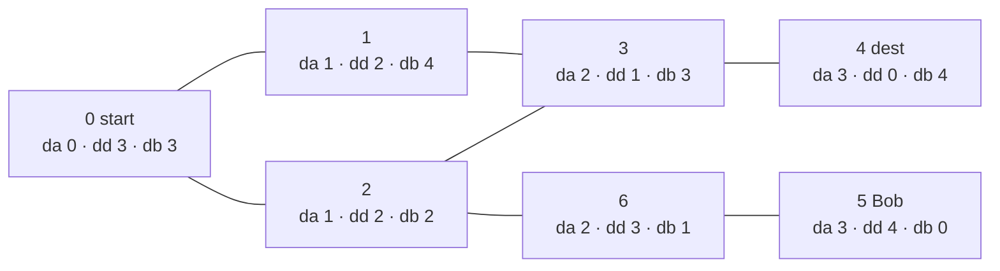

**Short answer:** Everything comes from BFS distances. One BFS from `dest` gives a shortest path: from Alice, keep stepping to a neighbour that is one closer to `dest`. A node lies on some shortest path exactly when `distA(v) + distD(v) == distA(dest)`. For the chaser, a node is safe when Bob's distance is strictly greater than Alice's, and Alice escapes if a chain of safe shortest-path nodes runs from her start to `dest`, which a backward DP over the BFS layers decides.

## Picture it

Example 2: `edges = [[0,1],[0,2],[1,3],[2,3],[3,4],[5,6],[6,2]]`, `alice = 0`, `bob = 5`, `dest = 4`. Each label shows `da` (Alice's distance), `dd` (distance to dest) and `db` (Bob's distance).



- **Part 1:** from 0, neighbours 1 and 2 both have `toDest = 2`; take the smaller, 1. Then 3, then 4. Path `[0,1,3,4]`.
- **Part 2:** `da + dd == 3` holds for 0, 1, 2, 3, 4. Node 6 gives 2 + 3 = 5, so it is off every shortest path.
- **Part 3:** layers by `da`, processed from `dest` backwards:

| Layer d | Node | db > da? (safe) | Good neighbour one layer later? | good |
|---|---|---|---|---|
| 3 | 4 | 4 > 3 yes | it is `dest` | true |
| 2 | 3 | 3 > 2 yes | 4 | true |
| 1 | 1 | 4 > 1 yes | 3 | true |
| 1 | 2 | 2 > 1 yes | 3 | true |
| 0 | 0 | 3 > 0 yes | 1 (or 2) | true → `canEscape = true` |

In Example 1 (edge 2–5 instead of 5–6–2) Bob is 3 steps from node 4 and so is Alice: `db = 3` is not > `da = 3`, so `dest` is unsafe, nothing is good, and the answer is false.

**The picture in one sentence:** three BFS distance arrays turn "on a shortest path" into `da + dd == total` and "caught" into `db <= da`, and a backward pass over the layers finds a fully safe route.

## Approach

- **Part 1, one shortest path:** BFS from `dest` to get `toDest[]`. From `alice`, repeatedly move to a neighbour with `toDest[w] == toDest[cur] - 1`. Choosing the **smallest** such neighbour at each step gives the lexicographically smallest path, because all shortest paths have the same length and the greedy choice decides the earliest differing position.
- **Part 2, all nodes on any shortest path:** BFS from both ends. v is on a shortest path iff `da[v] + dd[v] == da[dest]`. Reconstructing paths is unnecessary.
- **Part 3, the chaser:** Alice reaches node v at time `da[v]` (she only moves along shortest paths). Bob can be standing on v by then iff `db[v] <= da[v]` (he may wait). So v is safe iff Bob cannot reach it or `db[v] > da[v]`. Crossing on an edge is already covered: if Bob could meet her mid-edge, he could also have reached one of its endpoints in time.
- The question becomes: is there a path in the shortest-path DAG from `alice` to `dest` using only safe nodes? Process DAG layers from `dest` backwards: `good[v]` is true if v is safe and (v is `dest`, or some neighbour w with `da[w] == da[v] + 1` is good). The answer is `good[alice]`.

## Solution

```java
import java.util.*;

class Solution {
    public int[] shortestPath(int n, int[][] edges, int alice, int dest) {
        int[][] g = graph(n, edges);
        int[] toDest = bfs(g, dest);
        if (toDest[alice] < 0) return new int[0];
        int[] path = new int[toDest[alice] + 1];
        int cur = alice;
        for (int i = 0; i < path.length; i++) {
            path[i] = cur;
            int next = Integer.MAX_VALUE;            // smallest neighbour one step closer
            for (int w : g[cur]) if (toDest[w] == toDest[cur] - 1 && w < next) next = w;
            cur = next;
        }
        return path;
    }

    public int[] nodesOnShortestPaths(int n, int[][] edges, int alice, int dest) {
        int[][] g = graph(n, edges);
        int[] da = bfs(g, alice), dd = bfs(g, dest);
        if (da[dest] < 0) return new int[0];
        int cnt = 0;
        for (int v = 0; v < n; v++) if (da[v] >= 0 && da[v] + dd[v] == da[dest]) cnt++;
        int[] out = new int[cnt];
        cnt = 0;
        for (int v = 0; v < n; v++) if (da[v] >= 0 && da[v] + dd[v] == da[dest]) out[cnt++] = v;
        return out;
    }

    public boolean canEscape(int n, int[][] edges, int alice, int bob, int dest) {
        int[][] g = graph(n, edges);
        int[] da = bfs(g, alice), dd = bfs(g, dest), db = bfs(g, bob);
        int total = da[dest];
        if (total < 0) return false;
        // Group shortest-path nodes by their distance from Alice.
        List<List<Integer>> layers = new ArrayList<>();
        for (int i = 0; i <= total; i++) layers.add(new ArrayList<>());
        for (int v = 0; v < n; v++) if (da[v] >= 0 && da[v] + dd[v] == total) layers.get(da[v]).add(v);
        boolean[] good = new boolean[n];
        for (int d = total; d >= 0; d--) {           // from dest back to alice
            for (int v : layers.get(d)) {
                boolean safe = db[v] < 0 || db[v] > da[v];
                if (!safe) continue;
                if (v == dest) { good[v] = true; continue; }
                for (int w : g[v]) {
                    if (good[w] && da[w] == da[v] + 1) { good[v] = true; break; }
                }
            }
        }
        return good[alice];
    }

    private int[][] graph(int n, int[][] edges) {   // compact adjacency arrays
        int[] deg = new int[n];
        for (int[] e : edges) { deg[e[0]]++; deg[e[1]]++; }
        int[][] g = new int[n][];
        for (int i = 0; i < n; i++) g[i] = new int[deg[i]];
        for (int[] e : edges) {
            g[e[0]][--deg[e[0]]] = e[1];
            g[e[1]][--deg[e[1]]] = e[0];
        }
        return g;
    }

    private int[] bfs(int[][] g, int s) {
        int[] d = new int[g.length];
        Arrays.fill(d, -1);
        int[] q = new int[g.length];
        int h = 0, t = 0;
        q[t++] = s;
        d[s] = 0;
        while (h < t) {
            int u = q[h++];
            for (int w : g[u]) if (d[w] < 0) { d[w] = d[u] + 1; q[t++] = w; }
        }
        return d;
    }
}
```

## Complexity

- **Time:** O(n + m) per method: a constant number of BFS passes plus one pass over the shortest-path DAG.
- **Space:** O(n + m) for the adjacency arrays and distance arrays.

## Edge cases

- `dest` unreachable: empty arrays and `false`.
- `alice == dest`: path `[alice]`; she is caught only if `bob == alice` too (`db = 0 <= 0`).
- `bob == alice`: caught at time 0.
- Bob in a different component: `db[v] = -1`, so every node is safe.
- Bob reaching `dest` at the same time as Alice counts as a catch (`<=`).

## Follow-ups

- **Every node on some shortest path:** part 2 above; the two-BFS sum test is the standard trick.
- **Bob moves simultaneously:** part 3 above. The key reduction is that Bob's best strategy is to wait at a node, so a node-by-node time comparison is enough.

Practise it in the app: Run / Submit on this page.
