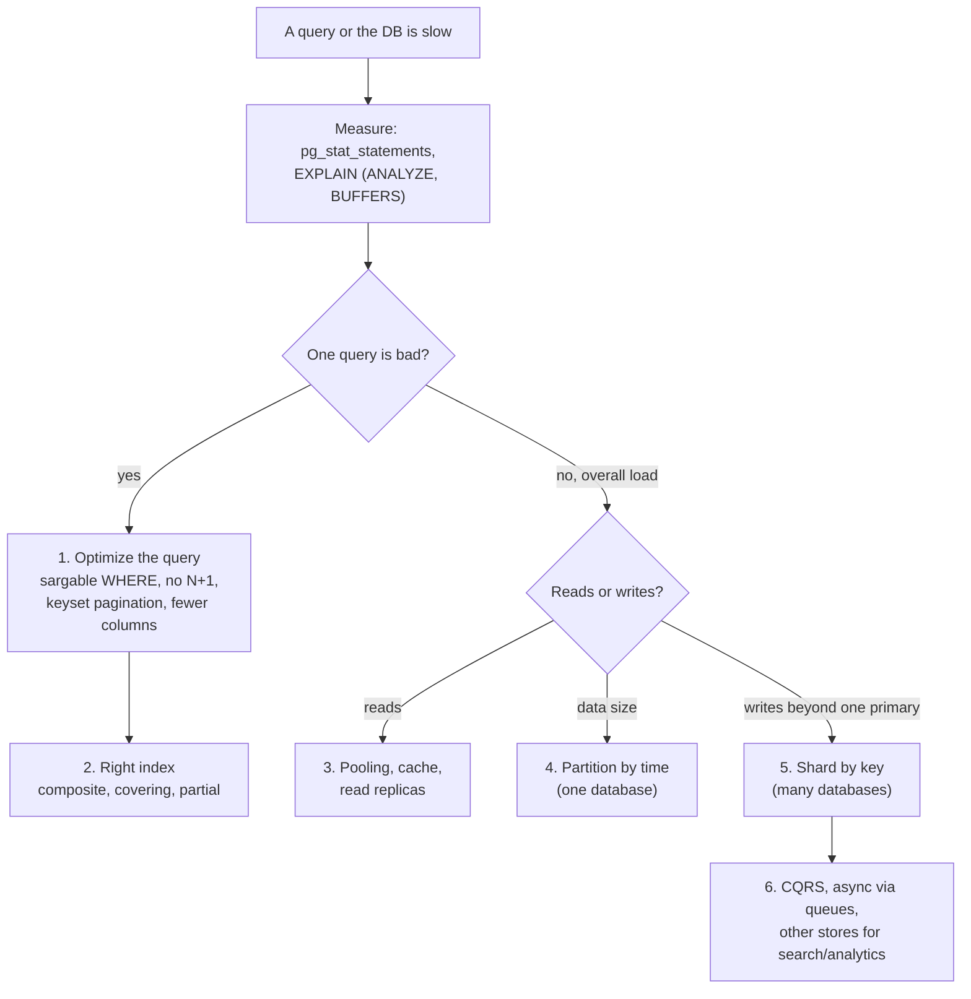

**Short answer:** Work in three layers, and always measure first (`pg_stat_statements` to find the expensive queries, `EXPLAIN (ANALYZE, BUFFERS)` to see why). **Optimization** makes one query cheaper: sargable filters, no N+1, keyset pagination, only the columns you need. **Performance** makes the database do less work: the right composite or covering indexes, pooled connections, short transactions, caching. **Scalability** grows past one machine, in order: bigger box → read replicas → cache → partitioning → sharding → CQRS/async, accepting a new trade-off at each step.

## Picture it



**How to read it:**
- Never guess. Find the query that costs the most total time, then read its plan.
- One bad query is almost always fixed by layers 1–2: rewrite it, then give it the index it needs.
- Load problems climb the ladder from the cheapest step. Each step up costs more complexity: replicas bring stale reads, sharding makes cross-shard queries and transactions hard.
- Say the trade-off out loud at every step. That is what the interviewer is listening for.

## Explanation

### 1. Query optimization: make one query cheaper

| Technique | Why it works |
|---|---|
| **Read the plan** | `EXPLAIN (ANALYZE, BUFFERS)` shows Seq Scan vs Index Scan, estimated vs actual rows, sort method and join type (Nested Loop, Hash, Merge). A big gap between estimated and actual rows means stale statistics: run `ANALYZE`. |
| **Sargable predicates** | Keep the indexed column bare: `created_at >= '2026-01-01'`, not `EXTRACT(YEAR FROM created_at) = 2026`. `LIKE 'abc%'` can use a B-tree index; `LIKE '%abc'` can't. Avoid implicit casts (comparing a `bigint` column to a text parameter). |
| **Only what you need** | No `SELECT *`. Fewer columns means less I/O, and may allow an index-only scan. |
| **No N+1** | One JOIN or `WHERE id IN (...)` instead of a query per row. In JPA: `JOIN FETCH`, `@EntityGraph` or `@BatchSize`. |
| **EXISTS, NOT EXISTS** | `EXISTS` stops at the first match. Prefer `NOT EXISTS` over `NOT IN`: if the subquery returns a NULL, `NOT IN` returns no rows at all. |
| **Keyset pagination** | `WHERE id > :lastId ORDER BY id LIMIT 20` stays fast; `OFFSET 100000` reads and throws away 100k rows. |
| **Filter early** | `WHERE` before `GROUP BY`; `HAVING` only for conditions on aggregates. Use `UNION ALL` unless you really need `UNION`'s dedup (a sort or hash). |
| **Window functions** | `ROW_NUMBER`, `DENSE_RANK` and `LAG` replace self-joins and correlated subqueries. |
| **Batch writes** | Multi-row `INSERT`, JDBC batching (`hibernate.jdbc.batch_size`), `COPY` for bulk loads. |

### 2. Performance: make the database do less work

**Indexes**
- B-tree on the columns used in `WHERE`, `JOIN` and `ORDER BY`.
- **Composite index order:** equality columns first, then the range or sort column. `(user_id, created_at)` serves `WHERE user_id = ? ORDER BY created_at DESC LIMIT 20` with no sort.
- **Covering:** `INCLUDE (amount)` answers the query from the index alone.
- **Partial:** `WHERE status = 'PENDING'` indexes only the hot rows.
- **Expression:** `ON lower(email)`.
- **GIN** for JSONB and full-text search; **BRIN** for huge, append-only tables ordered by time.
- **The cost:** every index slows down `INSERT`/`UPDATE` and takes space. Drop unused ones (`idx_scan = 0` in `pg_stat_user_indexes`).

**Schema:** normalize for correctness, then denormalize on purpose for hot reads (a summary column, a materialized view refreshed `CONCURRENTLY`). Use the right types: `bigint` ids, `timestamptz`, `numeric` for money.

**Connections and transactions**
- **Pool connections:** HikariCP in the app, PgBouncer in front of Postgres. Each Postgres connection is a process; a pool of about cores × 2 beats 200 connections.
- **Short transactions:** no HTTP calls inside a transaction. Long ones hold locks and stop VACUUM from cleaning up dead rows.
- **Lowest correct isolation:** Read Committed by default; optimistic locking (a `@Version` column) when conflicts are rare; `SELECT ... FOR UPDATE` when they are frequent.

**Maintenance and caching:** let autovacuum keep up, so tables and indexes don't bloat. Cache read-heavy, slowly changing data in Redis (cache-aside plus a TTL, with a clear invalidation rule).

### 3. Scalability: grow past one machine

1. **Vertical:** more CPU, RAM and faster disks. The simplest step, with a hard ceiling.
2. **Read replicas:** writes go to the primary, reads to replicas. The catch is **replication lag**. For read-your-own-writes, send that user's reads to the primary for a few seconds after they write, or read from a replica that has caught up to the write's LSN.
3. **Cache layer:** takes reads off the database entirely.
4. **Partitioning (one database):** `PARTITION BY RANGE (created_at)`. Queries skip irrelevant partitions (partition pruning), indexes stay small, and retention becomes `DROP TABLE` on an old partition instead of a huge `DELETE`.
5. **Sharding (many databases):** rows spread across servers by a shard key.
   - Pick a key with high cardinality and even load, that most queries include (`user_id`, `account_id`).
   - Cross-shard joins and transactions get hard, so you use sagas, the outbox pattern and denormalized copies.
   - Consistent hashing or a directory keeps resharding cheap.
6. **CQRS and async:** keep the transactional write model in SQL. Feed read models (Elasticsearch, OLAP) from change events (CDC, Kafka), and move slow work onto queues.

**Concurrency at scale:** avoid hot rows such as a single global counter: shard the counter or batch the increments. Use idempotency keys so retried writes never apply twice.

## Example

A betting-history page is slow:

```sql
-- Before: function on the column, OFFSET paging, every column
SELECT * FROM bets
WHERE EXTRACT(YEAR FROM placed_at) = 2026 AND user_id = 42
ORDER BY placed_at DESC
OFFSET 2000 LIMIT 20;

-- After: sargable range, keyset paging, only the needed columns
CREATE INDEX CONCURRENTLY idx_bets_user_time
  ON bets (user_id, placed_at DESC) INCLUDE (id, stake, status);

SELECT id, placed_at, stake, status
FROM bets
WHERE user_id = 42
  AND placed_at >= '2026-01-01' AND placed_at < '2027-01-01'
  AND placed_at < :last_seen_placed_at          -- keyset: the last row of the previous page
ORDER BY placed_at DESC
LIMIT 20;
```

`EXPLAIN` changes from a Seq Scan plus Sort to an Index Only Scan reading 20 rows. At scale, `bets` would also be partitioned by month (old months dropped or archived) and, if one primary can't take the writes, sharded by `user_id`, which this query already includes.

## Pitfalls and follow-ups

- **Which queries do you fix first?** The ones with the highest *total* time in `pg_stat_statements` (calls × mean), not the single slowest call.
- **When does an index hurt?** On write-heavy tables (every write updates every index), on low-selectivity columns (a boolean, where a Seq Scan is cheaper), and when duplicate or unused indexes waste memory.
- **Stale reads from replicas?** Read your own writes from the primary, or wait for the replica to pass the write's LSN. Say it is eventual consistency and where the app tolerates it (history pages) and where it doesn't (wallet balance).
- **Partitioning vs sharding?** Partitioning splits a table *inside one database*: easy, transparent, helps size and retention. Sharding splits data *across databases*: it scales writes but costs cross-shard queries, transactions and operational work. Partition first; shard only when one primary can't take the writes.
- **What gets harder after sharding?** Joins and transactions across shards, global unique IDs (use Snowflake-style ids), rebalancing, and queries that don't include the shard key (they fan out to every shard).
- **Why not just add NoSQL?** It trades joins and transactions for easy horizontal scale. Money (a wallet ledger) stays in SQL; see [rdbms-scaling-vs-nosql](rdbms-scaling-vs-nosql.md).

Go deeper: [Q5 · Indexes and reading EXPLAIN](../academy/lessons/Q5.md), [Q6 · Transactions, isolation, locking and MVCC](../academy/lessons/Q6.md), [Q7 · Query performance in practice](../academy/lessons/Q7.md), [Q8 · Scaling databases](../academy/lessons/Q8.md). For one slow query in detail, see [SQL query optimization](sql-query-optimization.md).
