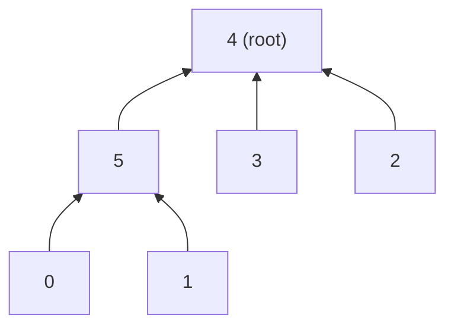

**Short answer:** Sort the logs by timestamp and feed them into a union-find that starts with `n` separate groups. Each union of two different groups reduces the group count by one; the timestamp at which the count reaches 1 is the answer. If the logs run out first, return -1. O(m log m) for the sort plus near-constant time per union.

## Picture it

`n = 6`, logs (already in time order): `[20190101,0,1] [20190104,3,4] [20190107,2,3] [20190211,1,5] [20190224,2,4] [20190301,0,3] ...` (answer 20190301).

| time | pair | find(a), find(b) | action | groups | components |
|---|---|---|---|---|---|
| start | | | | 6 | {0} {1} {2} {3} {4} {5} |
| 20190101 | 0,1 | 0, 1 | parent[0] = 1 | 5 | {0,1} {2} {3} {4} {5} |
| 20190104 | 3,4 | 3, 4 | parent[3] = 4 | 4 | {0,1} {2} {3,4} {5} |
| 20190107 | 2,3 | 2, 4 | parent[2] = 4 | 3 | {0,1} {2,3,4} {5} |
| 20190211 | 1,5 | 1, 5 | parent[1] = 5 | 2 | {0,1,5} {2,3,4} |
| 20190224 | 2,4 | 4, 4 | same root, skip | 2 | unchanged |
| 20190301 | 0,3 | 5, 4 | parent[5] = 4 | **1** | everyone, return 20190301 |

The forest at the end (arrows point to the parent; `find(0)` halved the path so 0 now points straight at 5):



**The picture in one sentence:** every union of two different roots removes one group, so the first timestamp where the count hits 1 is the moment everyone is connected.

## Approach

- **Brute force.** After each log (in time order), run a BFS/DFS to check whether the graph is connected: O(m · (n + m)), around 10⁹ steps here.
- **Binary search on time + BFS.** Connectivity only grows over time, so it is monotonic: O((n + m) log m). Valid, but union-find is simpler.
- **Key insight.** We only need to know *when the number of components becomes 1*. Union-find tracks components incrementally: a union that joins two different roots merges two components. No need to look at the whole graph again.
- **Sort first.** The logs are not sorted. Sort a copy so the caller's array is not reordered.

## Solution

```java
import java.util.*;

class Solution {
    private int[] parent;

    public int earliestAcq(int[][] logs, int n) {
        int[][] sorted = logs.clone();
        Arrays.sort(sorted, Comparator.comparingInt(a -> a[0]));
        parent = new int[n];
        for (int i = 0; i < n; i++) parent[i] = i;
        int groups = n;
        for (int[] l : sorted) {
            int a = find(l[1]), b = find(l[2]);
            if (a != b) {
                parent[a] = b;
                if (--groups == 1) return l[0];
            }
        }
        return -1;
    }

    private int find(int x) { // path halving
        while (parent[x] != x) {
            parent[x] = parent[parent[x]];
            x = parent[x];
        }
        return x;
    }
}
```

## Complexity

- **Time:** O(m log m) for sorting, plus O(m · α(n)) for the unions (with union by rank; path halving alone is already fast in practice).
- **Space:** O(n) for `parent`, O(m) for the sorted copy.

## Edge cases

- Someone never appears in any log: -1.
- Repeated pairs: the second union finds the same root and does nothing.
- `n = 2`: the first log between them is the answer.
- Everyone connected only at the very last log.

## Follow-ups

- **"Also require max connections between any two nodes ≤ k."** The phrase is ambiguous; ask. The most likely meaning is that every pair must be connected by a path of at most k hops (the graph's diameter ≤ k). Union-find cannot track distances. The property is still monotonic over time (adding edges never lengthens a shortest path), so binary search on the log index and, for each candidate, run BFS from every node to compute the diameter: O(n · (n + m) · log m). If it instead means "each person has at most k friends", process logs in time order, skip (or reject) edges that push a degree past k, and still count components with union-find.
- **Logs can contain "unfriend" events.** Connectivity is no longer monotonic, and union-find cannot split groups. The standard offline method is a **segment tree over time with a rollback DSU**: each friendship is alive over an interval of log indices; insert it into the O(log m) segment-tree nodes covering that interval, then DFS the tree, applying unions on entry and undoing them on exit. The DSU uses union by size and **no path compression**, so each union can be undone in O(1) from a stack. Total O(m log m log n). At each leaf, check `groups == 1` and return the first such timestamp. If events must be handled online, you need a fully dynamic connectivity structure (for example Holm–de Lichtenberg–Thorup), which is beyond an interview.

Practise it in the app: Run / Submit on this page.
