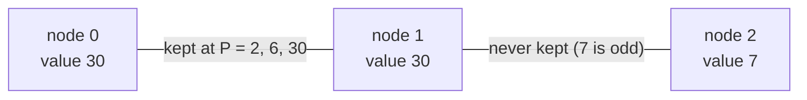

**Short answer:** MEX-P of a path is the smallest prime that does not divide the gcd of the values on the path. The product 2·3·5·…·23 = 223,092,870 is at most 10⁹, but multiplying by 29 goes past 10⁹. So MEX-P is always one of the first ten primes, 2 to 29. Write MEX-P as 2 plus a sum of "bonus steps". Path `u–v` earns the step from prime `p_j` to `p_{j+1}` when every value on it is divisible by the primorial `P(j)`. For each of the 9 primorials, the nodes divisible by it form a forest. The pairs (u, v) that earn the step are exactly the pairs in the same component. Union-find gives the component sizes. Total time is O(9·n·α(n)).

## Picture it

Example 2: `values = [30,30,7]`, path `0 – 1 – 2`. At each primorial level only edges whose both ends are divisible survive.



| Level | P(j) | Divisible nodes | Components | Gain p(j+1) − p(j) | ans after level |
|---|---|---|---|---|---|
| start | – | – | – | base 2n = 6 | [6, 6, 6] |
| 1 | 2 | 0, 1 | {0,1} size 2 | 3 − 2 = 1 | [8, 8, 6] |
| 2 | 6 | 0, 1 | {0,1} size 2 | 5 − 3 = 2 | [12, 12, 6] |
| 3 | 30 | 0, 1 | {0,1} size 2 | 7 − 5 = 2 | [16, 16, 6] |
| 4 | 210 | none | – | 11 − 7 = 4 | [16, 16, 6] |
| 5–9 | 2310 … | none | – | – | **[16, 16, 6]** |

Node 0's paths: MEX-P 7 to itself, 7 to node 1, 2 to node 2. Telescoped: 2 + 1 + 2 + 2 = 7 for the first two, plus 2 for the third, giving 16.

**The picture in one sentence:** the answer is 2 plus a staircase of prime gaps, and each step is counted by the size of the union-find component of nodes divisible by that primorial.

## Approach

- **Brute force.** From every node, run a DFS that carries the running gcd and evaluates MEX-P for each v. That is O(n²), too slow for 10⁵ nodes.
- **Insight 1: the answer set is tiny.** If the smallest non-dividing prime is `p_{j+1}`, the gcd is divisible by `P(j) = p_1·…·p_j`. With values ≤ 10⁹, `P(j)` ≤ 10⁹, which allows j ≤ 9. So MEX-P ∈ {2, 3, 5, 7, 11, 13, 17, 19, 23, 29}.
- **Insight 2: telescoping.** `MEX-P(path) = 2 + Σ_{j≥1} (p_{j+1} − p_j) · [P(j) divides every value on the path]`. The indicators are 1 for j = 1..J and 0 after, so the sum telescopes to `p_{J+1}`.
- **Insight 3: per-level connectivity.** For a fixed j, "every value on the path is divisible by P(j)" means u and v are connected using only nodes divisible by P(j). Keep only edges whose two ends are both divisible. Then every node u counts `size(component(u))` partners, including itself. A node that is not divisible gets nothing at that level.
- **Assemble.** Start with `ans[u] = 2n`, since every one of the n paths contributes at least 2. For each level j, add `(p_{j+1} − p_j) · componentSize(u)` to each divisible u.

Check example 1, `values = [6,2,3]`: base 6 for every node. At level P = 2, nodes {0,1} are connected (size 2) and gain 1 each: [8,8,6]. At level P = 6, node 0 is alone (size 1) and gains 2: [10,8,6]. Correct.

## Solution

```java
import java.util.*;

class Solution {
    private static final int[] PRIMES = {2, 3, 5, 7, 11, 13, 17, 19, 23, 29};
    private int[] parent, size;

    public long[] pathMexSums(int[] values, int[][] edges) {
        int n = values.length;
        long[] ans = new long[n];
        Arrays.fill(ans, 2L * n);
        long prod = 1;
        for (int j = 0; j + 1 < PRIMES.length; j++) {
            prod *= PRIMES[j];
            if (prod > 1_000_000_000L) break;
            parent = new int[n];
            size = new int[n];
            for (int i = 0; i < n; i++) { parent[i] = i; size[i] = 1; }
            for (int[] e : edges)
                if (values[e[0]] % prod == 0 && values[e[1]] % prod == 0) union(e[0], e[1]);
            int gain = PRIMES[j + 1] - PRIMES[j];
            for (int u = 0; u < n; u++)
                if (values[u] % prod == 0) ans[u] += (long) gain * size[find(u)];
        }
        return ans;
    }

    private int find(int x) {
        while (parent[x] != x) {
            parent[x] = parent[parent[x]];
            x = parent[x];
        }
        return x;
    }

    private void union(int a, int b) {
        a = find(a);
        b = find(b);
        if (a == b) return;
        if (size[a] < size[b]) { int t = a; a = b; b = t; }
        parent[b] = a;
        size[a] += size[b];
    }
}
```

## Complexity

- **Time:** O(L · n · α(n)), with L = 9 levels.
- **Space:** O(n) for the union-find, rebuilt at each level.

## Edge cases

- A single node: its answer is MEX-P({value}). A value of 1 gives 2.
- Value 1, or any odd value: it is never divisible by 2, so its answer is 2n.
- Values divisible by 223,092,870 reach every level, so MEX-P = 29.
- Sums: up to 29 · 10⁵ fits easily, but `long` is used anyway.

## Variations

- **Sum over all unordered pairs instead of per node:** add `gain · C(size, 2)` per component plus the diagonal terms.
- **Path gcd queries in general:** binary lifting with gcd, or centroid decomposition. Here they are not needed because only 10 answers exist.
- **The general pattern:** when the answer comes from a tiny set, decompose it into threshold indicators and count each threshold separately.

See [C1 · From constraints to the expected complexity](../academy/lessons/C1.md). The bound "values ≤ 10⁹" is the whole hint.

Practise it in the app: Run / Submit on this page.
