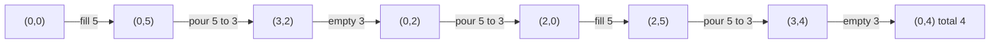

**Short answer:** Let `g` be the gcd of all the jug capacities. The total amount of water is always a multiple of `g`, and every multiple of `g` from 0 up to the total capacity can be reached. So the answer is `target <= sum(capacities) && target % g == 0`. That takes O(N log max) time and no search. For two jugs this is Bézout's identity: `a·x + b·y` can produce exactly the multiples of `gcd(x, y)`.

## Picture it

Why 4 is reachable with jugs 3 and 5 (example 1): contents shown as (3-jug, 5-jug). Every state total is a multiple of gcd(3, 5) = 1.



The code never searches states. It folds the gcd and the total:

| Input | Step | g | total | Check | Result |
|---|---|---|---|---|---|
| [3,5], 4 | 3, then 5 | 3 → 1 | 8 | 4 ≤ 8, 4 % 1 = 0 | true |
| [2,6], 5 | 2, then 6 | 2 → 2 | 8 | 5 % 2 = 1 | false |
| [6,10,15], 1 | 6, 10, 15 | 6 → 2 → 1 | 31 | 1 ≤ 31, 1 % 1 = 0 | true |

**The picture in one sentence:** every move keeps the total a multiple of the gcd and every such multiple up to the total capacity is reachable, so the whole search collapses to one gcd.

## Approach

- **Brute force (BFS over states).** A state is the content of every jug. For two jugs it is a pair `(a, b)`, with six moves out of each state. That is O(x·y) states: fine for small capacities, hopeless for 10⁶ × 10⁶, and the state space grows exponentially with N jugs.
- **Key insight 1: the invariant.** Every jug always holds a multiple of `g`. Filling adds a multiple of `g`, emptying removes one, and pouring moves `min(from, room in to)`, which is a difference of multiples of `g`. So the total can never be anything else.
- **Key insight 2: reachability (Bézout).** For two jugs, there are integers with `m·x − n·y = g`. You can carry out that combination by repeatedly filling x, pouring into y, and emptying y when it is full. Example 1 shows this for 3 and 5. This produces every multiple of `g` up to `x + y`. With more jugs, the gcd of all capacities combines the same way. In example 3, gcd(6, 10, 15) = 1, even though every pair shares a factor.
- **Upper bound.** The jugs cannot hold more than their total capacity, so `target > sum` is false.

## Solution

```java
class Solution {
    public boolean canMeasureWater(int[] jugs, int target) {
        long total = 0;
        int g = 0;
        for (int c : jugs) {
            total += c;          // up to 1000 × 10^6, needs long
            g = gcd(g, c);
        }
        return target <= total && target % g == 0;
    }

    private int gcd(int a, int b) {
        while (b != 0) {
            int t = a % b;
            a = b;
            b = t;
        }
        return a;
    }
}
```

`gcd(0, c) = c`, so starting with `g = 0` needs no special case.

## Complexity

- **Time:** O(N · log(max capacity)) for the gcd steps.
- **Space:** O(1).

## Edge cases

- `target = 0`: always true (all jugs empty).
- `target` equal to the total capacity: true (fill everything).
- `target` larger than the total: false, even if it is a multiple of `g`.
- A single jug: only 0 or its full capacity.
- Total capacity overflowing `int`: use `long`.

## Variations

- **Classic two jugs (LC 365):** the same formula with `x + y` as the bound.
- **Exact amount in one specific jug:** the gcd condition still applies, with the bound being that jug's capacity.
- **Minimum number of steps:** the formula does not give it. Use BFS over states for small capacities, or simulate both pouring directions ("x into y" and "y into x") and take the shorter one for two jugs.
- **Die Hard puzzle (3 and 5 litres, target 4):** example 1 is exactly this.

Practise it in the app: Run / Submit on this page.
