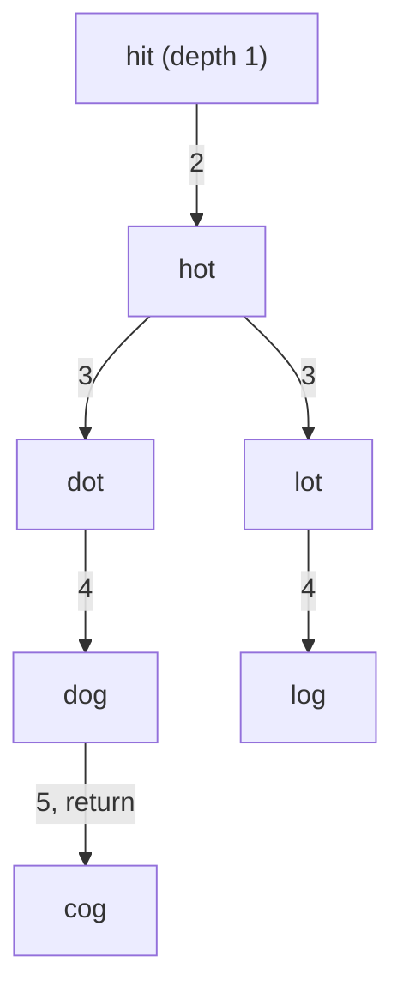

**Short answer:** Each word is a node, and two words are connected when they differ in one letter. The shortest chain is a BFS from `beginWord`. To find neighbours, change each position to each of the 26 letters and look the result up in a hash set. Remove words from the set as they are visited. That costs O(N · L · 26 · L) time, instead of comparing every pair of words.

## Picture it

Example 1: `hit → cog`, list `[hot, dot, dog, lot, log, cog]`. Edge labels show the depth at which the word is generated.



| depth | Polled | New words removed from the set and queued | Queue after level |
|---|---|---|---|
| 2 | hit | hot | [hot] |
| 3 | hot | dot, lot | [dot, lot] |
| 4 | dot, lot | dog (from dot), log (from lot) | [dog, log] |
| 5 | dog | cog generated: it is `endWord` | return **5** |

`log` would also reach `cog`, but `dog` is polled first and returns.

**The picture in one sentence:** BFS by levels over one-letter variants, with removal from the set doubling as "visited", so the first time `endWord` appears is the shortest chain.

## Approach

- **Brute force.** Build the graph by comparing every pair of words: O(N² · L). With 5·10⁴ words that is about 2.5·10⁹ pairs, too slow.
- **Key insight 1: unweighted shortest path = BFS.** Every edit costs 1, so BFS level by level gives the minimum. Count words, not edges: start at depth 1.
- **Key insight 2: generate neighbours.** A word of length L has only 25·L possible one-letter variants. Checking each one against a `HashSet` is far cheaper than scanning the whole dictionary.
- **Visited = removed.** Deleting a word from the set when it is enqueued marks it visited and shrinks future lookups. `Set.remove` returns `true` only the first time, which doubles as the visited check.
- **Early exit.** If `endWord` is not in the list, return 0 at once. Return as soon as `endWord` is generated.

## Solution

```java
import java.util.*;

class Solution {
    public int ladderLength(String beginWord, String endWord, List<String> wordList) {
        Set<String> unvisited = new HashSet<>(wordList);
        if (!unvisited.contains(endWord)) return 0;
        unvisited.remove(beginWord);
        ArrayDeque<String> q = new ArrayDeque<>();
        q.add(beginWord);
        int depth = 1;
        while (!q.isEmpty()) {
            depth++;
            for (int size = q.size(); size > 0; size--) {
                char[] w = q.poll().toCharArray();
                for (int i = 0; i < w.length; i++) {
                    char orig = w[i];
                    for (char c = 'a'; c <= 'z'; c++) {
                        if (c == orig) continue;
                        w[i] = c;
                        String next = new String(w);
                        if (unvisited.remove(next)) {      // in the dictionary and not yet seen
                            if (next.equals(endWord)) return depth;
                            q.add(next);
                        }
                    }
                    w[i] = orig;
                }
            }
        }
        return 0;
    }
}
```

## Complexity

- **Time:** O(N · L · 26 · L). Each of N words generates 26·L candidates, and building and hashing each candidate costs O(L).
- **Space:** O(N · L) for the set and the queue.

## Edge cases

- `endWord` not in the list: 0.
- `beginWord` in the list: remove it so it is not revisited.
- A direct one-letter neighbour: 2.
- No path: the queue empties, return 0.
- Single-letter words (example 3): every word is a neighbour of every other.

## Variations

- **Bidirectional BFS:** expand from both ends, always growing the smaller frontier. It reduces the explored nodes a lot on large dictionaries, and is a good optimisation to mention.
- **Wildcard buckets:** precompute `h*t → [hit, hot, hat]` patterns. Neighbours come from buckets, which helps when the alphabet is large.
- **Word Ladder II (all shortest paths):** BFS recording parents per level, then DFS backtracking from the end word.
- **Edits that include insert and delete:** generate those variants too. The graph is still unweighted, so BFS still applies.

Practise it in the app: Run / Submit on this page.
